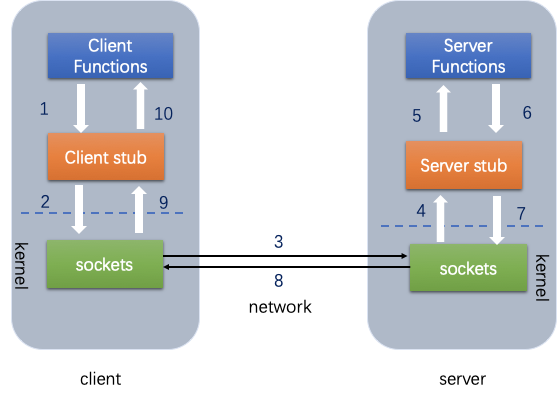

# RPC

目录：

1. [简介][1]

 	2. [原理][2]
 	3. [参考资料][3]

### 1.简介

RPC就是远程过程调用协议，其作用就是客户端与服务端之间的远程调用，就像本地自己调用一样。微服务的基础。

### 2.原理

- RPC（Remote Procedure Call）远程过程调用，简单的理解是一个节点请求另一个节点提供的服务
- 本地过程调用：如果需要将本地student对象的age+1，可以实现一个addAge()方法，将student对象传入，对年龄进行更新之后返回即可，本地方法调用的函数体通过函数指针来指定。
- 远程过程调用：上述操作的过程中，如果addAge()这个方法在服务端，执行函数的函数体在远程机器上，如何告诉机器需要调用这个方法呢？

* 首先客户端需要告诉服务器，需要调用的函数，这里函数和进程ID存在一个映射，客户端远程调用时，需要查一下函数，找到对应的ID，然后执行函数的代码。

* 客户端需要把本地参数传给远程函数，本地调用的过程中，直接压栈即可，但是在远程调用过程中不再同一个内存里，无法直接传递函数的参数，因此需要客户端把参数转换成字节流，传给服务端，然后服务端将字节流转换成自身能读取的格式，是一个序列化和反序列化的过程。
   3.数据准备好了之后，如何进行传输？网络传输层需要把调用的ID和序列化后的参数传给服务端，然后把计算好的结果序列化传给客户端，因此TCP层即可完成上述过程，gRPC中采用的是HTTP2协议。

图1 RPC调用原理

#### RPC框架的实现

  RPC能够让本地应用简单、高效地调用服务器中的过程（服务）。它主要应用在分布式系统。如Hadoop中的IPC组件。但怎样实现一个RPC框架呢？

从下面几个方面思考，仅供参考：

1.通信模型：假设通信的为A机器与B机器，A与B之间有通信模型，在Java中一般基于BIO或NIO；。

2.过程（服务）定位：使用给定的通信方式，与确定IP与端口及方法名称确定具体的过程或方法；

3.远程代理对象：本地调用的方法(服务)其实是远程方法的本地代理，因此可能需要一个远程代理对象，对于Java而言，远程代理对象可以使用Java的动态对象实现，封装了调用远程方法调用；

4.序列化，将对象名称、方法名称、参数等对象信息进行网络传输需要转换成二进制传输，这里可能需要不同的序列化技术方案。如:thrift,protobuf,Arvo,msgback等。

### 3.参考资料

1. https://www.cnblogs.com/zyl2016/p/9875593.html

2. https://www.jianshu.com/p/7d6853140e13

[1]: #1简介
[2]: #2原理
[3]: #参考资料

