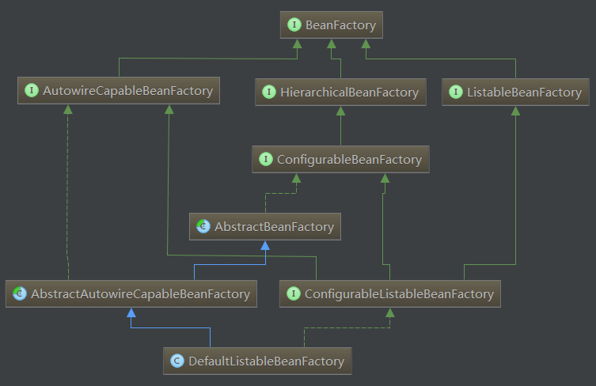

Spring容器继承关系

目录:

1. [简介][1]
2. [容器继承关系][2]
3. [BeanFactory和ApplicationContext区别][3]
4. [参考资料][4]


### 1.简介

Spring容器(`Spring Container`)可以理解为生产对象(OBJECT/BEAN)的地方，容器负责对象的整个生命周期(`LifeCycle`)，创建、装配、销毁。而这里面对象的生命周期管理都交给Spring容器，这种编程模型成为-控制反转(`Inversion of Control`),容器称为IOC容器。而这里面的IOC容器并不只是Spring才有，很多框架也有该技术


### 2.容器继承关系

如图,下面是Spring容器类继承关系.

<center>图1 Spring容器类继承关系</center>


Spring容器最基本的接口就是BeanFactory。BeanFactory负责配置、创建、管理Bean，它有一个子接口ApplicationContext，也被称为Spring上下文，容器同时还管理着Bean和Bean之间的依赖关系。
spring Ioc容器的实现，从根源上是beanfactory，**但真正可以作为一个可以独立使用的ioc容器还是DefaultListableBeanFactory，因此可以这么说，
DefaultListableBeanFactory 是整个spring ioc的始祖**.

#### 2.1 接口说明

**BeanFactory**
Spring容器根接口，提供 `获取bean`,`判断是否包含bean`,`判断是否是singleton/prototype`,`获取bean类型`,`获取bean别名`


<center>图片</center>

This interface is implemented by objects that hold a number of bean definitions, each uniquely identified by a String name. Depending on the bean definition, the factory will return either an independent instance of a contained object (the Prototype design pattern), or a single shared instance

Bean factory implementations should support the standard bean lifecycle interfaces as far as possible. The full set of initialization methods and their standard order is:

1. BeanNameAware's setBeanName
2. BeanClassLoaderAware's setBeanClassLoader
3. BeanFactoryAware's setBeanFactory
4. EnvironmentAware's setEnvironment
5. EmbeddedValueResolverAware's setEmbeddedValueResolver
6. ResourceLoaderAware's setResourceLoader (only applicable when running in an application context)
7. ApplicationEventPublisherAware's setApplicationEventPublisher (only applicable when running in an application context)
8. MessageSourceAware's setMessageSource (only applicable when running in an application context)
9. ApplicationContextAware's setApplicationContext (only applicable when running in an application context)
10. ServletContextAware's setServletContext (only applicable when running in a web application context)
11. postProcessBeforeInitialization methods of BeanPostProcessors
12. InitializingBean's afterPropertiesSet
13. a custom init-method definition
14. postProcessAfterInitialization methods of BeanPostProcessors

On shutdown of a bean factory, the following lifecycle methods apply:
1. postProcessBeforeDestruction methods of DestructionAwareBeanPostProcessors
2. DisposableBean's destroy
3. a custom destroy-method definition


**HierachicalBeanFactory**

提供访问父容器(parent beanfactory)功能

Sub-interface implemented by bean factories that can be part of a hierarchy.
The corresponding setParentBeanFactory method for bean factories that allow setting the parent in a configurable fashion can be found in the `ConfigurableBeanFactory` interface.

method:
    getParentBeanFactory():BeanFactory  
        returns the parent bean factory,or null if there is none.
    containsLocalBean(String):boolean
        Return whether the local bean factory contains a bean of the given name, ignoring beans defined in ancestor contexts.
This is an alternative to containsBean, ignoring a bean of the given name from an ancestor bean factory.


**ListablebeanFactory**

批量获取Bean

Extension of the BeanFactory interface to be implemented by bean factories that can enumerate all their bean instances, rather than attempting bean lookup by name one by one as requested by clients. BeanFactory implementations that preload all their bean definitions (such as XML-based factories) may implement this interface.


**AutowireCapableBeanFactory**

在BeanFactory基础上实现对已存在示例的管理，容器提供自动装配(autowiring)功能

Extension of the BeanFactory interface to be implemented by bean factories that are capable of autowiring, provided that they want to expose this functionality for existing bean instances.


**ConfigurableBeanFactory**

单例bean的注册，生成实例

Configuration interface to be implemented by most bean factories. Provides facilities to configure a bean factory, in addition to the bean factory client methods in the BeanFactory interface.


**ConfigurableListableBeanFactory**

继承了上述的所有接口，增加了其他功能：比如类加载器,类型转化,属性编辑器,BeanPostProcessor,作用域,bean定义,处理bean依赖关系, bean如何销毁…

Configuration interface to be implemented by most listable bean factories. In addition to ConfigurableBeanFactory, it provides facilities to analyze and modify bean definitions, and **to pre-instantiate singletons**.

**DefaultListableBeanFactory**

实现了ConfigurableListableBeanFactory，实现上述BeanFactory所有功能。它还可以注册BeanDefinition

### 3.BeanFactory和ApplicationContext区别

BeanFactory和ApplicationContext是Spring两大核心接口,而其中ApplicationContext是BeanFactory的子接口.它们都可以当作Spring容器,Spring容器是生成Bean实例的工厂,并管理容器中的Bean.在基于Spring的javaEE应用中,所有的组件(Component)都被当作Bean处理，包括数据源(DataSource),Hibernate的SessionFactory、事务管理器(TransactionManager).

Spring的核心是容器(Spring Container),框架本身提供了很多个容器的实现。大概分为两种类型：
    BeanFactory: 提供基本的DI(Dependency Injection).
    ApplicationContext: 提供更多企业级服务，例如解析配置文本信息等等。

BeanFactory更专注与保存Bean,解析Bean之间的关系,重点是Factory.而ApplicationContext更在于从应用的全局角度看待问题,翻译为"应用上下文",代表整个应用的情况,并且提供更多的企业级别服务,而且ApplicationContext里面持有BeanFactory的引用,默认是`DefaultListableBeanFactory`.


ApplicationContext常用类

|ApplicationContext常用实现类|作用|
|----|----|
|AnnotationConfigApplicationContext|从一个或多个基于java配置类加载上下文定义,适用于java注解的方式|
|ClassPathXmlApplicationContext|从类路径下的一个或多个xml配置文件中加载上下文定义,适用于xml配置方式|
|FileSystemXmlApplicationContext|从文件系统下的一个或多个xml配置文件中加载上下文定义,适用于xml配置方式|
|AnnotationConfigWebApplicationContext|专门为web应用准备的，适用于注解方式|
|XmlWebApplicationContext|从web应用下的一个或多个xml配置文件加载上下文定义，适用于xml配置方式|


Spring具有非常大的灵活性，它提供了三种主要的装配机制：

    1. XML显示配置
    2. JAVA中进行显示配置（Configuration）
    3. 隐式Bean发现机制和自动装配
        3.1 组件扫描(Component Scan)：Spring会自动发现应用上下文中所创建的Bean
        3.2 自动装配(autowiring):Spring会自动满足Bean之间的依赖


例子：

1.通过XML文件配置
```xml
<beans>
    <bean id="test" class="com.foo.Test"/>
</beans>
```

2.通过JAVA注解的方式配置
```java
@Configuration
public class Config{
    //Spring autowiring A of B
    @Bean
    public B b(A a){
        return new B(a);
    }

    @Bean
    public A a(){
        return new A();
    }
}
```

3.Spring隐式Bean发现
```java
@Component
public class MyComponent{

}
```
注意：组件扫描默认情况下不请用，需要配置.
```java
@ComponenetScan
@Configuration
public class Config{}
```

在Config类中添加@ComponentScan表示开启组件扫描,默认扫描与配置类相同的包。


### 4.参考资料

1. https://www.pianshen.com/article/6729221959/


[1]: #1简介
[2]: #2容器继承关系
[3]: #3beanfactory和applicationcontext区别
[4]: #4参考资料
