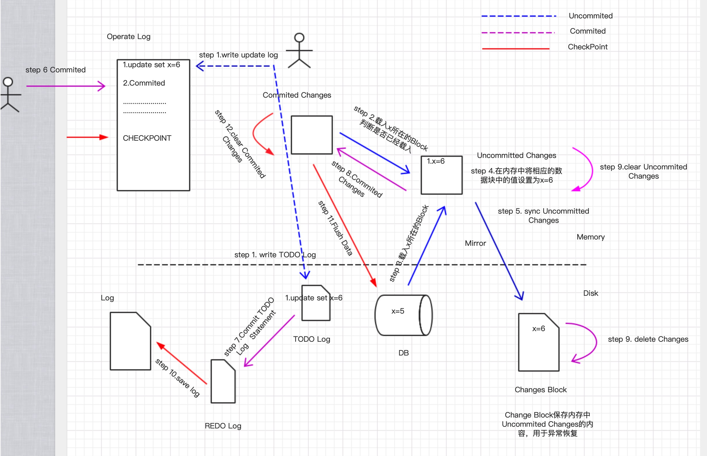
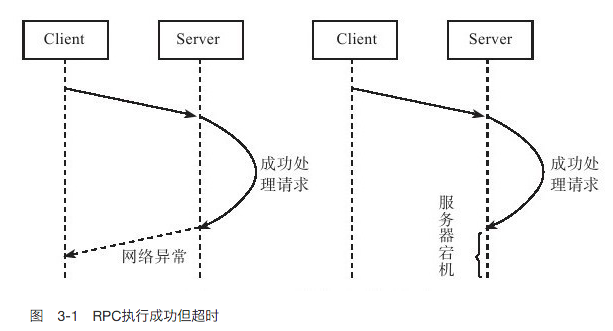
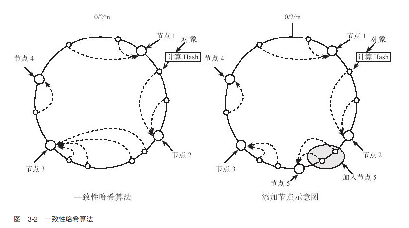
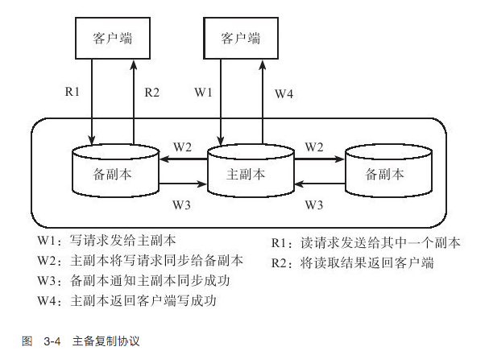

# 分布式系统概述

目录：

1. [概述][1]
2. [分布式系统特点][2]
3. [数据分布][3]
4. [一致性协议][4]
5. [负载均衡][5]
6. [复制][6]
7. [Paxos协议][7]
8. [参考资料][8]

这篇文章的重要性，描绘了分布式系统涉及到的所有点。了解了这些东西的时候，对于其它分布式系统也就涉及到这些问题。

### 1.概述

目前随着业务规模不断增加，业务越来越复杂，传统的单机部署越来越不能满足需求。分布式系统(distributed system)成为当前主流的架构。分布式系统从底层的数据存储，中间的业务服务，再到系统的部署，每一部分都涉及到很多技术。

大规模的分布式系统的重要目标就是**节省成本**，因而只能采用性价比较高PC服务器。这些服务**性能很好**，但是**故障率**很高，要求系统在软件层面进行**自动容错**。**当系统节点出现故障时，系统能够自动检测出来，并能将原有的数据和服务迁移到集群中其它正在工作的节点**。

分布式系统有两个重要的协议，**Paxos**选举协议和**2PC(两阶段提交协议)**。Paxos协议用于多个节点之间达成一致，往往用于节点选举。2PC协议用来保证跨多个节点之间的原子性，这些操作要么全部成功，要么全部失败。这两个协议是理解分布式系统的两个重要协议，其中Paxos协议用来**找到集群中的leader**，然后2PC协议用来协调集群中节点间的行为，保持节点间行为的一致。

### 2.分布式系统特点

分布式系统面临的第一个问题就是数据分布，即将数据均匀地分布到多个存储节点。另外为了保证系统的可用性，可靠性，需要将数据复制多个副本，然后分散到多个节点上面，这就带来了副本之间数据一致性问题。

* 可用性：系统是否可用，别宕机
* 可靠性：系统能用的同时，提供的服务都是可靠的

分布式系统中，往往将一台服务器或者一台服务器上面的一个进程称之为一个节点，直接之间通过网络连接(rpc,http)。大规模的分布式系统一个核心问题在于自动容错。这里面面临的问题有两大类：

* 服务器故障
* 网络问题

**服务器故障：**

1.服务器宕机

引发服务器宕机的原因可能是内存错误、服务器停电等。服务器宕机可能随时发生，当发生宕机时，节点无法正常工作，称为“不可用”（unavailable）。服务器重启后，节点将失去所有的内存信息。因此，设计存储系统时需要考虑如何通过读取持久化介质（如机械硬盘，固态硬盘）中的数据来恢复内存信息，从而恢复到宕机前的某个一致的状态。进程运行过程中也可能随时因为core dump等原因退出，和服务器宕机一样，进程重启后也需要恢复内存信息。

这一点太重要了，假如说一个已经提交的事务，改动信息目前存放在内存，没有回写到磁盘。这个时候出现宕机，数据库就是不一致的，系统重启时需要根据日志恢复到某个一致的状态。

下图是我本人画的一个图，说明了说明了数据库怎么使用日志来进行宕机恢复后的一致性状态

图1 数据库日志系统 

如上图所示，是我本人画的一个数据库日志系统。可能和MYSQL的日志系统不一样，能达到说明问题即可。上图由虚线分为两个部分Memory和Disk，其中Memory中有 Operate Log ，Commited Changes，Uncommited Changes 。Operate Log主要记录客户端的操作，Uncommited Changes 用来保存未提交的改动，Commited Changes用来保存已经提交但未写到磁盘的改动。

Disk中有Log，REDO Log，TODO Log，Changes Block，其中Log记录数据都**已经做了哪些操作**，这些日志中的操作和数据库的状态是一致的，即Log中保存的操作数据库已经保存了改动。REDO Log和TODO Log 分别与内存中 Commited Change 和Uncommited Changes相对应，分别保存未提交的操作，和已提交的操作；而Changes Block 则是Uncommited Changes在内存中的镜像，改动两者是同步的。

图中有三条线，分别是Uncommited ，Commited , CheckPoint.

#### UnCommited

首先把改动写到Operate Log和TODO Log中，然后载入与改动相关的Block块，首先从Commited Changes找数据块是否已经载入，如果没有则从Disk载入，然后对其进行修改，并把相关改动与Changes Block同步。

#### Commited

首先将Operate Log中相关日志标记为已提交，然后将TODO Log中的日志信息移动到REDO Log中；之后把Uncommited Changes中的改动放到Commited Changes 中，然后删除Uncommited Changes 和Changes Block 中相应的数据

#### CheckPoint

CheckPoint指的是在当前这个时间点，之前的改动都已经落到磁盘上，是可信的。首先把REDO Log里面的日志信息添加到Log中，然后将Commited Changes中的内容Flush到数据库，最后清除Comminted Changes中相应的数据。

#### 宕机恢复

使用TODO Log ,REDO Log , Changes Block来恢复，将数据库恢复到当机前的状态。首先先把TODO Log , REDO Log , Changes Block都加载到内存，然后重做REDO Log里面的操作，注意：这个时候其实可以不需要undo  UNDO log表中的操作，设想这样一个场景，客户端把X=5 update 6,但是未提交，这个时候数据库宕机；客户端不能提交，数据库恢复的时候，由于已经记录了X的改动信息，客户端不需要再进行一遍update操作，只需要提交即可。

2.磁盘故障

磁盘故障是一种发生概率很高的异常。磁盘故障分为两种情况：磁盘损坏和磁盘数据错误。磁盘损坏时，将会丢失存储在上面的数据，因而，分布式存储系统需要考虑将数据存储到多台服务器，即使其中一台服务器磁盘出现故障，也能从其他服务器上恢复数据。对于磁盘数据错误，往往可以采用校验和（checksum）机制来解决，这样的机制既可以在操作系统层面实现，又可以在上层的分布式存储系统层面实现。

**网络问题：**

1.网络切割

引发网络异常的原因可能是消息丢失、消息乱序（如采用UDP方式通信）或者网络包数据错误。有一种特殊的网络异常称为“网络分区”(**network partition**)，即集群的所有节点被划分为多个区域，每个区域内部可以正常通信，但是区域之间无法通信。例如，某分布式系统部署在两个数据中心，由于网络调整，导致数据中心之间无法通信，但是，数据中心内部可以正常通信。

设计容错系统的一个基本原则是：网络永远是不可靠的，任何一个消息只有收到对方的回复后才可以认为发送成功，系统设计时总是假设网络将会出现异常并采取相应的处理措施。

2.超时

由于网络异常的存在，分布式存储系统中请求结果存在“三态”的概念。在单机系统中，只要服务器没有发生异常，每个函数的执行结果是确定的，要么成功，要么失败。然而，在分布式系统中，如果某个节点向另外一个节点发起RPC（Remote Procedure Call）调用，这个RPC执行的结果有三种状态：“成功”、“失败”、“超时”（未知状态），也称为分布式存储系统的三态。

图2给出了RPC执行成功但超时的例子。服务器（Server）收到并成功处理完成客户端（Client）的请求，但是由于网络异常或者服务器宕机，客户端没有收到服务器端的回复。此时，RPC的执行结果为超时，**客户端不能简单地认为服务器端处理失败**

 图2 RPC调用超时

当出现超时状态时，只能通过不断读取之前操作的状态来验证RPC操作是否成功。当然，设计分布式存储系统时可以将操作设计为“幂等”的，也就是说，操作执行一次与执行多次的结果相同，例如，覆盖写就是一种常见的幂等操作。如果采用这种设计，当出现失败和超时时，都可以采用相同的处理方式，即一直重试直到成功。

### 3.数据分布

分布式系统区别于传统单机系统在于能够将数据分布到多个节点，并在多个节点之间实现负载均衡。数据分布的方式主要有两种，一种是哈希分布，如一致性哈希，代表系统为Amazon的Dynamo系统；另外一种方法是顺序分布，即每张表格上的数据按照主键整体有序，代表系统为Google的Bigtable系统。Bigtable将一张大表根据主键切分为有序的范围，每个有序范围是一个子表。

将数据分散到多台机器后，需要尽量保证多台机器之间的负载是比较均衡的。衡量机器负载涉及的因素很多，如机器Load值，CPU，内存，磁盘以及网络等资源使用情况，读写请求数及请求量，等等，分布式存储系统需要能够自动识别负载高的节点，当某台机器的负载较高时，将它服务的部分数据迁移到其他机器，实现自动负载均衡。

分布式存储系统的一个基本要求就是透明性，**包括数据分布透明性，数据迁移透明性，数据复制透明性，故障处理透明性**。本节介绍数据分布以及数据迁移相关的基础知识。

### 

**哈希-一致性哈希**

哈希取模的方法很常见，其方法是根据数据的某一种特征计算哈希值，并将哈希值与集群中的服务器建立映射关系，从而将不同哈希值的数据分布到不同的服务器上。所谓数据特征可以是key-value系统中的主键（key），也可以是其他与业务逻辑相关的值。例如，将集群中的服务器按0到N-1编号（N为服务器的数量），根据数据的主键（hash（key）%N）或者数据所属的用户id（hash（user_id）%N）计算哈希值，来决定将数据映射到哪一台服务器。

如果哈希函数的散列特性很好，哈希方式可以将数据比较均匀地分布到集群中去。而且，哈希方式需要记录的元信息也非常简单，每个节点只需要知道哈希函数的计算方式以及模的服务器的个数就可以计算出处理的数据应该属于哪台机器。然而，找出一个散列特性很好的哈希函数是很难的。这是因为，如果按照主键散列，那么同一个用户id下的数据可能被分散到多台服务器，这会使得一次操作同一个用户id下的多条记录变得困难；如果按照用户id散列，容易出现“数据倾斜”（data skew）问题，即某些大用户的数据量很大，无论集群的规模有多大，这些用户始终由一台服务器处理。

传统的哈希分布算法还有一个问题：当服务器上线或者下线时，N值发生变化，数据映射完全被打乱，几乎所有的数据都需要重新分布，这将带来大量的数据迁移。

一种思路是不再简单地将哈希值和服务器个数做除法取模映射，而是将哈希值与服务器的对应关系作为元数据，交给专门的元数据服务器来管理。访问数据时，首先计算哈希值，再查询元数据服务器，获得该哈希值对应的服务器。这样，集群扩容时，可以将部分哈希值分配给新加入的机器并迁移对应的数据。

另一种思路就是采用一致性哈希（Distributed Hash Table,DHT）算法。算法思想如下：给系统中每个节点分配一个随机token，这些token构成一个哈希环。执行数据存放操作时，先计算Key（主键）的哈希值，然后存放到顺时针方向第一个大于或者等于该哈希值的token所在的节点。**一致性哈希的优点在于节点加入/删除时只会影响到在哈希环中相邻的节点，而对其他节点没影响。**

图3 一致性哈希

### 4.一致性协议

由于异常的存在，分布式存储系统设计时往往会将数据冗余存储多份，每一份称为一个副本（replica/copy）。这样，当某一个节点出现故障时，可以从其他副本上读到数据。可以这么认为，副本是分布式存储系统容错技术的唯一手段。由于多个副本的存在，如何保证副本之间的一致性是整个分布式系统的理论核心。

可以从两个角度理解一致性：第一个角度是用户，或者说是客户端，即客户端读写操作是否符合某种特性；第二个角度是存储系统，即存储系统的多个副本之间是否一致，更新的顺序是否相同，等等。

首先定义如下场景，这个场景包含三个组成部分：

●存储系统：存储系统可以理解为一个黑盒子，它为我们提供了可用性和持久性的保证。

●客户端A：客户端A主要实现从存储系统write和read操作。

●客户端B和客户端C：客户端B和C是独立于A，并且B和C也相互独立的，它们同时也实现对存储系统的write和read操作。

从客户端的角度来看，一致性包含如下三种情况：

●**强一致性**：假如A先写入了一个值到存储系统，存储系统保证后续A,B，C的读取操作都将返回最新值。当然，如果写入操作“超时”，那么成功或者失败都是可能的，客户端A不应该做任何假设。

●弱一致性：假如A先写入了一个值到存储系统，存储系统不能保证后续A,B，C的读取操作是否能够读取到最新值。

●**最终一致性**：最终一致性是弱一致性的一种特例。假如A首先写入一个值到存储系统，存储系统保证如果后续没有写操作更新同样的值，A，B，C的读取操作“最终”都会读取到A写入的最新值。“最终”一致性有一个“不一致窗口”的概念，它特指从A写入值，到后续A，B，C读取到最新值的这段时间。“不一致性窗口”的大小依赖于以下的几个因素：交互延迟，系统的负载，以及复制协议要求同步的副本数。

强一致性保证改动点之后，其它客户端都能看见修改的值。而最终一致性保证系统最终会让其它客户端都能看见修改的值，但是会有一个窗口，在这个窗口其它客户端会看见修改前的值。

### 5.负载均衡

**分布式存储系统的每个集群中一般有一个总控节点，其他节点为工作节点，由总控节点根据全局负载信息进行整体调度。工作节点刚上线时，总控节点需要将数据迁移到该节点，另外，系统运行过程中也需要不断地执行迁移任务，将数据从负载较高的工作节点迁移到负载较低的工作节点**。

工作节点通过心跳包（Heartbeat，定时发送）将节点负载相关的信息，如CPU，内存，磁盘，网络等资源使用率，读写次数及读写数据量等发送给主控节点。主控节点计算出工作节点的负载以及需要迁移的数据，生成迁移任务放入迁移队列中等待执行。需要注意的是，负载均衡操作需要控制节奏，比如一台全新的工作节点刚上线的时候，由于负载最低，如果主控节点将大量的数据同时迁移到这台新加入的机器，整个系统在新增机器的过程中服务能力会大幅下降。负载均衡操作需要做到比较平滑，一般来说，从新机器加入到集群负载达到比较均衡的状态需要较长一段时间，比如30分钟到一个小时。

负载均衡需要执行数据迁移操作。在分布式存储系统中往往会存储数据的多个副本，其中一个副本为主副本，其他副本为备副本，由主副本对外提供服务。迁移备副本不会对服务造成影响，迁移主副本也可以首先将数据的读写服务切换到其他备副本。整个迁移过程可以做到无缝，对用户完全透明。

假设数据分片D有两个副本D1和D2，分别存储在工作节点A1和A2，其中，D1为主副本，提供读写服务，D2为备副本。如果需要将D1从工作节点A1中迁移出去，大致的操作步骤如下：

1）将数据分片D的读写服务由工作节点A1切换到A2，D2变成主副本；

2）增加副本：选择某个节点，例如B节点，增加D的副本，即B节点从A2节点获取D的副本数据（D2）并与之保持同步；

3）删除工作节点A1上的D1副本。

注意：第二步，B节点是从A2获取副本数据，因为读写服务已经切换到A2，所以A2上面的数据是最全的。

**思考一个问题：在A2提供服务时，怎么同时与B同步副本呢？**

​	答：首先记录一个点，这个点之前的数据通过网络传输到B，然后这个点之后的数据通过操作日志的方法传输到B，然后在节点B上面通过操作日志+已经传输的数据 与A2保持同步。这样避免了A2一边进行读写，一边进行数据同步的任务而造成的性能问题。

### 6.复制

分布式存储系统中数据保存多个副本，一般来说，其中一个副本为主副本，其他副本为备副本，常见的做法是数据写入到主副本，由主副本确定操作的顺序并复制到其他副本。

如图4所示，客户端将写请求发送给主副本，主副本将写请求复制到其他备副本，常见的做法是同步操作日志（Commit Log）。主副本首先将操作日志同步到备副本，备副本回放操作日志，完成后通知主副本。接着，主副本修改本机，等到所有的操作都完成后再通知客户端写成功。图3-4中的复制协议要求主备同步成功才可以返回客户端写成功，这种协议称为强同步协议。强同步协议提供了强一致性，但是，如果备副本出现问题将阻塞写操作，系统可用性较差。

图4 主复备份协议

假设所有副本的个数为N，且N＞2，即备副本个数大于1。那么，实现强同步协议时，主副本可以将操作日志并发地发给所有备副本并等待回复，只要至少1个备副本返回成功就可以回复客户端操作成功。强同步的好处在于如果主副本出现故障，至少有1个备副本拥有完整的数据，分布式存储系统可以自动地将服务切换到最新的备副本而不用担心数据丢失的情况。

与强同步对应的复制方式是异步复制。在异步模式下，主副本不需要等待备副本的回应，只需要本地修改成功就可以告知客户端写操作成功。另外，主副本通过异步机制，比如单独的复制线程将客户端修改操作推送到其他副本。异步复制的好处在于系统可用性较好，但是一致性较差，如果主副本发生不可恢复故障，可能丢失最后一部分更新操作。

强同步复制和异步复制都是将主副本的数据以某种形式发送到其他副本，这种复制协议称为基于主副本的复制协议（Primary-based protocol）。这种方法要求在任何时刻只能有一个副本为主副本，由它来确定写操作之间的顺序。如果主副本出现故障，需要选举一个备副本成为新的主副本，这步操作称为选举，经典的选举协议为Paxos协议。这个后面进行介绍

**主备副本之间的复制一般通过操作日志来实现。操作日志的原理很简单：为了利用好磁盘的顺序读写特性，将客户端的写操作先顺序写入到磁盘中，然后应用到内存中，由于内存是随机读写设备，可以很容易通过各种数据结构，比如B+树将数据有效地组织起来。当服务器宕机重启时，只需要回放操作日志就可以恢复内存状态。为了提高系统的并发能力，系统会积攒一定的操作日志再批量写入到磁盘中，这种技术一般称为成组提交。**

**如果每次服务器出现故障都需要回放所有的操作日志，效率是无法忍受的，检查点（checkpoint）正是为了解决这个问题。系统定期将内存状态以检查点文件的形式dump到磁盘中，并记录检查点时刻对应的操作日志回放点。检查点文件成功创建后，回放点之前的日志可以被垃圾回收，以后如果服务器出现故障，只需要回放检查点之后的操作日志。**

强同步复制和异步复制的区别在于，客户端是否要等系统返回复制成功信息。

### 7.Paxos协议

### 8.参考资料

1. https://www.jianshu.com/p/2141a86452b1

[1]: #1概述
[2]: #2分布式系统特点
[3]: #3数据分布
[4]: #4一致性协议
[5]: #5负载均衡
[6]: #6复制
[7]: #7paxos协议
[8]: #8参考资料

