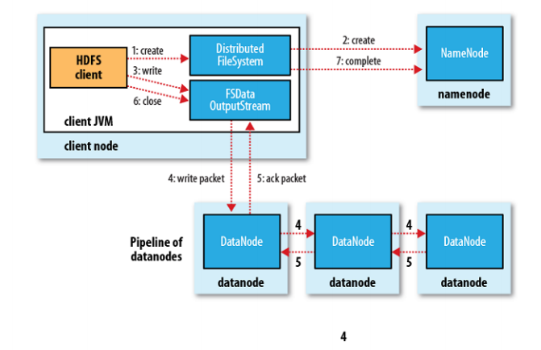

# HDFS

目录：

1. [HDFS思想][1]
2. [HDFS学习路线][2]
3. [HDFS目标和使用场景][3]
4. [datanode和namenode][4]
5. [hdfs读写过程][5]
6. [复制][6]
7. [文件系统元数据持久性][7]
8. [系统可靠性][8]
9. [数据组织][9]
10. [hdfs安装和使用][10]
11. [访问HDFS][11]
12. [文件删除和取消删除][12]
13. [参考资料][13]

### 1.HDFS思想

HDFS的思想就是**分而治之**，设想在单机环境下处理一个1TB文件的时间，可能会是好几个小时；但是想象一下如果有成千上完个计算几点同时参与计算，每个节点处理的数据量所耗费的时间是可以接受的，这样1TB文件的处理时间与普通大小文件的时间相差无几。

图1 hdfs思想

如图所示，绿色节点代表执行真正计算逻辑的计算节点。在集群环境下这样的计算节点可能会有10w+，每个计算节点处理的数据量为上百M，**这样一来整个数据集的计算任务就被拆分成普通任务的计算**。

仔细思考上面的思想，你会感受到这个思想特别厉害(so dope!)。厉害之处在于，这个思想其实很普通，但是它发挥出来的能力确实巨大的。

举个例子，现在时间是2020年11月1日，北京。现在正在人口普查，中国有13亿人。如果让一个省份去调查估计得累死，但是如果把这个任务分配到每个省，每个市，每个镇，每个乡，每个村，去进行统计，然后在 村<-乡<-镇<-市<-省统计结果，估计三天就可以完成。

HDFS的思想也是这样，掌握了这个思想，就很好理解HDFS的出发点。

### 2.HDFS学习路线

图2 hdfs学习路线

### 3.HDFS目标和使用场景

#### 硬件故障

硬件故障是正常现象，而非例外。HDFS实例可能包含数百或数千个服务器计算机，每个服务器计算机都存储文件系统数据的一部分。存在大量组件并且每个组件都有不小的故障概率这一事实意味着HDFS的某些组件始终无法正常工作。因此，**检测故障并从故障中快速自动恢复**是HDFS的核心架构目标。

#### 流式数据访问

在HDFS上运行的应用程序需要对其数据集的流访问。它们不是通常在通用文件系统上运行的通用应用程序。HDFS设计用于批处理，而不是用户交互使用。**重点在于数据访问的高吞吐量，而不是数据访问的低延迟**。POSIX提出了许多针对HDFS的应用程序不需要的硬性要求。交换了一些关键领域中的POSIX语义以提高数据吞吐率。

#### 大数据集

在HDFS上运行的应用程序具有大量数据集。HDFS中的典型文件大小为GB到TB。因此，HDFS已调整为支持大文件。它应提供较高的聚合数据带宽，并可以扩展到单个群集中的数百个节点。它应该在单个实例中支持数千万个文件。

#### 简单一致性模型

HDFS应用程序需要文件一次写入多次读取(**write-once-read-many**)访问模型。一旦创建，写入和关闭文件，除了追加和截断外，无需更改。支持将内容追加到文件末尾，但不能在任意点更新。该假设简化了数据一致性问题并实现了高吞吐量数据访问。MapReduce应用程序或Web爬网程序应用程序非常适合此模型。

#### Moving Computation is Cheaper than Moving Data

如果应用程序所请求的计算在其所操作的数据附近执行，则效率会高得多。当数据集的大小巨大时，尤其如此。这样可以最大程度地减少网络拥塞，并提高系统的整体吞吐量。假设通常是将计算迁移到更靠近数据的位置，而不是将数据移动到应用程序正在运行的位置。HDFS为应用程序提供了接口，使它们自己更靠近数据所在的位置。

####  跨异构硬件和软件平台的可移植性

HDFS被设计为可从一个平台轻松移植到另一个平台。这有助于将HDFS广泛用作大量应用程序的首选平台。

### 4.datanode和namenode

图3 hdfs架构

图4 数据节点-机架-数据中心 拓扑

HDFS具有主/从体系结构。HDFS群集由单个NameNode和管理文件系统名称空间并控制客户端对文件的访问的主服务器组成。此外，还有许多数据节点，通常是集群中每个节点一个，用于管理与它们所运行的节点相连的存储。HDFS公开了文件系统名称空间，并允许用户数据存储在文件中。在内部，文件被分成一个或多个块，这些块存储在一组DataNode中。NameNode执行文件系统名称空间操作，例如打开，关闭和重命名文件和目录。它还确定块到DataNode的映射。DataNode负责处理来自文件系统客户端的读写请求。DataNode还会执行块创建，删除。

对应英文：

HDFS has a master/slave architecture. An HDFS cluster consists of a single NameNode, a master server that manages the file system namespace and regulates access to files by clients. In addition, there are a number of DataNodes, usually one per node in the cluster, which manage storage attached to the nodes that they run on. HDFS exposes a file system namespace and allows user data to be stored in files. Internally, a file is split into one or more blocks and these blocks are stored in a set of DataNodes. The NameNode executes file system namespace operations like opening, closing, and renaming files and directories. It also determines the mapping of blocks to DataNodes. The DataNodes are responsible for serving read and write requests from the file system’s clients. The DataNodes also perform block creation, deletion, and replication upon instruction from the NameNode.

**记住这个即可：**

namenode 管理管理文件系统命名空间，发送文件打开、关闭、重命名操作、确定块到datanode的映射、维护文件的副本数(复制因子)

datanode 保存数据块、处理来自客户端的读写请求、执行数据库的创建和删除

### 5.hdfs读写过程

#### hdfs写过程

图5 hdfs写过程

1. 客户端向NameNode发出写文件请求。
2. 检查是否已存在文件、检查权限。若通过检查，**直接先将操作写入EditLog**，并返回输出流对象。 
   （注：WAL，write ahead log，先写Log，再写内存，因为EditLog记录的是最新的HDFS客户端执行所有的写操作。如果后续真实写操作失败了，由于在真实写操作之前，操作就被写入EditLog中了，故EditLog中仍会有记录，我们不用担心后续client读不到相应的数据块，因为在第5步中DataNode收到块后会有一返回确认信息，若没写成功，发送端没收到确认信息，会一直重试，直到成功）
3. client端**按128MB的块切分文件**。
4. client将NameNode返回的分配的可写的**DataNode列表**和**Data数据**一同发送给最近的第一个DataNode节点，此后client端和NameNode分配的多个DataNode构成pipeline管道，client端向输出流对象中写数据。client每向第一个DataNode写入一个packet，这个packet便会直接在pipeline里传给第二个、第三个…DataNode。 
   （注：并不是写好一个块或一整个文件后才向后分发）
5. 每个DataNode写完一个块后，会返回**确认信息**。 
   （注：并不是每写完一个packet后就返回确认信息，因为packet中的每个chunk都携带校验信息，没必要每写一个就汇报一下，这样效率太慢。正确的做法是写完一个block块后，对校验信息进行汇总分析，就能得出是否有块写错的情况发生）
6. 写完数据，关闭输输出流。
7. 发送完成信号给NameNode。 
   （注：发送完成信号的时机取决于集群是强一致性还是最终一致性，强一致性则需要所有DataNode写完后才向NameNode汇报。最终一致性则其中任意一个DataNode写完后就能单独向NameNode汇报，HDFS一般情况下都是强调强一致性）

注意：

1. 文件块分布的datanode是创建时namenode返回给client的

 	2. 文件分块是在client端完成
 	3. datanode之间的节点复制

#### hdfs读过程

图6 hdfs读过程

1. client访问NameNode，查询元数据信息，获得这个文件的数据块位置列表，返回输入流对象。
2. 就近挑选一台datanode服务器，请求建立输入流 。
3. DataNode向输入流中中写数据，以packet为单位来校验。
4. 关闭输入流

### 6.复制

HDFS旨在可靠地在大型群集中的计算机之间存储非常大的文件。它将每个文件存储为一系列块。复制文件的块是为了容错。块大小和复制因子是每个文件可配置的。

文件中除最后一个块外的所有块都具有相同的大小，而在添加了对可变长度块的支持后，用户可以在不填充最后一个块的情况下开始新的块，而不用配置的块大小。

应用程序可以指定文件的副本数。复制因子可以在文件创建时指定，以后可以更改。HDFS中的文件只能写入一次（追加和截断除外），并且在任何时候都只能具有一个写入器。

NameNode做出有关块复制的所有决定。它定期从群集中的每个DataNode接收心跳信号和Blockreport。收到心跳信号表示DataNode正常运行。Blockreport包含DataNode上所有块的列表。

#### 副本放置

在常见情况下，当复制因子为3时，HDFS的放置策略是：如果写入器位于数据节点上，则将一个副本放置在本地计算机上；否则，与写入器位于同一机架的随机数据节点上放置一个副本，将复制器放置在本地计算机上。一个节点（位于不同（远程）机架中），最后一个节点位于同一远程机架中的另一个节点上。该策略减少了机架间的写流量，通常可以提高写性能。机架故障的机会远少于节点故障的机会。此策略不会影响数据的可靠性和可用性保证。但是，由于一个块仅放置在两个唯一的机架中，而不是三个，因此它确实减少了读取数据时使用的总网络带宽。使用此策略，文件的副本不会在机架上均匀分布。三分之一的副本位于一个节点上，三分之二的副本位于一个机架上，其余三分之一则平均分布在其余机架上。此策略可提高写入性能，而不会影响数据可靠性或读取性能。

图7 副本放置

#### 副本选择

为了最大程度地减少全局带宽消耗和读取延迟，HDFS尝试满足最接近读取器的副本的读取请求。如果在与读取器节点相同的机架上存在一个副本，则首选该副本来满足读取请求。如果HDFS群集跨越多个数据中心，则驻留在本地数据中心中的副本比任何远程副本都优先。

#### 安全模式

启动时，NameNode进入一个特殊的状态，称为安全模式。当NameNode处于安全模式状态时，不会发生数据块的复制。NameNode从数据节点接收心跳和Blockreport消息。Blockreport包含DataNode托管的数据块列表。每个块都有指定的最小副本数。

假设我们设置的副本数（即参数dfs.replication）是5，那么在datanode上就应该有5个副本存在，假设只存在3个副本，那么比例就是3/5=0.6。在配置文件hdfs-default.xml中定义了一个最小的副本的副本率。我们的副本率0.6明显小于0.99，因此系统会自动的复制副本到其他的dataNode,使得副本率不小于0.999.如果系统中有8个副本，超过我们设定的5个副本，那么系统也会删除多余的3个副本。

注意：安全模式下，不允许客户端进行任何修改文件的操作,包括上传文件，删除文件，重命名，创建文件夹等操作

### 7.文件系统元数据持久型

HDFS命名空间由NameNode存储。NameNode使用一个称为EditLog的事务日志来永久记录文件系统元数据发生的所有更改。例如，在HDFS中创建一个新文件将导致NameNode将一条记录插入到EditLog中，以表明这一点。同样，更改文件的复制因子会导致将新记录插入到EditLog中。NameNode使用其本地主机OS文件系统中的文件来存储EditLog。整个文件系统名称空间（包括块到文件的映射和文件系统属性）存储在称为FsImage的文件中。FsImage也作为文件存储在NameNode的本地文件系统中。

NameNode在内存中保留整个文件系统名称空间和文件Blockmap的图像。当NameNode启动或由可配置的阈值触发检查点时，它将从磁盘读取FsImage和EditLog，将EditLog中的所有事务应用于FsImage的内存中表示形式，并将此新版本刷新为磁盘上的新FsImage。然后，它可以截断旧的EditLog，因为其事务已应用于持久性FsImage。此过程称为检查点。检查点的目的是通过对文件系统元数据进行快照并将其保存到FsImage来确保HDFS对文件系统元数据具有一致的视图。即使读取FsImage效率很高，但直接对FsImage进行增量编辑效率也不高。我们无需为每个编辑修改FsImage，而是将编辑保留在Editlog中。在检查点期间，来自Editlog的更改将应用于FsImage。可以在给定的时间间隔触发检查点（``以秒表示的`dfs.namenode.checkpoint.period`，或者在累积一定数量的文件系统事务之后（`dfs.namenode.checkpoint.txns`）。如果同时设置了这两个属性，则要达到的第一个阈值将触发检查点。

DataNode将HDFS数据存储在其本地文件系统中的文件中。DataNode不了解HDFS文件。它将每个HDFS数据块存储在其本地文件系统中的单独文件中。DataNode不会在同一目录中创建所有文件。而是使用启发式方法确定每个目录的最佳文件数，并适当创建子目录。在同一目录中创建所有本地文件不是最佳选择，因为本地文件系统可能无法有效地支持单个目录中的大量文件。当DataNode启动时，它将扫描其本地文件系统，生成与每个本地文件相对应的所有HDFS数据块的列表，并将此报告发送到NameNode。该报告称为*Blockreport*。

注意：上述原理与上一章节“分布式系统概述-数据库日志系统图片”里面的思想是一样的。

### 8.系统可靠性

DFS的主要目标是即使出现故障也能可靠地存储数据。三种常见的故障类型是NameNode故障，DataNode故障和网络分区。

#### 数据磁盘故障，心跳和复制

每个DataNode定期向NameNode发送心跳消息。网络分区可能导致一部分DataNode失去与NameNode的连接。NameNode通过缺少心跳消息来检测到这种情况。NameNode将没有最近心跳的DataNode标记为已死，并且不会将任何新的IO请求转发给它们。已注册到失效DataNode的任何数据不再可用于HDFS。DataNode死亡可能导致某些块的复制因子降至其指定值以下。NameNode不断跟踪需要复制的块，并在必要时启动复制。由于许多原因，可能需要进行重新复制：DataNode可能不可用，副本可能损坏，DataNode上的硬盘可能发生故障，

标记DataNode失效的超时保守地较长（默认情况下超过10分钟），以避免由DataNode的状态震荡引起的复制风暴。用户可以设置较短的时间间隔以将DataNode标记为过时，并通过配置来避免对性能敏感的工作负载进行读和/或写时出现过时的节点。

#### 集群再平衡

HDFS体系结构与数据重新平衡方案兼容。如果DataNode的可用空间低于某个阈值，则方案可能会自动将数据从一个DataNode移到另一个DataNode。如果对特定文件的需求突然增加，则方案可能会动态创建其他副本并重新平衡群集中的其他数据。这些类型的数据重新平衡方案尚未实现。

#### 数据的完整性

从DataNode提取的数据块可能会损坏。由于存储设备故障，网络故障或软件故障，可能会导致这种损坏。HDFS客户端软件对HDFS文件的内容执行校验和检查。客户端创建HDFS文件时，它将计算文件每个块的校验和，并将这些校验和存储在同一HDFS命名空间中的单独的隐藏文件中。客户端检索文件内容时，它将验证从每个DataNode接收到的数据是否与存储在关联的校验和文件中的校验和匹配。如果不是，则客户端可以选择从另一个具有该块副本的DataNode中检索该块。

#### 元数据磁盘故障

FsImage和EditLog是HDFS的中央数据结构。这些文件损坏可能导致HDFS实例无法正常运行。因此，可以将NameNode配置为支持维护FsImage和EditLog的多个副本。FsImage或EditLog的任何更新都会导致FsImages和EditLogs中的每个同步更新。FsImage和EditLog的多个副本的这种同步更新可能会降低NameNode可以支持的每秒名称空间事务处理的速度。但是，这种降级是可以接受的，因为即使HDFS应用程序本质上是数据密集型的，但它们也不是元数据密集型的。当NameNode重新启动时，它将选择要使用的最新一致的FsImage和EditLog。

增强抗故障能力的另一种方法是使用多个NameNode来启用高可用性，这些NameNode可以[在NFS上](https://hadoop.apache.org/docs/stable/hadoop-project-dist/hadoop-hdfs/HDFSHighAvailabilityWithNFS.html)使用[共享存储，](https://hadoop.apache.org/docs/stable/hadoop-project-dist/hadoop-hdfs/HDFSHighAvailabilityWithNFS.html)也可以使用[分布式编辑日志](https://hadoop.apache.org/docs/stable/hadoop-project-dist/hadoop-hdfs/HDFSHighAvailabilityWithQJM.html)（称为Journal）。推荐使用后者。

图8 系统可靠性

### 9.数据组织

#### 数据块

HDFS旨在支持非常大的文件。与HDFS兼容的应用程序是处理大型数据集的应用程序。这些应用程序仅写入一次数据，但读取一次或多次，并要求以流速度满足这些读取要求。HDFS支持文件上一次写入多次读取的语义。HDFS使用的典型块大小为128 MB。因此，HDFS文件被切成128 MB的块，并且如果可能的话，每个块将驻留在不同的DataNode上。

#### 复制管道

当客户端将数据写入复制因子为3的HDFS文件时，NameNode使用复制目标选择算法检索DataNode列表。该列表包含将托管该块副本的DataNode。然后，客户端写入第一个DataNode。第一个DataNode开始分批接收数据，将每个部分写入其本地存储库，然后将该部分传输到列表中的第二个DataNode。第二个DataNode依次开始接收数据块的每个部分，将该部分写入其存储库，然后将该部分刷新到第三个DataNode。最后，第三个DataNode将数据写入其本地存储库。因此，DataNode可以从管道中的前一个接收数据，同时将数据转发到管道中的下一个。

### 10.hdfs安装和使用

### 12.参考资料

1. https://hadoop.apache.org/docs/stable/hadoop-project-dist/hadoop-hdfs/HdfsDesign.html
2. https://blog.csdn.net/qq_27384769/article/details/80325967
3. https://blog.csdn.net/qq_27384769/article/details/79439801

思考：HDFS不适合存储小文件

> 元信息存储在NameNode内存中

一个节点的内存是有限的

> 存取大量小文件消耗大量的寻道时间

类比拷贝大量小文件与拷贝同等大小的一个大文件

> NameNode存储block数目是有限的

- 一个block元信息消耗大约150 byte内存
- 存储1亿个block，大约需要20GB内存
- 如果一个文件大小为10K，则1亿个文件大小仅为1TB（但要消耗掉NameNode 20GB内存）

**思想：对于一个大文件(例如:1TB)，数据块越大，则数据块数据越小，namenode内存中保存的元数据信息就越少。**