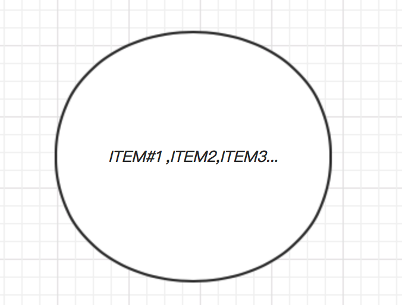

# MySQL事务特点和四种隔离特性

目录:

1. [简介][1]
2. [事务特性][2]
3. [事务隔离级别][3]
4. [事务提交][4]
5. [参考资料][5]


### 1.简介

一个事务涉及到大量的CPU操作和IO操作,这些操作被打包成一个执行单元,要么同时完成,要么同时不完成.事务是一组原子性SQL命令或者说一个独立的工作单元,如果数据库引擎能够成功对数据库应用该组的全部SQL语句.那么就执行该组命令.如果其中任何一条语句因为崩溃或者其它原因无法执行,那么该组所有的SQL语句都无法执行.


可以这么理解事务.事务是一组**TO DO LIST** ,事务的每个操作都是**TO DO LIST**里面的一个**ITEM**项.

```
-------TO DO LIST--------
#1.item1
#2.item2
#3.item3
....

-------TO DO LIST END---
```

事务的具体执行做法就是,逐个执行ITEM( one by one ).如果其中某个ITEM出错则回滚(rollback).


### 2.事务特性

**原子性**

一个事务中的所有操作,要么都完成,要么都不执行.对于一个事务来说,不能只执行其中的一部分.



<center>图1 事务原子性</center>

上图这个圆圈代表事务的原子性,一个**不被打破**的执行单元.

**一致性**

数据库总是从一个一致性状态转到另外一个一执行状态.

这个一执行状态怎么解释:银行账户300元(一致性状态),然后进行转出操作20元,那么目前银行帐户280(一致性转台)

**隔离性**

一个事务所做的修改在事务的最终提交之前,对其它事务是不可见的.多个事务之间的操作相互不影响,每降低一个事务隔离个别都能够提高数据库的并发.

**持久性**

一旦一个事务提交了,就算服务器崩溃,让要在下次启动的时候自动恢复.

结合事务日志完成:

​	事务日志写入磁盘的时候是顺序IO,写数据文件的时候是随机IO(数据地址不确定).一旦事务提交了,必须立即执行一个IO操作,确保此事务立即写入磁盘.

事务的状态:

​	活动(active) -----> 中止(pause/inactive)------> 活动 ------>  失败(failed) -------> 部分提交 -----> 提交


### 3.事务隔离级别

read uncommited (读未提交事务)

read commited (读已提交事务)

reputable read(可重复读)

serializable(可串行化)


脏读(dirty read): 读取到了其它事务未提交的内容

不可重复读(Nonrepetable read): 在同一个事务中,完全相同的select语句可能看到不一样的结果( so wired -_-!).

造成这样的结果可能原因:

​	(1) 有一个交叉的事务有新的commit,导致了数据的改变

​	(2) 一个数据库被多个实例操作时,同一事务的其它实例在该实例处理期间可能有新的commit

幻影读(phantom read): 读取某一个范围数据行的时候,另一个事务在该范围内插入了新行,当再一次读区这个范围的数据行时,会发现新的“幻影”行.

我个人称之为“眩晕读(duzzy read)”,因为这个感觉就像眼冒金星一样.第二次看到了新的东西(幻影行)


#### 读未提交事务- read uncommited

(1)所有事务都可以看到其它事务未提交的执行结果 -------TMD不乱了套了吗

(2)存在问题: 脏读,不可重复读,幻读


执行顺序:

1.select * from tx ; # 事务1

| id   | num  |
| ---- | ---- |
| 1    | 1    |
| 2    | 2    |
| 3    | 3    |

2.update tx set num=10 where id=1  # 事务2

| id   | num  |
| ---- | ---- |
| 1    | 10   |
| 2    | 2    |
| 3    | 3    |

3.select * from tx; #事务1

| id   | num  |
| ---- | ---- |
| 1    | 10   |
| 2    | 2    |
| 3    | 3    |

可以看到事务1读到了事务2未提交的数据


#### 读已提交事务- read commited

(1)一个事务只能看见已提交事务所做的改变

(2)存在不可重复读的问题


执行顺序:

1.select * from tx; #事务1

| id   | num  |
| ---- | ---- |
| 1    | 1    |
| 2    | 2    |
| 3    | 3    |

2.update tx set num=10 where id=1(不提交) #事务2

3.select * from tx; #事务1

| id   | num  |
| ---- | ---- |
| 1    | 1    |
| 2    | 2    |
| 3    | 3    |

因为事务2没有提交,所以事务2做的改变事务1看不见


#### 可重复读 - read repeatable

(1)解决不可重复读

(2)问题:幻影读


| 隔离级别 | 脏读 | 不可重复读 | 幻读 |
| -------- | ---- | ---------- | ---- |
| 读未提交 | y    | y          | y    |
| 读已提交 | x    | y          | y    |
| 可重复读 | x    | x          | y    |
| 串行化   | x    | x          | x    |


### 4.事务提交

**如果没有显式启动事务,数据库会根据autocommit的值,默认每条sql都会自动提交**


事务日志

事务要保证ACID完成性必须依靠事务日志跟踪,每一个操作在真正写入数据库之前,先写入到日志文件中.如果要删除一行数据会现在日志文件中将此行标记为删除,但是数据库中的文件并没有发生变化.只有在整个事务提交后,再把整个事务的sql语句批量同步到磁盘上的数据库文件.


### 5.参考资料

1. https://www.cnblogs.com/xrq730/p/5087378.html

2. https://www.cnblogs.com/devilwind/p/8058268.html

3. https://www.cnblogs.com/snsdzjlz320/p/5761387.html

4. https://www.cnblogs.com/zl0372/articles/mysql_16.html

5. https://www.cnblogs.com/yxh168/p/9174932.html

6. https://blog.csdn.net/weixin_43639512/article/details/84304672


[1]: #1简介
[2]: #2事务特性
[3]: #3事务隔离级别
[4]: #4事务提交
[5]: #5参考资料

