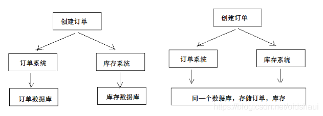
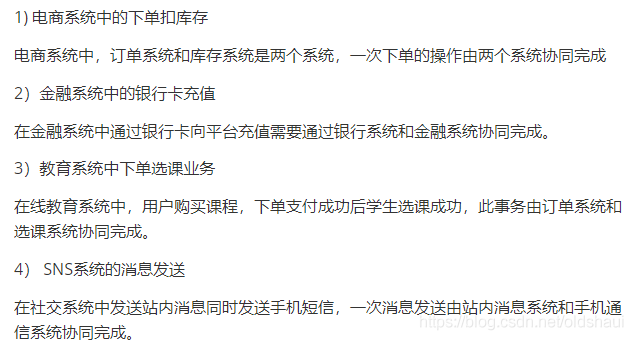
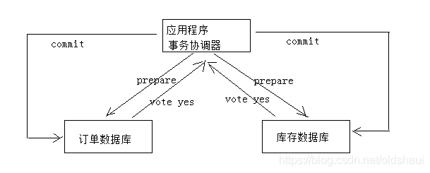
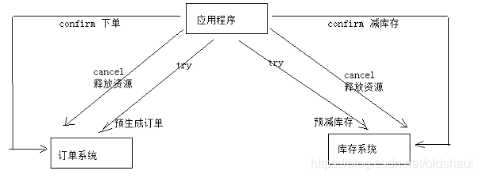

# Java微服务下的分布式事务介绍及其解决方案

目录：

1. [什么是分布式事务][1]
2. [分布式事务应用场景][2]
3. [分布式事务解决方案][3]
4. [参考资料][4]

### 1.什么是分布式事务

在分布式系统中，一次操作由多个系统协同完成。这种一次操作涉及多个系统通过网络协同完成的过程称为分布式事务。这里强调的是多个系统通过网络协同完成一个事务的过程，并不是强调多个系统访问了不同的数据库，即使多个系统访问的是同一个数据库也是分布式事务。

图1 分布式事务

### 2.分布式事务应用场景

图2 分布式事务应用场景

如图是分布式事务的几个应用场景，这里面都涉及到多个系统之间的协作过程。

### 3.分布式事务解决方案

* 2PC
* TCC
* 消息队列

#### 2PC

1）第一阶段：准备阶段（prepare）
 协调者通知参与者准备提交订单，参与者开始投票。
 协调者完成准备工作向协调者回应Yes。
 2）第二阶段：提交(commit)/回滚(rollback)阶段
 协调者根据参与者的投票结果发起最终的提交指令。
 如果有参与者没有准备好则发起回滚指令。
 一个下单减库存的例子：
 

图2 2PC

1、应用程序连接两个数据源

 2、应用程序通过事务协调器向两个库发起prepare，两个数据库收到消息分别执行本地事务（记录日志），但不提交，如果执行成功则回复yes，否则回复no。
 3、事务协调器收到回复，只要有一方回复no则分别向参与者发起回滚事务，参与者开始回滚事务。
 4、事务协调器收到回复，全部回复yes，此时向参与者发起提交事务。如果参与者有一方提交事务失败则由事务协调器发起回滚事务。
 2PC的优点：实现强一致性，部分关系数据库支持（Oracle、MySQL等）。
 缺点：整个事务的执行需要由协调者在多个节点之间去协调，增加了事务的执行时间，性能低下。

### TCC

TCC事务补偿是基于2PC实现的业务层事务控制方案，它是Try、Confirm和Cancel三个单词的首字母，含义如下：
 1、Try 检查及预留业务资源完成提交事务前的检查，并预留好资源。
 2、Confirm 确定执行业务操作
 对try阶段预留的资源正式执行。
 3、Cancel 取消执行业务操作
 对try阶段预留的资源释放。
 下边用一个下单减库存的业务为例来说明

图3 TCC 

 1、Try
 下单业务由订单服务和库存服务协同完成，在try阶段订单服务和库存服务完成检查和预留资源。
 订单服务检查当前是否满足提交订单的条件（比如：当前存在未完成订单的不允许提交新订单）。
 库存服务检查当前是否有充足的库存，并锁定资源。
 2、Confirm
 订单服务和库存服务成功完成Try后开始正式执行资源操作。
 订单服务向订单写一条订单信息。
 库存服务减去库存。
 3、Cancel
 如果订单服务和库存服务有一方出现失败则全部取消操作。
 订单服务需要删除新增的订单信息。
 库存服务将减去的库存再还原。
 优点：最终保证数据的一致性，在业务层实现事务控制，灵活性好。
 缺点：开发成本高，每个事务操作每个参与者都需要实现try/confirm/cancel三个接口。
 注意：TCC的try/confirm/cancel接口都要实现幂等性，在为在try、confirm、cancel失败后要不断重试。

###### 幂等性

幂等性是指同一个操作无论请求多少次，其结果都相同。
 幂等操作实现方式有：
 1、操作之前在业务方法进行判断如果执行过了就不再执行。
 2、缓存所有请求和处理的结果，已经处理的请求则直接返回结果。
 3、在数据库表中加一个状态字段（未处理，已处理），数据操作时判断未处理时再处理。

#### 消息队列

本方案是将分布式事务拆分成多个本地事务来完成，并且由消息队列异步协调完成，如下图：
 下边以下单减少库存为例来说明：

图4 消息队列实现事务最终一致性M

 1、订单服务和库存服务完成检查和预留资源。
 2、订单服务在本地事务中完成添加订单表记录和添加“减少库存任务消息”。
 3、由定时任务根据消息表的记录发送给MQ通知库存服务执行减库存操作。
 4、库存服务执行减少库存，并且记录执行消息状态（为避免重复执行消息，在执行减库存之前查询是否执行过此消息）。
 5、库存服务向MQ发送完成减少库存的消息。
 6、订单服务接收到完成库存减少的消息后删除原来添加的“减少库存任务消息”。
 实现最终事务一致要求：预留资源成功理论上要求正式执行成功，如果执行失败会进行重试，要求业务执行方法实现幂等。
 优点 ：
 由MQ按异步的方式协调完成事务，性能较高。
 不用实现try/confirm/cancel接口，开发成本比TCC低。
 缺点：
 此方式基于关系数据库本地事务来实现，会出现频繁读写数据库记录，浪费数据库资源，另外对于高并发操作不是最佳方案。

[1]: #1什么是分布式事务
[2]: #2分布式事务应用场景
[3]: #3分布式事务解决方案
[4]: #4参考资料