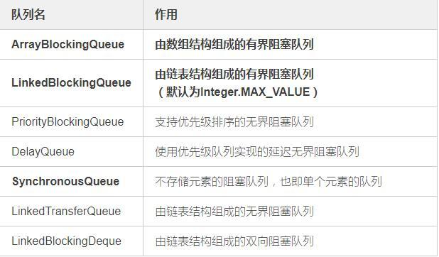
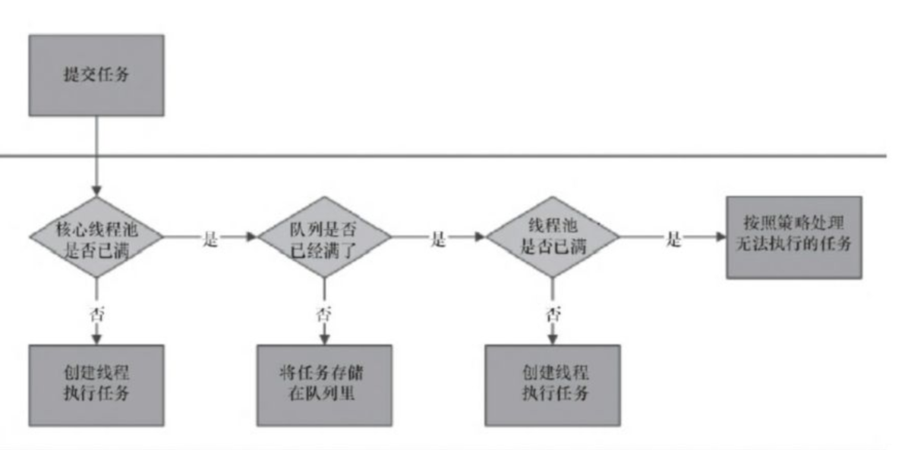

# 线程池-ThreadPoolExecutor

目录：

1. [简介][1]
3. [如何重用线程][2]
4. [阻塞队列][3]
5. [线程池任务执行流程][4]
6. [线程池状态转换][5]
10. [参考资料][5]


### 1.简介

java中所有的池化技术都有一个好处，就是通过复用池中的对象，降低系统资源消耗。设想一下如果我们有n多个子任务需要执行，如果我们为每个子任务都创建一个执行线程，而创建线程的过程是需要一定的系统消耗的，最后肯定会拖慢整个系统的处理速度。而通过线程池我们可以做到复用线程，任务有多个，但执行任务的线程可以通过线程池来复用，这样减少了创建线程的开销，系统资源利用率得到了提升。


### 2.如何重用线程

通过阻塞队列，线程从阻塞队列中获取任务，如果没有任务就阻塞到队列的等待线程列表中。


### 3.阻塞队列

BlockingQueue提供插入和移除两类方法


<center>图1 BlockQueue提供的插入和移除方法</center>

抛出异常：这时候插入和取出在不能立即被执行的时候就会抛出异常。

特殊值：插入和取出在不能被立即执行的情况下会返回一个特殊的值（true 或者 false）

阻塞：插入和取出操作在不能被立即执行时会阻塞线程，直到条件成熟，被其他线程唤醒

超时：插入和取出操作在不能立即执行的时候会被阻塞一定的时候，如果在指定的时间内没有被执行，那么会返回一个特殊值。


常见的阻塞队列：



<center>图2 常见的阻塞队列</center>

### 4.线程池任务执行流程



<center>图3 线程池执行流程</center>

​	首先判断核心线程池是否满，如果没有满则创建线程执行任务；否则将任务放到任务队列，如果队列满则创建线程，如果线程池满则采用拒绝策略。

拒绝策略有：

CallerRunsPolicy 在调用线程中执行任务

AbortPolicy 拒绝任务，并抛出RejectedExecutionExecution异常

DiscardPolicy 忽略任务

DiscardPolicy 移除队列中oldest task


### 5.线程池状态转换


<center>图4 线程池状态转换</center>

1、RUNNING

(1) 状态说明：线程池处在RUNNING状态时，能够接收新任务，以及对已添加的任务进行处理。 
 (02) 状态切换：线程池的初始化状态是RUNNING。换句话说，线程池被一旦被创建，就处于RUNNING状态，并且线程池中的任务数为0！

```
private final AtomicInteger ctl = new AtomicInteger(ctlOf(RUNNING, 0));
```

2、 SHUTDOWN

(1) 状态说明：线程池处在SHUTDOWN状态时，不接收新任务，但能处理已添加的任务。 
 (2) 状态切换：调用线程池的shutdown()接口时，线程池由RUNNING -> SHUTDOWN。

3、STOP

(1) 状态说明：线程池处在STOP状态时，不接收新任务，不处理已添加的任务，并且会中断正在处理的任务。 
 (2) 状态切换：调用线程池的shutdownNow()接口时，线程池由(RUNNING or SHUTDOWN ) -> STOP。

4、TIDYING

(1)  状态说明：当所有的任务已终止，ctl记录的”任务数量”为0，线程池会变为TIDYING状态。当线程池变为TIDYING状态时，会执行钩子函数terminated()。terminated()在ThreadPoolExecutor类中是空的，若用户想在线程池变为TIDYING时，进行相应的处理；可以通过重载terminated()函数来实现。 
 (2) 状态切换：当线程池在SHUTDOWN状态下，阻塞队列为空并且线程池中执行的任务也为空时，就会由 SHUTDOWN -> TIDYING。 
 当线程池在STOP状态下，线程池中执行的任务为空时，就会由STOP -> TIDYING。

5、 TERMINATED

(1) 状态说明：线程池彻底终止，就变成TERMINATED状态。 
 (2) 状态切换：线程池处在TIDYING状态时，执行完terminated()之后，就会由 TIDYING -> TERMINATED。


### 6.参考资料

1. https://blog.csdn.net/qq_31262175/article/details/90672095
2. https://baijiahao.baidu.com/s?id=1659873724613844132&wfr=spider&for=pc
3. https://www.jianshu.com/p/32665a52eba1
4. https://www.jianshu.com/p/b7f7eb2bc778
5. https://www.cnblogs.com/dwlsxj/p/Thread.html
6. https://www.jianshu.com/p/5847f8759ea6
7. https://blog.csdn.net/xiaoliuliu2050/article/details/88246816


[1]: #1简介
[2]: #2如何重用线程
[3]: #3阻塞队列
[4]: #4线程池任务执行流程
[5]: #5线程池状态转换
[6]: #6参考资料