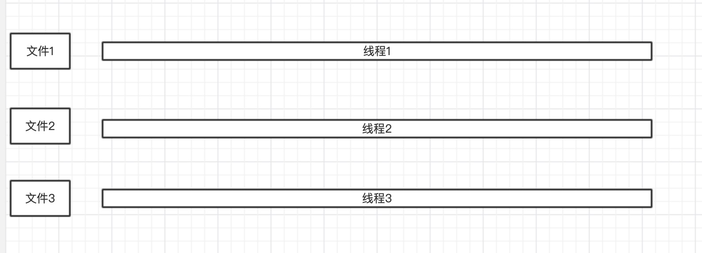
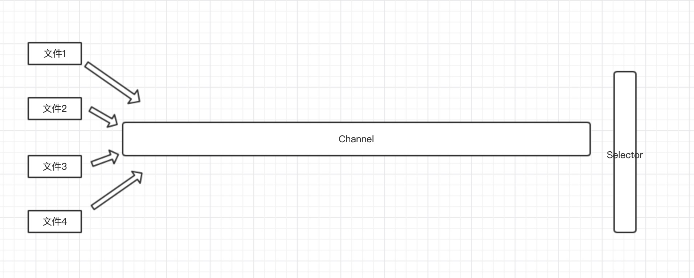
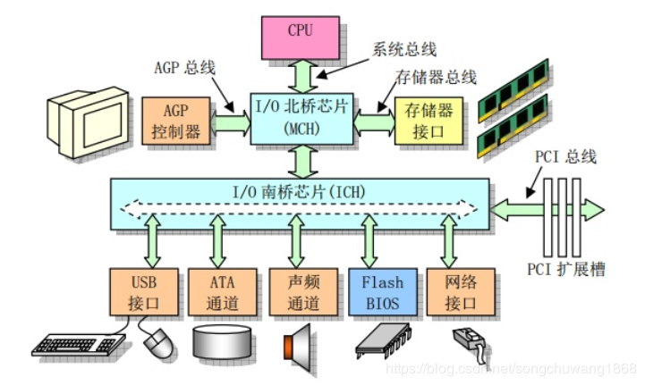
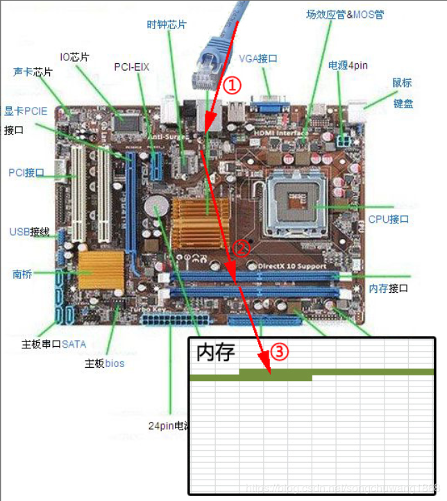
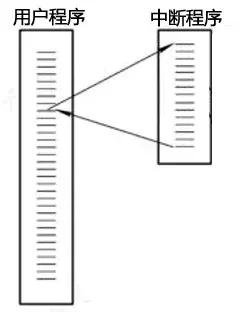
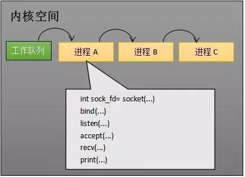
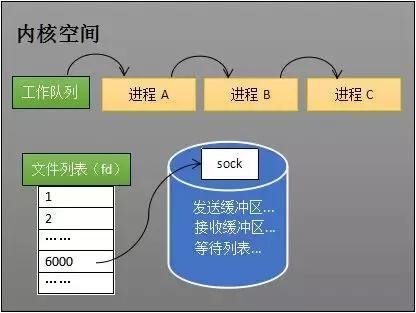
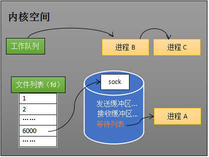
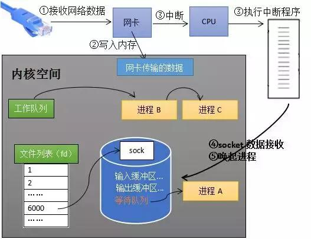
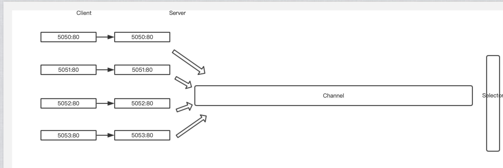

# Java NIO

目录：

1. [简介][1]
2. [NIO原理][2]
3. [NIO操作系统层面原理][3]
4. [流程][4]
5. [参考资料][5]

### 1.简介

Java NIO主要有三部分组成通道(`Channel`)、缓冲区(`Buffer`)、选择器(`Selector`)。传统的IO是面向字节流和字符流的，而NIO基于Channel和Buffer(缓冲区)进行操作，数据总是从通道读取到缓冲区中，或者从缓冲区写入到通道中。Selector(选择区)用于监听同一个通道里面每个的事件（比如：连接打开，数据到达）。因此，单个线程可以监听多个数据通道。

NIO和传统IO（一下简称IO）之间第一个最大的区别是，IO是面向流的，NIO是面向缓冲区的。 Java  IO面向流意味着每次从流中读一个或多个字节，直至读取所有字节，它们没有被缓存在任何地方。此外，它不能前后移动流中的数据。如果需要前后移动从流中读取的数据，需要先将它缓存到一个缓冲区。NIO的缓冲导向方法略有不同。数据读取到一个它稍后处理的缓冲区，需要时可在缓冲区中前后移动。这就增加了处理过程中的灵活性。但是，还需要检查是否该缓冲区中包含所有您需要处理的数据。而且，需确保当更多的数据读入缓冲区时，不要覆盖缓冲区里尚未处理的数据。

IO的各种流是阻塞的。这意味着，当一个线程调用read() 或  write()时，该线程被阻塞，直到有一些数据被读取，或数据完全写入。该线程在此期间不能再干任何事情了。  NIO的非阻塞模式，使一个线程从某通道发送请求读取数据，但是它仅能得到目前可用的数据，如果目前没有数据可用时，就什么都不会获取。而不是保持线程阻塞，所以直至数据变得可以读取之前，该线程可以继续做其他的事情。 非阻塞写也是如此。一个线程请求写入一些数据到某通道，但不需要等待它完全写入，这个线程同时可以去做别的事情。  线程通常将非阻塞IO的空闲时间用于在其它通道上执行IO操作，所以一个单独的线程现在可以管理多个输入和输出通道（channel）。

### 2.NIO原理

​	**Java NIO**的原理本质上是**IO复用技术**。使用一个/几个线程去监视多个IO文件的变化，当其中某个文件可读、可写时，则发出**读事件**或者**写事件**，然后将事件传给相应的使用这个文件的工作线程，这个工作线程就可以对这个文件进行读写。如图所示。

图1 Java 阻塞IO

​	上图是Java经典的阻塞IO，对于每一个文件启用一个线程去进行读写，这样的弊端在于文件读写经常会出现阻塞(**数据没有准备好**)的情况，此时线程就得处于阻塞阻塞状态，**不能执行其他的代码**。并且当系统中出现大量IO阻塞的情况时，就会造成大量线程出现阻塞的情况，影响系统的正常运行。

​	如果上图的文件是服务器中的连接，那么每一个线程处理一个连接，当线程出现阻塞时，会影响服务器的工作线程数目，导致服务器的服务质量下降

图2 Java NIO

​	如图所示，Java NIO模型。其中使用一个线程(Selector)去监听`Channel`中文件状态的变化，当出现读写事件时，将事件传给系统中的工作线程，工作线程就可以直接进行读写即可。**这样的优点是，避免了线程阻塞；将工作线程和文件读写状态分离，只有当出现读写事件工作线程才去进行读写，其他时间可以执行别的代码**

### 3. NIO操作系统层面的原理

##### 3.1 网卡接收数据

下图是一个典型的计算机结构图，计算机由CPU、存储器（内存）、网络接口等部件组成。了解epoll本质的**第一步**，要从**硬件**的角度看计算机怎样接收网络数据。

图3 计算机结构

下图展示了网卡接收数据的过程。在①阶段，网卡收到网线传来的数据；经过②阶段的硬件电路的传输；最终将数据写入到内存中的某个地址上（③阶段）。这个过程涉及到DMA传输、IO通路选择等硬件有关的知识，但我们只需知道：**网卡会把接收到的数据写入内存。**

图4 网卡接收数据过程

#### 3.2 如何知道接收了数据

了解epoll本质的**第二步**，要从**CPU**的角度来看数据接收。要理解这个问题，要先了解一个概念——中断。

计算机执行程序时，会有优先级的需求。比如，当计算机收到断电信号时（电容可以保存少许电量，供CPU运行很短的一小段时间），它应立即去保存数据，保存数据的程序具有较高的优先级。

一般而言，由硬件产生的信号需要cpu立马做出回应（不然数据可能就丢失），所以它的优先级很高。cpu理应中断掉正在执行的程序，去做出响应；当cpu完成对硬件的响应后，再重新执行用户程序。中断的过程如下图，和函数调用差不多。只不过函数调用是事先定好位置，而中断的位置由“信号”决定。

图5 中断

 

现在可以回答本节提出的问题了：当网卡把数据写入到内存后，**网卡向cpu发出一个中断信号，操作系统便能得知有新数据到来**，再通过网卡**中断程序**去处理数据。

#### 3.3CPU阻塞队列和工作队列

操作系统为了支持多任务，实现了进程调度的功能，会把进程分为“运行”和“等待”等几种状态。运行状态是进程获得cpu使用权，正在执行代码的状态；等待状态是阻塞状态，比如执行recv(**Linux接收函数**)函数时，程序会从运行状态变为等待状态，接收到数据后又变回运行状态。操作系统会分时执行各个运行状态的进程，由于速度很快，看上去就像是同时执行多个任务。

下图中的计算机中运行着A、B、C三个进程，其中进程A执行着上述基础网络程序，一开始，这3个进程都被操作系统的工作队列所引用，处于运行状态，会分时执行。

图6 工作队列中有A、B和C三个进程

当进程A执行到创建socket的语句时，操作系统会创建一个由文件系统管理的socket对象（如下图）。这个socket对象包含了发送缓冲区、接收缓冲区、等待队列等成员。等待队列是个非常重要的结构，它指向所有需要等待该socket事件的进程。

图7 创建socket

当程序执行到recv时，操作系统会将进程A从工作队列移动到该socket的等待队列中（如下图）。由于工作队列只剩下了进程B和C，依据进程调度，cpu会轮流执行这两个进程的程序，不会执行进程A的程序。**所以进程A被阻塞，不会往下执行代码，也不会占用cpu资源**。

图8 socket的等待队列

ps：操作系统添加等待队列只是添加了对这个“等待中”进程的引用，以便在接收到数据时获取进程对象、将其唤醒，而非直接将进程管理纳入自己之下。上图为了方便说明，直接将进程挂到等待队列之下。

**唤醒进程**

当socket接收到数据后，操作系统将该socket等待队列上的进程重新放回到工作队列，该进程变成运行状态（当socket事件触发时，也就是有数据到来，会取下一个进程结构调用其回调，将其挂到工作队列中），继续执行代码。也由于socket的接收缓冲区已经有了数据，recv可以返回接收到的数据。

#### 3.4 内核接收数据全过程

如下图所示，进程在recv阻塞期间，计算机收到了对端传送的数据（步骤①）。数据经由网卡传送到内存（步骤②），然后网卡通过中断信号通知cpu有数据到达，cpu执行中断程序（步骤③）。此处的中断程序主要有两项功能，先将网络数据写入到对应socket的接收缓冲区里面（步骤④），再唤醒进程A（步骤⑤），重新将进程A放入工作队列中。

图9 图内核接收数据全过程

唤醒进程的过程如下图所示。

图10 唤醒进程

### 4.流程

​	了解了操作系统如何接收数据，以及如何挂起和唤醒进程后，再来分析一下NIO的流程

图11 流程

如图当所有的Socket没有事件(OP_ACCEPT(接受数据)，OP_CONNECT(连接) ，OP_WRITE(写) ，OP_READ(读))时，Selector阻塞，直到出现上面上面四种事件之一，终端程序向CPU发出中断，将Selector放到工作队列，将后将相应的事件交给工作线程；将事件交付后，如果没有其他的事件，则Selctor继续阻塞。

### 5.参考资料

1. https://blog.csdn.net/songchuwang1868/article/details/89877739 强烈推荐
2. https://blog.csdn.net/forezp/article/details/88414741

[1]: #1简介
[2]: #2nio原理
[3]: 	#3nio操作系统层面的原理
[4]: #4流程
[5]: #5参考资料

