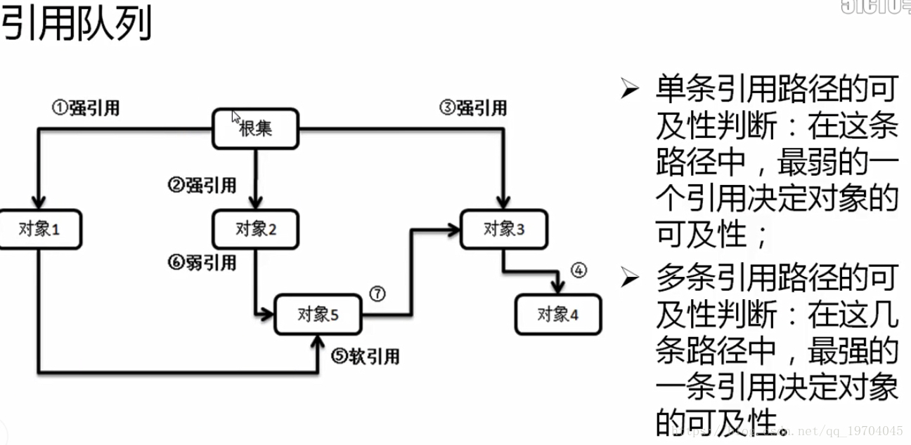
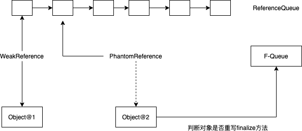
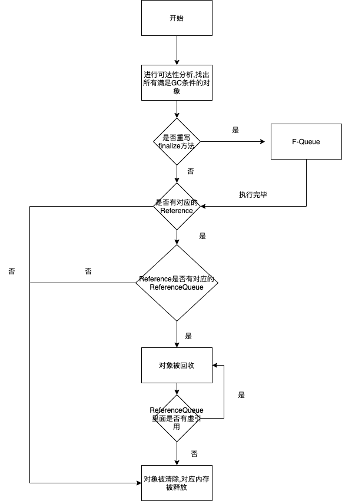

# Java引用类型

目录：

1. [简介][1]
2. [引用类型][2]
3. [引用队列][3]
4. [虚引用的使用场景][4]
5. [垃圾回收带来的内存泄漏问题][5]
6. [总结][6]
7. [参考资料][7]


### 1.简介

`Java Reference`即Java对象的引用。在Java中通过引用来操作Java对象。

```java
Object obj = new Object();
```
其中，`obj`指向`new Object()`，即为一个引用.

Java中的垃圾回收(Garbage Collection)机制判断是否回收某个对象的时候,需要根据`引用`这个概念.通常有两种判断对象是否需要回收的方法: 

* 引用计数法        
    为每个对象添加一个引用计数器,每当一个引用指向对象时,计数器就加1,当引用失效(obj=null/引用不指向对象)时,计数器就减1,当计数器为0时,则认为这个对象可以被回收.       

    缺点：对象只有“被引用”，和“未被引用”两种状态，无法满足某些特殊情况下的场景，比如内存紧张时要回收一些对象。**而且无法解决对象间互相引用的情况,A<->B,这种情况我称之为"对象间的抱团取暖"**

* 可达性分析        
    从GC Roots(跟节点)的对象开始像下搜索，如果GC Roots到对象之间没有任何`引用链`时,则说明对象不可用.        

    从引用链延伸出了“强引用、软引用、弱引用、虚引用”，这四种引用配合引用链来说明对象的引用情况，从而适用于不同场景下(如内存紧张、GC发生)对象是否需要回收的情况.


### 2.引用类型

* 强引用(Strong Reference)        
    强引用是Java默认支持的一种操作模式，也就是说在引用的处理其间，即使出现有GC，即使内存不足，该引用的数据也不会被回收。

* 软引用(Soft Reference)        
    **内存不足**时才进行GC的空间释放
    
    ```java
    String s = new String("soft reference");
    SoftReference<String> soft = new SoftReference<>(s);
    s = null;
    System.gc();
    ```
其中，对象只有在内存不足的情况下，才会被GC回收      
    
应用：软引用中保存的内容如果在内存富裕的时候会继续保留，内存不足会作为第一批的丢弃者进行垃圾空间的释放。可以`作为高速缓存组件`
    
* 弱引用(Weak Reference)        
    GC发生时就回收对象.

* 虚引用(Phantom Reference)     
    无法从引用队列中获取对引用对象,只能判断对象是否被加入到了引用队列.
```java
String s = new String("Phantom Reference");
ReferenceQueue<String> queue = new ReferenceQueue<>();
PhantomReference<String> pr = new PhantomReference<>(s,queue);
str = null; // 断开强引用
pr.isEnqueued(); // true 能够判断对象是否被加入了引用队列
pr.get(); // 无法获得引用对象
```

* 引用队列(Reference Queue)     
    Reference queues, to which registered reference objects are appended by the garbage collector after the appropriate reachability changes are detected.      

    当引用对象的可达性发生变化时，就会被垃圾收集器(garbage collector)添加到引用队列中来

    * 可达性分析        


<center>图1 可达性分析</center>

原则：      
1. 对象可及性是由引用链上面最弱的引用决定的(木桶理论)
2. 多个引用链的情况下,对象的引用是最强的引用决定的

例如,对于对象5来说由两条引用链.
* 1 -> 5 (强引用 -> 软引用)
* 2 -> 6 (强引用 -> 弱引用)

根据上面的原则来判断,对象5的可达性为软引用.

### 3.引用队列

`"ReferenceQueue,to which registered reference objects are appended by the garbage collector after appropriate reachability changes are detected"` 这句话是ReferenceQueue源码中的解释，即当垃圾收集器探测到对象可达性发生变化时就会把“引用对象”放到引用队列中，需要注意的是引用队列并不是一个真正的队列，而是通过“引用对象”之间采用head,next这样的链表形式表示的。

如图是垃圾回收器对Reference和Reference的使用



<center>图2 垃圾回收过程</center>

首先当垃圾回收器发生垃圾回收动作时(GC)，会分析对象的可达性，所有满足GC条件可达性的对象都会被检测；然后判断对象是否重写了finalize方法，将重写finalize方法的对象放到F-Queue中执行，如果在finalize方法中对象的可达性发生了变化，可以进行“自救”，避免被垃圾回收器进行回收；当执行完finalize方法后，如果对象有相应的Reference，则将Reference放入到其初始化时关联的ReferenceQueue 中，然后进行对象回收；此时Reference对象的`get()`方法返回为null，`isEnqueued`方法返回为true；


### 4.虚引用的使用场景

特别地，对于虚引用引用的对象。在其被放入到引用队列时`get()`方法返回为null，`isEnqueued`方法返回为true，对象变得不可达；`但是虚引用初始化时关联的对象(referent)虽然被回收，但是没有被清除(即对象占用的内存空间没有被释放),只有当虚引用本身变得不可访问时其关联的对象才会被回收`

它的作用在于跟踪垃圾回收过程，在对象被收集器回收时收到一个系统通知。  当垃圾回收器准备回收一个对象时，如果发现它还有虚引用，就会在垃圾回收后，将这个虚引用加入引用队列，在其关联的虚引用出队前，不会彻底销毁该对象。  所以可以通过检查引用队列中是否有相应的虚引用来判断对象是否已经被回了。


### 5.垃圾回收带来的内存泄漏问题

### 内存泄露原因分析

在JAVA中JVM的栈记录了方法的调用，每个线程拥有一个栈。在线程的运行过程当中，执行到一个新的方法调用，就在栈中增加一个内存单元，即帧(frame)。在frame中，保存有该方法调用的参数、局部变量和返回地址。然而JAVA中的局部变量只能是基本类型变量(int)，或者对象的引用。**所以在栈中只存放基本类型变量和对象的引用。**引用的对象保存在堆中。

**当某方法运行结束时，该方法对应的frame将会从栈中删除，frame中所有局部变量和参数所占有的空间也随之释放。线程回到原方法继续执行，当所有的栈都清空的时候，程序也就随之运行结束。**

而对于堆内存，堆存放着普通变量。**在JAVA中堆内存不会随着方法的结束而清空**，所以在方法中定义了局部变量，在方法结束后变量依然存活在堆中。

综上所述，栈(stack)可以自行清除不用的内存空间。但是如果我们不停的创建新对象，堆(heap)的内存空间就会被消耗尽。所以JAVA引入了垃圾回收(garbage collection，简称GC)去处理堆内存的回收，但如果对象一直被引用无法被回收，造成内存的浪费，无法再被使用。所以**对象无法被GC回收**就是造成内存泄露的原因！


**对于各种连接，数据库连接，网络连接，IO连接等没有显式调用close关闭，不被GC回收导致内存泄露。这一点在底层代码的时候需要注意！！**


### 6.总结



<center>图3 垃圾回收全流程</center>

如图所示是java回收过程的整个流程。对于java对象回收来说在数据库


### 7.参考资料

1. https://www.cnblogs.com/liyutian/p/9690974.html
2. https://blog.csdn.net/qq_19704045/article/details/80646437
3. https://www.cnblogs.com/mfrank/p/9837070.html
4. https://blog.csdn.net/shijiujiu33/article/details/104547837


[1]: #1简介
[2]: #2引用类型
[3]: #3应用
[4]: #4虚引用的使用场景
[5]: #5垃圾回收带来的内存泄漏问题
[6]: #6总结
[7]: #参考资料