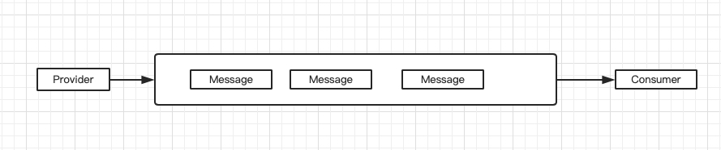
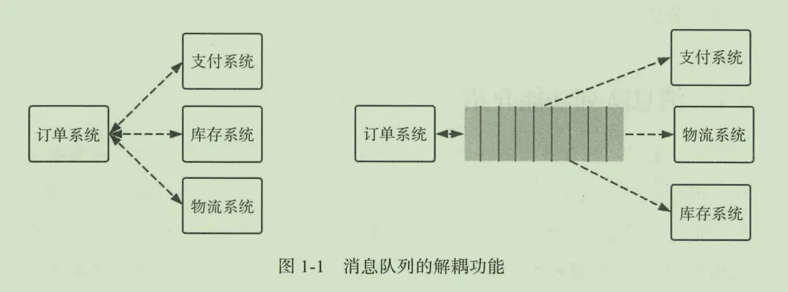
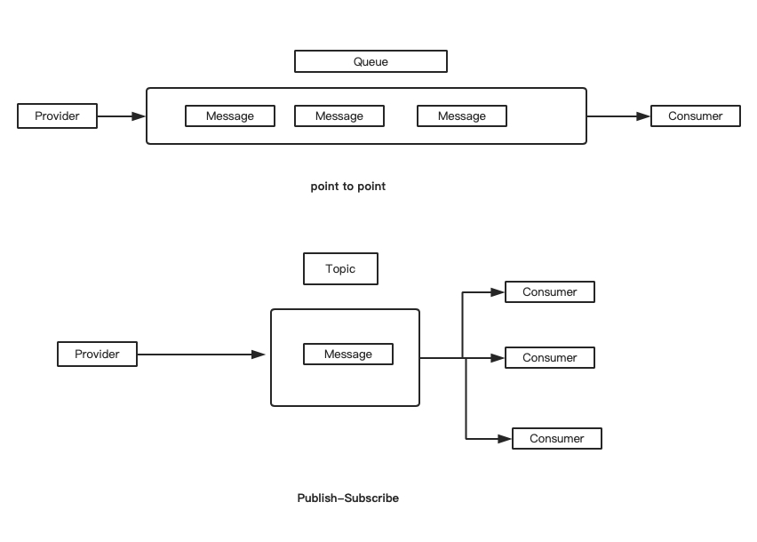
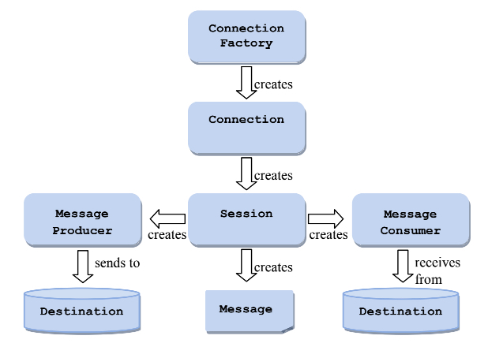
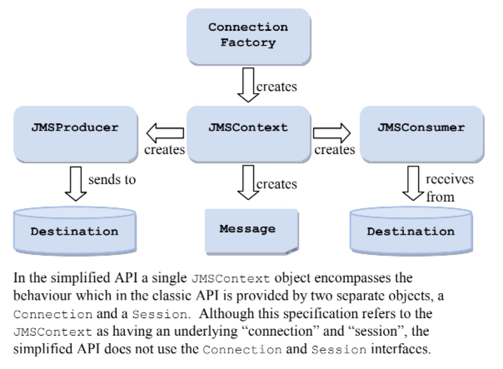
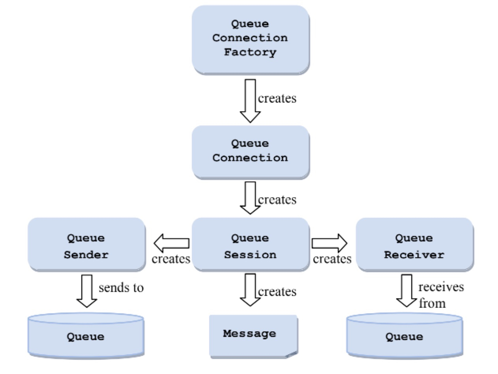
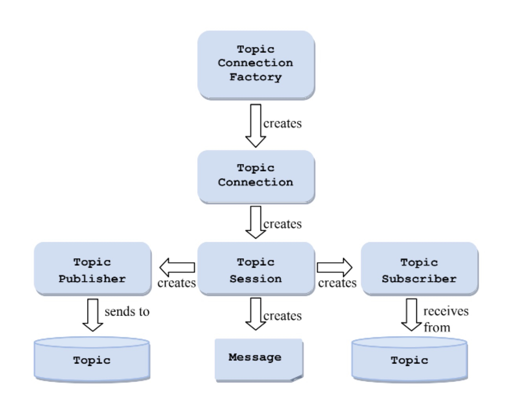
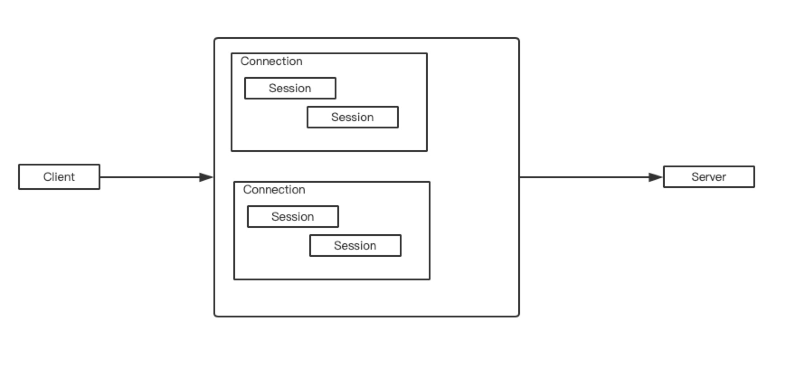
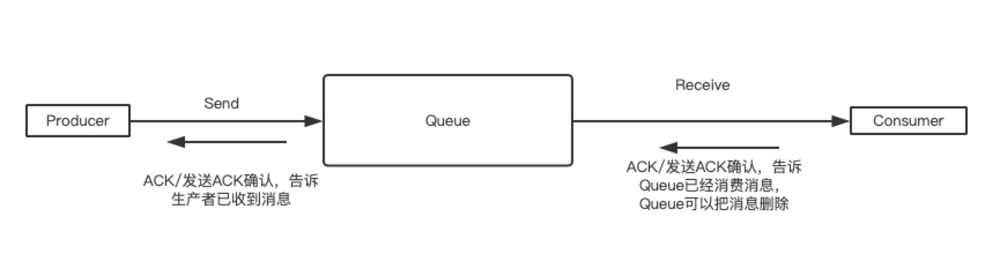
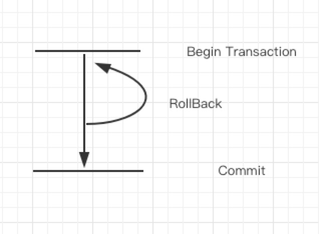

# Introduction

目录：

1. [简介][1]
2. [使用场景][2]
3. [特点][3]
4. [MQ相关名词][4]
5. [Active MQ使用例子][5]
6. [总结][6]
7. [参考][7]
8. [QA][8]


### 1.简介

`JMS`及java message service，即java消息服务。JMS是一套面向消息中间件的API接口规范，用于在不同的程序中**异步**的发送消息。JMS本身与语言无关，绝大多数的消息中间件厂商都提供了对JMS的支持。给予JMS实现的消息中间件，也叫做JMS Provider

消息服务，传递的载体是消息(message)。在JMS中，消息主体可以分为几个类型：简单文本(TextMessage)、可序列化的对象(ObjectMessage)、属性集合(MapMessage)、字节流(BytesMessage)、原始值流(StreamMessage)

消息队列是一种FIFO的数据结构。如下图:



<center>图1 消息队列</center>

如图，其中Provider是生产者，负责提供消息；Consumer是消费者，负责消费消息。Message是消息体，放在队列当中。


### 2.使用场景

**应用解耦**

以电商系统为例，应用中有订单系统，库存系统，物流系统，支付系统。用户创建订单后，如果**耦合**调用库存系统，物流系统，支付系统(具体手段：在代码中直接调用相关系统的API)。任何一个子系统出现故障都会造成订单失败。



<center>图2 应用解耦</center>


当引入消息队列的方式后，订单系统把订单相关信息转变成消息放在消息队列。即使支付系统，物流系统，库存系统当中出现故障也不会导致订单系统出错。当出现故障的系统恢复后，可以继续消费这个订单消息。


**流量消峰**

还是以电商系统为例，订单系统的吞吐量是10000订单/s。但是在流量高峰时期，用户数远远大于这个值，就会造成某些用户不能下单的情况。引入消息队列后，不能立即处理的订单可以先放到消息队列，这样下单后的界面可以变成“订单处理中”，而不是界面一直“未响应”的状态，这样的用户体验就好得多。


**消息发布**

消息发布有两种模式，分别是p2p(point to point)和发布-订阅模式(publish-subscribe)。其中p2p模式指的是有一个生产者和消费者，生产者将消息放到queue中，消息者进行消费。发布订阅模式针对topic，订阅方订阅topic。



<center>图3 消息模式</center>

对于Publish-Subscribe模式来说，当生产者进行消息发布时，凡是订阅了这个topic的都会消费这个消息


**异步消息**

有些服务间调用是异步的，例如A调用B，但是B的响应时间过长，这时候同步操作是不合适的。可以通过异步的方式，当B执行完成发送消息告诉A执行完毕。


### 3.特点

**应用解耦**

**流量消峰**

**消息发布**

**异步消息**


### 4.MQ相关名词

**Provider：**

​	消息生产者，负责发送消息到目的地(Destination)。应用接口为`MessageProducer`。

**Consumer:**

​	消息接收者，负责从目的地(Destination)接收消息。应用接口为`MessageConsumer`

**Destination:**

​	目的地。JMS Provider进行维护，用于对消息对象进行管理。**`MessageProducer`需要指定Destination才能发送消息，`MessageConsumer`需要指定Destination才能接收消息**

**Message:**

​	消息体，一般有TextMessage、ObjectMessage、BytesMessage。

**ConnectionFactory:**

​	连接工厂。用于创建连接

**Connection:**

​	连接。用于和ActiveMQ建立连接，一般由ConnectionFactory创建

**Session:**

​	会话。Session是操作消息的接口。可以通过session创建生产者、消费者、消息等信息。Session支持事务特征，当需要批处理（发送或者接收）消息的时候，可以将这些操作放到一个事务中进行。

**Queue和Topic:**

​	Queue - 队列目的地。Topic - 主题目的地。都是Destination的子接口。

　Queue：一般队列中的一条消息，默认的只能被一个消费者消费。消费完成即删除。

　Topic：消息会发送给所有订阅的消费者。消息不会持久化，也即如果发消息时不存在订阅关系，则消息直接丢弃。


下图是JMS规范中 API Interface:



<center>图4 JMS Classic API Interface</center>




<center>图5 Simplied API Interface</center>



<center>图5 JMS Queue API</center>



<center>图7 Publish-Subscribe API</center>


从上面的API图感悟：

**对于这种C-S模式的应用来说，都是由 ConnectionFactory -获取-> Connection-获取-> Session->Session做具体的操作**

具体的例子有：JMS，数据库连接池(datasource)




<center>图8 C-S模式下的交互</center>

首先创建连接，然后获取连接中的会话。在会话中完成具体的和服务端的交互。


### 5.active mq使用例子

5.1 下载安装activeMQ

5.2 将activeMQ的bin目录添加到path路径下

5.3 activemq start 启动mq

​	注意：activemq使用tcp://ip:61616 传递消息

​			   activemq页面管理 ip:8161/admin 用户名/密码 amdin/admin


**Producer**

```java
package com.cfang.mq.simpleCase;
 
import javax.jms.Connection;
import javax.jms.ConnectionFactory;
import javax.jms.Destination;
import javax.jms.JMSException;
import javax.jms.Message;
import javax.jms.MessageProducer;
import javax.jms.Session;
 
import org.apache.activemq.ActiveMQConnectionFactory;
 
public class SimpleProducer {
 
    public static void main(String[] args) {
        SimpleProducer simpleProducer = new SimpleProducer();
        simpleProducer.sendMsg("我有一只小毛驴");
    }
     
    public void sendMsg(String msg) {
        ConnectionFactory factory = null;   //连接工厂
        Connection connection = null;       //连接对象
        Session session = null;             //session会话
        Destination destination = null;     //目的地
        MessageProducer producer = null;    //生产者
        Message message = null;             //消息
        try {
            //创建连接工厂，前两个参数是做安全认证使用，本例中尚未开启。
            factory = new ActiveMQConnectionFactory(null, null, "tcp://172.31.31.160:61616");
            //通过工厂创建连接对象
            connection = factory.createConnection();
            //启动连接。生产者通常来说不是必须显式启动的，在发送消息的时候，会检测是否启动，未启动的话会先进行启动操作。
            connection.start();
            /**
             *  根据连接对象信息，创建session会话信息。
             *  第一个参数为是否开启事务特性。
             *      false - 不开启事务。使用比较多的配置。
             *      true - 开启事务。如果开启事务，这第二个参数默认无效了，建议还是写成Session.SESSION_TRANSACTED
             *  第二个参数表示消息确认机制。
             *      AUTO_ACKNOWLEDGE - 自动消息确认。消息消费者接受处理消息后，自动发送确认信息
             *      CLIENT_ACKNOWLEDGE - 手动确认。消息消费者在接受处理消息后，必须手动发起确认ack信息
             *      DUPS_OK_ACKNOWLEDGE - 有副本的手动确认机制。
             */
            session = connection.createSession(false, Session.AUTO_ACKNOWLEDGE);
            //创建目的地，参数是目的地名称，也即队列名。
            destination = session.createQueue("tp_simple_queue");
            //创建消息生产者，参数为目的地，也可以不指定，在发送消息的时候再指定
            producer = session.createProducer(destination);
            //创建消息
            message = session.createTextMessage(msg);
            //发送到ActiveMQ指定的目的地中
            producer.send(message);
            System.out.println("=====send msg ok!=====");
        } catch (Exception e) {
            e.printStackTrace();
        } finally {
            // 回收资源
            if(producer != null){ // 回收消息发送者
                try {
                    producer.close();
                } catch (JMSException e) {
                    e.printStackTrace();
                }
            }
            if(session != null){ // 回收会话对象
                try {
                    session.close();
                } catch (JMSException e) {
                    e.printStackTrace();
                }
            }
            if(connection != null){ // 回收连接对象
                try {
                    connection.close();
                } catch (JMSException e) {
                    e.printStackTrace();
                }
            }
        }
    }
}
```


**Consumer**

```java
package com.cfang.mq.simpleCase;
 
import javax.jms.Connection;
import javax.jms.ConnectionFactory;
import javax.jms.Destination;
import javax.jms.JMSException;
import javax.jms.Message;
import javax.jms.MessageConsumer;
import javax.jms.Session;
import javax.jms.TextMessage;
 
import org.apache.activemq.ActiveMQConnectionFactory;
 
public class SimpleConsumer {
 
    public static void main(String[] args) {
        SimpleConsumer simpleConsumer = new SimpleConsumer();
        System.out.println("=====receive msg: " + simpleConsumer.receiveMsg());
    }
     
    public String receiveMsg() {
        String result = "";
        ConnectionFactory factory = null;   //连接工厂
        Connection connection = null;       //连接对象
        Session session = null;             //session会话
        Destination destination = null;     //目的地
        MessageConsumer consumer = null;    //生产者
        Message message = null;             //消息
        try {
            factory = new ActiveMQConnectionFactory(null, null, "tcp://172.31.31.160:61616");
            connection = factory.createConnection();
            //不同于生产者存在自动启动机制，消息的消费者必须显式的手动启动连接
            connection.start();
            session = connection.createSession(false, Session.AUTO_ACKNOWLEDGE);
            //创建目的地，参数是目的地名称，也即队列名。
            destination = session.createQueue("tp_simple_queue");
            //创建消费者，参数为目的地，也可以不指定，在发送消息的时候再指定
            consumer = session.createConsumer(destination);
            //接收一条消息
            message = consumer.receive();
            //手动确认
//          message.acknowledge();
            result = ((TextMessage)message).getText();
        } catch (Exception e) {
            e.printStackTrace();
        } finally {
            // 回收资源
            if(consumer != null){ // 回收消息发送者
                try {
                    consumer.close();
                } catch (JMSException e) {
                    e.printStackTrace();
                }
            }
            if(session != null){ // 回收会话对象
                try {
                    session.close();
                } catch (JMSException e) {
                    e.printStackTrace();
                }
            }
            if(connection != null){ // 回收连接对象
                try {
                    connection.close();
                } catch (JMSException e) {
                    e.printStackTrace();
                }
            }
        }
        return result;
    }
}
```


### 6.总结

1.了解消息队列的概念

2.了解JMS规范中规定的接口说明

3.了解ActiveMQ使用方式

4.了解消息队列的使用场景


### 7.参考

1. https://www.jianshu.com/p/9a0e9ffa17dd
2. https://blog.csdn.net/qq_33404395/article/details/80590113
3. https://www.cnblogs.com/eric-fang/p/11314191.html
4. https://www.cnblogs.com/williamjie/p/9481780.html


[1]: #1简介
[2]: #2使用场景
[3]: 	#3特点
[4]: #4MQ相关名词
[5]: #5active-mq使用例子
[6]: #6总结
[7]: #7参考
[8]: #8qa


### 8.QA

a.如何保证消息不被重复消费

​	消费者在发送消息的时候，消息消费完毕之后，会发送一个确认消息给消息队列，消息队列就知道消息被消费了，就会将该消息从消息队列中删除（**类似TCP握手时的确认**)。只是不同的消息队列发送的确认信息形式不同,例如RabbitMQ是发送一个ACK确认消息，RocketMQ是返回一个CONSUME_SUCCESS成功标志，kafka实际上有个offset的概念，简单说一下(如果还不懂，出门找一个kafka入门到精通教程),就是每一个消息都有一个offset，kafka消费过消息后，需要提交offset，让消息队列知道自己已经消费过了。**那造成重复消费的原因?，就是因为网络传输等等故障，确认信息没有传送到消息队列，导致消息队列不知道自己已经消费过该消息了，再次将该消息分发给其他的消费者。**

如何解决?这个问题针对业务场景来答分以下几点
  (1)比如，你拿到这个消息做数据库的insert操作。那就容易了，给这个消息做一个唯一主键，那么就算出现重复消费的情况，就会导致主键冲突，避免数据库出现脏数据。
  (2)再比如，你拿到这个消息做redis的set的操作，那就容易了，不用解决，因为你无论set几次结果都是一样的，set操作本来就算幂等操作。
  (3)如果上面两种情况还不行，上大招。准备一个第三方介质,来做消费记录。以redis为例，给消息分配一个全局id，只要消费过该消息，将<id,message>以K-V形式写入redis。那消费者开始消费前，先去redis中查询有没消费记录即可。


采用确认模式的消息队列：



<center>图9 采用确认模式的消息队列</center>


b.如何保证消息的顺序性

分析:其实并非所有的公司都有这种业务需求，但是还是对这个问题要有所复习。

回答:针对这个问题，通过某种算法，将需要保持先后顺序的消息放到同一个消息队列中(kafka中就是partition,rabbitMq中就是queue)。然后只用一个消费者去消费该队列。
有的人会问:那如果为了吞吐量，有多个消费者去消费怎么办？
这个问题，没有固定回答的套路。比如我们有一个微博的操作，发微博、写评论、删除微博，这三个异步操作。如果是这样一个业务场景，那只要重试就行。比如你一个消费者先执行了写评论的操作，但是这时候，微博都还没发，写评论一定是失败的，等一段时间。等另一个消费者，先执行写评论的操作后，再执行，就可以成功。
总之，针对这个问题，我的观点是保证入队有序就行，出队以后的顺序交给消费者自己去保证，没有固定套路。


c.**如何保证消费的可靠性传输**

分析：在使用消息队列的过程中，应该做到消息不能多消费，也不能少消费。每种MQ都要从三个角度来分析:生产者弄丢数据、消息队列弄丢数据、消费者弄丢数据

c.1 生产者丢数据

从生产者弄丢数据这个角度来看，**RabbitMQ提供transaction和confirm模式来确保生产者不丢消息**。
transaction机制就是说，发送消息前，开启事物(channel.txSelect())，然后发送消息，如果发送过程中出现什么异常，事物就会回滚(channel.txRollback())，如果发送成功则提交事物(channel.txCommit())。
然而缺点就是吞吐量下降了。因此，按照博主的经验，生产上用confirm模式的居多。一旦channel进入confirm模式，所有在该信道上面发布的消息都将会被指派一个唯一的ID(从1开始)，一旦消息被投递到所有匹配的队列之后，rabbitMQ就会发送一个Ack给生产者(包含消息的唯一ID)，这就使得生产者知道消息已经正确到达目的队列了.如果rabiitMQ没能处理该消息，则会发送一个Nack消息给你，你可以进行重试操作



<center>图10 事务执行过程</center>

开启事务（Begin Transaction），如果事务在执行过程中出错则回滚（Rollback），否则提交（Commit）


```java
public void transactionalMethod(Session session){
  try{
    //开启事务
    session.beginTransaction();
    //处理业务逻辑，例如：SQL语句
    session.doMethod();
    //如果上面方法执行成功，则走到下面这一步：这个很关键
    //提交事务:说明上面的业务肯定成功执行了
    session.commit();
  }catch(Exception e){
    //如果处理业务逻辑出错
    //进行业务回滚
    session.rollBack();
  }finally{
    //关闭session
    session.close();
  }
}

//上面的思想很关键，基本就是Spring @Transactional注解的处理方式.
```


c.2 消息队列丢数据
处理消息队列丢数据的情况，一般是开启持久化磁盘的配置。这个持久化配置可以和confirm机制配合使用，你可以在消息持久化磁盘后，再给生产者发送一个Ack信号。这样，如果消息持久化磁盘之前，rabbitMQ阵亡了，那么生产者收不到Ack信号，生产者会自动重发

***这个思想和上面的是一样的，都是先做可能出错的操作，如果操作安全/成功 完成，再发送确认信号***


c.3 消费者丢数据
这种情况一般是自动提交了offset，然后你处理程序过程中挂了。kafka以为你处理好了。再强调一次offset是干嘛的

offset：指的是kafka的topic中的每个消费组消费的下标。简单的来说就是一条消息对应一个offset下标，每次消费数据的时候如果提交offset，那么下次消费就会从提交的offset加一那里开始消费。
比如一个topic中有100条数据，我消费了50条并且提交了，那么此时的kafka服务端记录提交的offset就是49(offset从0开始)，那么下次消费的时候offset就从50开始消费。
解决方案也很简单，改成手动提交即可。

意思：**就是先做了确认操作，然后消费消息。这样的危险时处理消息时候报错。改为先消费消息，成功后手动发送确认**

