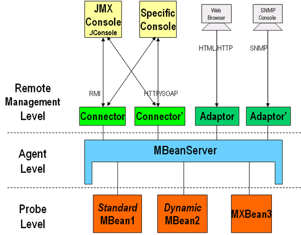
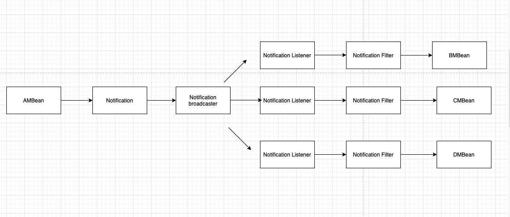

# JMX - Java Management Extension

目录：

1. [什么是jmx][1]
2. [jmx架构][2]
3. [spring集成jmx][3]
4. [jmx应用场景][4]
5. [参考资料][5]


### 1.什么是jmx

所谓JMX，是Java Management Extensions(Java管理扩展)的缩写，是一个为应用程序植入管理功能的框架。用户可以在任何Java应用程序中使用这些代理和服务实现管理。


### 2.jmx架构



<center>图1 JMX架构</center>

JMX架构分为三层，分别是Probe level层，Agent层，Remote Management层。其中Probe Level层主要管理MBean。Agent层主要定义了各种服务以及通信模型，和需要被管理的资源在同一机器上，核心模块是MBean Server，所有的MBean都要向它注册，才能被管理。注册在MBeanServer上的MBean并不直接和远程应用程序进行通信，他们通过协议适配器（Adapter）和连接器（Connector）进行通信。也叫Remote Management Layer. 即远程管理层。MBean Server依赖于该层的协议适配器（Adaptor）和连接器（Connector），让JMX Agent可以被该JVM外面的管理系统远程访问。支持多种协议：SNMP，HTML，RMI.


#### MBean分类

* Standard MBean
* MXBean
* Dynamic MBean
* Open MBean
* Module MBean


#### MBean规范

* A set of readable or writable attributes, or both.
* A set of invokable operations.
* A self-description.
* 管理接口贯穿于MBean的整个生命周期，并且是不变的。Mbean在某些预先定义的事件发生时可以发出通知（Notifications）。


#### Standard  MBean规范

* 接口必须以MBean结尾，如HelloMBean
* 其中实现类名字必须为Hello
* 接口和实现类必须在同一个包下

```java
public interface HelloMBean {
  void sayHello();
  void setValue(int i);
  int getValue();
}


public class Hello implements HelloMBean{
  
  private int value;
  
  public void sayHello(){}
  
  public void setValue(int value){
    this.value = value
  }
  
  public int getValue(){
    return value;
  }
  
}
```


#### 注册MBean

```java
 MBeanServer server = ManagementFactory.getPlatformMBeanServer();
 ObjectName helloName = new ObjectName("jmxBean:name=hello");
 //create mbean and register mbean
 server.registerMBean(new Hello(), helloName);
 Thread.sleep(60*60*1000);
```

1、 通过工厂类获取Mbean Server，用来做Mbean的容器
 2、 **ObjectName的取名规范：`域名:name=Mbean名称`，**其中域名和Mbean的名称可以任取。这样定义后，我们可以唯一标示我们定义的这个Mbean的实现类了
 3、最后将Hello这个类注册到MbeanServer中，注入需要创建一个ObjectName类，**我们可以用jdk自带的Jconsole用来观察，可以设置属性值和调用相关方法**。


#### Notification

MBean之间的通信是必不可少的，Notification起到了在MBean之间沟通桥梁的作用。JMX 的通知由四部分组成：

1、Notification这个相当于一个信息包，封装了需要传递的信息

2、Notification broadcaster这个相当于一个广播器，把消息广播出。

3、Notification listener 这是一个监听器，用于监听广播出来的通知信息。

4、Notification filiter 这个一个过滤器，过滤掉不需要的通知




<center>图2 Notification架构</center>

MBean之间的通信类似与MQ(message queue)，其中Notification作为消息被braodcaster进行广播，然后被相应的Listener坚挺，执行真正MBean的逻辑前会有Filter进行过滤。


例子如下：

**定义MBean**

```java
package jmx;

public interface JackMBean
{
    public void hi();
}
```

**发送Notification**

```java
package jmx;

import javax.management.Notification;
import javax.management.NotificationBroadcasterSupport;

public class Jack extends NotificationBroadcasterSupport implements JackMBean
{
    private int seq = 0;
    public void hi()
    {
         //创建一个信息包
        Notification notify = 
            //通知名称；谁发起的通知；序列号；发起通知时间；发送的消息
            new Notification("jack.hi",this,++seq,System.currentTimeMillis(),"jack");
        sendNotification(notify);
    }

}
```

**定义Listener**

```java
package jmx;

import javax.management.Notification;
import javax.management.NotificationListener;

public class HelloListener implements NotificationListener
{

    public void handleNotification(Notification notification, Object handback)
    {
        if(handback instanceof Hello)
        {
            Hello hello = (Hello)handback;
            hello.printHello(notification.getMessage());
        }
    }
    
}
```

**修改Agent**

```java
package jmx;

import java.lang.management.ManagementFactory;

import javax.management.JMException;
import javax.management.MBeanServer;
import javax.management.ObjectName;

public class HelloAgent
{
    public static void main(String[] args) throws JMException, Exception
    {
        MBeanServer server = ManagementFactory.getPlatformMBeanServer();
        ObjectName helloName = new ObjectName("yunge:name=Hello");    
        Hello hello=new Hello();          
        server.registerMBean(hello, helloName);  
        Jack jack = new Jack();
        server.registerMBean(jack, new ObjectName("jack:name=Jack"));
        jack.addNotificationListener(new HelloListener(), null, hello);
        Thread.sleep(500000);
    }
}
```

利用jconsole调用jack的hi方法，**这里当jack发出消息后，Notification被广播至所有的MBean，当有MBean属于Hello类时则调用Hello的printHello()方法**。


#### JMX环境变量

-Dcom.sun.management.jmxremote=true 相关 JMX 代理侦听开关  

-Djava.rmi.server.hostname 服务器端的IP  

-Dcom.sun.management.jmxremote.port=29094 相关 JMX 代理侦听请求的端口  

-Dcom.sun.management.jmxremote.ssl=false 指定是否使用 SSL 通讯  

-Dcom.sun.management.jmxremote.authenticate=false 指定是否需要密码验证


### 3.spring集成jmx

思想：**spring通过annotation暴露MBean**

涉及到三个重要的annotation：@ManagedResource @ManagedAttribute 和 @ManagedOperation。

|                                     |                             |                                                             |                                                              |
| ----------------------------------- | --------------------------- | ----------------------------------------------------------- | ------------------------------------------------------------ |
| 将类的所有实例标识为JMX受控资源     | `ManagedResource`           | `@ManagedResource`                                          | Class 类                                                     |
| 将方法标识为JMX操作                 | `ManagedOperation`          | `@ManagedOperation`                                         | Method方法                                                   |
| 将getter或者setter标识为部分JMX属性 | `ManagedAttribute`          | `@ManagedAttribute`                                         | Method (only getters and setters) 方法（仅getters和setters） |
| 定义操作参数说明                    | `ManagedOperationParameter` | `@ManagedOperationParameter`和`@ManagedOperationParameters` | Method 方法                                                  |

例子如下:

```java

@ManagedResource (objectName= "bean:name=lionbuleTest" , description= "My Managed Bean" )  
public class AnnotationTestMBean{  
    private String name;  
    private int age;  
      
    @ManagedAttribute(description="The Name Attribute")  
    public void setName(String name) {  
        this.name = name;  
    }  
  
    @ManagedAttribute()  
    public String getName() {  
        return name;  
    }    
    public int getAge() {  
        return age;  
    }  
    public void setAge(int age) {  
        this.age = age;  
    }  
      
    @ManagedOperation(description="Add two numbers")  
    @ManagedOperationParameters({  
    @ManagedOperationParameter(name = "x", description = "The first number"),  
    @ManagedOperationParameter(name = "y", description = "The second number")})  
    public int add_1(int x, int y) {  
        return x + y;  
    }  
  
    @ManagedOperation  
    public int add_2(int x, int y){  
        return x + y;  
    }  
    
    public void dontExposeMe() {  
        throw new RuntimeException();  
    }  
}
```


思考：Spring怎么实现的这个功能

答：MBean规范规定接口必须以MBean结尾，而通过Spring注解导出的MBean则不需要遵守这个规范；原因是(**我个人猜测**)通过生成代理，让代理实现MBean的规范，然后把自定义的Bean的逻辑织入进入就可以了。


### 6.jmx应用场景

JMX是一种JAVA的正式规范，它主要目的是让程序有被管理的功能。

那么怎么理解所谓的“被管理”呢？试想你开发了一个软件（如ＷＥＢ网站），它是在２４小时不简断运行的，那么你可能会想要“监控”这个软件的运行情况，比如收到了多少数据，有多少人登录等等。或者你又想“配置”这个软件，比如现在访问人数比较多，你想把数据连接池设置得大一些；每天的UV、PV是多少；又或者在业务高峰的期间，你想对接口进行限流，就必须去修改接口并发的配置值。

应用场景：中间件软件WebLogic的管理页面就是基于JMX开发的，而JBoss则整个系统都基于JMX构架。

对于一些参数的修改，网上有一段描述还是比较形象的：

1、程序初哥一般是写死在程序中，到要改变的时候就去修改代码，然后重新编译发布。

2、程序熟手则配置在文件中（JAVA一般都是properties文件），到要改变的时候只要修改配置文件，但还是必须重启系统，以便读取配置文件里最新的值。

3、程序好手则会写一段代码，把配置值缓存起来，系统在获取的时候，先看看配置文件有没有改动，如有改动则重新从配置里读取，否则从缓存里读取。

4、程序高手则懂得物为我所用，用JMX把需要配置的属性集中在一个类中，然后写一个MBean，再进行相关配置。另外JMX还提供了一个工具页，以方便我们对参数值进行修改。


---- 上面这些话就是JMX的场景；动态、运行期配置是JMX的一个特点


### 5.参考资料

1.https://docs.oracle.com/javase/tutorial/jmx/mbeans

2.https://blog.csdn.net/flsmgf/article/details/78758997

3.https://www.jianshu.com/p/7e8da4f7467f

4.https://blog.csdn.net/yaerfeng/article/details/28232435