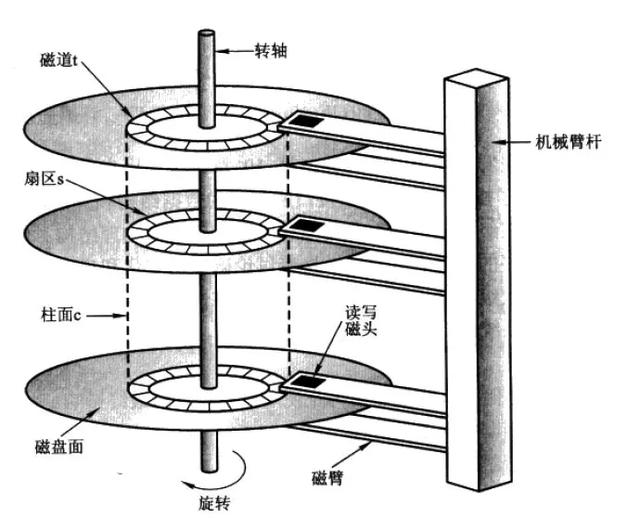
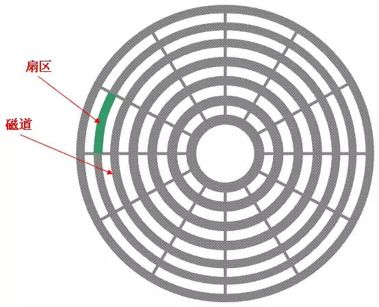
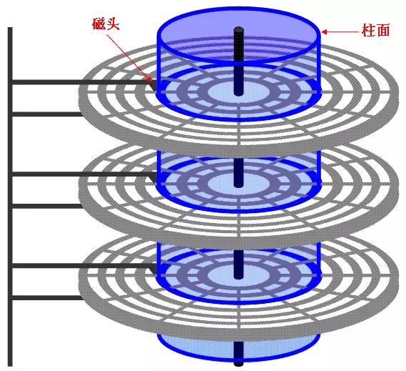

# 文件顺序/随机IO

目录：

1. [磁盘的组成结构][1]
2. [磁盘读取响应时间][2]
3. [块/簇/页][3]
4. [IO读取模型][4]
5. [顺序/随机IO][5]
6. [参考资料][6]

### 1.磁盘的组成结构

图1 磁盘组成结构

如图所示，磁盘由以下几部分组成：盘片（platter）,磁头（head），磁道（track）,扇区（sector），	

柱面（cydiner）组成

图2 盘片组成

上图显示的是一个盘面，盘面中一圈圈灰色同心圆为一条条磁道，从圆心向外画直线，可以将磁道划分为若干个弧段，每个磁道上一个弧段被称之为一个扇区（图践绿色部分）。扇区是磁盘的最小组成单元，通常是512字节。（由于不断提高磁盘的大小，部分厂商设定每个扇区的大小是4096字节)

图3 柱面

硬盘通常由重叠的一组盘片构成，每个盘面都被划分为数目相等的磁道，**并从外缘的“0”开始编号**，具有相同编号的磁道形成一个圆柱，称之为磁盘的柱面。磁盘的柱面数与一个盘面上的磁道数是相等的。由于每个盘面都有自己的磁头，因此，盘面数等于总的磁头数。

### 2.磁盘读取响应时间

磁盘读取数据步骤如下

	* 寻道时间：将磁头移动到对应的磁道,寻道时间越短，I/O操作越快，目前磁盘的平均寻道时间一般在3－15ms，一般都在10ms左右。
	* 旋转延迟：盘片旋转将请求数据所在扇区移至读写磁头下方所需要的时间，旋转延迟取决于磁盘转速。普通硬盘一般都是7200rpm，慢的5400rpm。
	* 数据传输：完成传输所请求的数据所需要的时间

其中影响磁盘数据传输效率的主要是：磁盘寻道时间，旋转延迟

**注意：按照上文所说应该是每一个盘面只有一个磁头，然后磁盘寻址的时候把磁头移动道相应的磁道。这样是我个人觉得效率太低，每次寻道都要将磁头移动道对应的磁道。可以这样改进，每个磁道都有一个固定磁头，然后选择读取对应的磁头由相应的机械电路控制。这样省去了磁盘的寻道时间**

### 3.块/簇/页

磁盘块/簇（虚拟出来的）。 块是操作系统中最小的逻辑存储单位。操作系统与磁盘打交道的最小单位是磁盘块。
通俗的来讲，在Windows下如NTFS等文件系统中叫做簇；在Linux下如Ext4等文件系统中叫做块（block）。每个簇或者块可以包括2、4、8、16、32、64…2的n次方个扇区。

为什么存在磁盘块？

读取方便：由于扇区的数量比较小，数目众多在寻址时比较困难，所以操作系统就将相邻的扇区组合在一起，形成一个块，再对块进行整体的操作。

分离对底层的依赖：操作系统忽略对底层物理存储结构的设计。通过虚拟出来磁盘块的概念，在系统中认为块是最小的单位

操作系统经常与内存和硬盘这两种存储设备进行通信，类似于“块”的概念，都需要一种虚拟的基本单位。所以，与内存操作，是虚拟一个页的概念来作为最小单位。与硬盘打交道，就是以块为最小单位。

扇区： 硬盘的最小读写单元

块/簇： 是操作系统针对硬盘读写的最小单元

page： 是内存与操作系统之间操作的最小单元。

扇区 <= 块/簇 <= page

### 4.IO读取模型

IO操作通常分为两个部分：用户进行空间<----->内核空间 ,内核空间<---->设备空间

LINUX中进程无法直接操作I/O设备，其必须通过系统调用请求kernel来协助完成I/O动作；内核会为每个I/O设备维护一个缓冲区。

对于一个输入操作来说，**进程IO系统调用后，内核会先看缓冲区中有没有相应的缓存数据，没有的话再到设备中读取，因为设备IO一般速度较慢，需要等待；内核缓冲区有数据则直接复制到进程空间。**

所以，对于一个网络输入操作通常包括两个不同阶段：

（1）等待网络数据到达网卡→读取到内核缓冲区，数据准备好；

（2）从内核缓冲区复制数据到进程空间。

### 5.顺序/随机IO

顺序与随机指的是**每次数据存取请求对应的地址是否连续**。Windows系统采取“见缝插针”的策略进行数据写入，多任务系统下各进程对硬盘位置的读写请求也变得更为随机化。

磁盘读写最慢的地方在于寻道，根据kafka官网写的资料是，寻道时间大概10ms，寻道之后磁头顺序读取信息的速度是很快的，根据kafka官网的说法，6个7200转的磁盘组成raid5，顺序写的速度能达到（600MB/S），而随机读写速度仅为100kb/s。

顺序IO针对大文件拷贝、视频编辑等的任务，**读写的过程中会遵循先后顺序，数值越高代表读写性能越强，单位是MB/s。**

**随机读写速度的单位是IOPS，就是每秒进行的IO操作次数**，可以理解为吞吐量指标，数值越高读写性能越强。随机读写也可以从字面意思理解，无疑不遵循文件的先后顺序，当固态硬盘读写操作的时候**能够任意跳到某个文件，或者同一文件的某个位置**，主要作用是针对零碎文件（病毒扫描、启动程序等）任务。

注意：

  1. 顺序/随机IO 的使用场景
  2. 顺序/随机IO 的读写文件最主要的区别
 	3. 顺序/随机IO 单位 MB/S, IOPS

### 6.参考资料

1. https://www.toutiao.com/a6771311045630755341/
2. https://www.toutiao.com/a6761254830716486157/ (推荐)
3. https://www.toutiao.com/a6736053525266039304/

[1]: #1磁盘的组成结构
[2]: #2磁盘读取响应时间
[3]: #3块/簇/页
[4]: #4io读取模型
[5]: #5顺序/随机io
[6]: #6参考资料