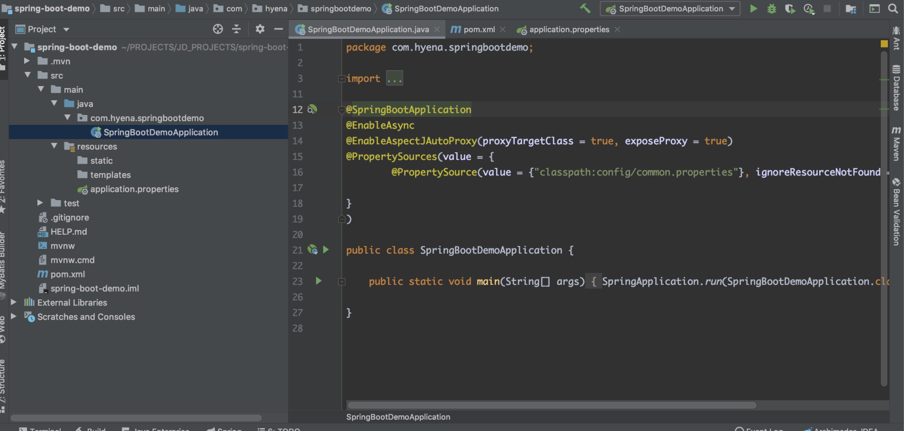
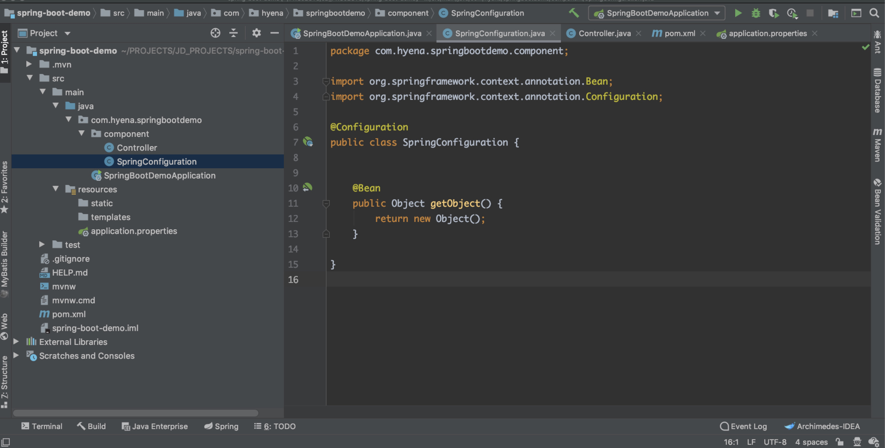
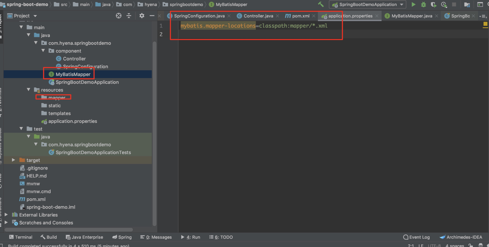

# Spring项目配置

目录：

1. [简介][1]
2. [Spring-boot项目结构][2]
3. [Spring-boot配置][3]
4. [特点][4]
5. [总结][4]
6. [参考][6]


### 1.简介

Spring Boot makes it easy to create stand-alone,production-grade Spring based Applications that you can "just run".

we take and opinionated view of the Spring platform and third-party libraries so you can get started with minimum fuss. Most Spring boot applicaitons need Spring Configuration.

我们在使用Spring Boot时只需要配置相应的Spring  Boot就可以用所有的Spring组件，简单的说，spring  boot就是整合了很多优秀的框架，不用我们自己手动的去写一堆xml配置然后进行配置。


### 2.Spring-boot项目结构



<center>图1 Spring-Boot项目结构</center>



<center>图2 Spring Configuration和Component</center>


Spring-Boot/Spring项目的两个主要配置就是，配置类/x-config.xml，属性文件。这是Spring项目的重点。

配置类/x-config.xml提供Spring项目运行需要的对象

配置`@SpringBootApplication`注解相当于配置了`@Configuration` ,`@EnableAutoConfiguration` ,`@ComponentScan`

Indicates a  configuration class that declares one or more  @Bean  methods and also triggers auto-configuration  and `component scanning` .This is a convenience annotation that is equivalent  to declaring `@Configuration`, `@EnableAutoConfiguration`  and `@ComponentScan`.    


### 3.Spring-boot配置

1.maven配置

```xml
				<dependency>
            <groupId>org.springframework.boot</groupId>
            <artifactId>spring-boot-starter-web</artifactId>
            <exclusions>
                <exclusion>
                    <groupId>org.springframework.boot</groupId>
                    <artifactId>spring-boot-starter-logging</artifactId>
                </exclusion>
                <exclusion>
                    <groupId>org.springframework.boot</groupId>
                    <artifactId>spring-boot-starter-tomcat</artifactId>
                </exclusion>
            </exclusions>
        </dependency>
        <dependency>
            <groupId>org.springframework.boot</groupId>
            <artifactId>spring-boot-starter-test</artifactId>
            <scope>test</scope>
        </dependency>
        <dependency>
            <groupId>org.springframework.boot</groupId>
            <artifactId>spring-boot-starter-log4j2</artifactId>
            <version>1.5.8.RELEASE</version>
        </dependency>
        <dependency>
            <groupId>org.springframework.boot</groupId>
            <artifactId>spring-boot-starter-tomcat</artifactId>
            <scope>provided</scope>
        </dependency>

			<dependency>
            <groupId>org.mybatis.spring.boot</groupId>
            <artifactId>mybatis-spring-boot-starter</artifactId>
            <version>2.0.0</version>
        </dependency>
```


2.SpringBootDemoApplication配置

SpringBoot项目作为一个annotation-driven的项目，配置大都是依赖注解

```java
@SpringBootApplication  
@EnableAsync
@EnableTransactionaManageMent
@EnableAspectJAutoProxy(proxyTargetClass = true, exposeProxy = true)
@PropertySources(value = {
        @PropertySource(value = {"classpath:config/common.properties"}, ignoreResourceNotFound = true, encoding = "utf-8")})
@Import(SpringConfiguration.class)
public class SpringBootDemoApplication {

    public static void main(String[] args) {
        SpringApplication.run(SpringBootDemoApplication.class, args);
    }

}

```


3.SpringBoot项目集成MyBatis

引入依赖

```xml
				<dependency>
            <groupId>org.mybatis</groupId>
            <artifactId>mybatis</artifactId>
            <version>3.5.4</version>
        </dependency>

			<dependency>
            <groupId>org.mybatis.spring.boot</groupId>
            <artifactId>mybatis-spring-boot-starter</artifactId>
            <version>2.0.0</version>
			</dependency>
```

项目结构



<center>图3 SpringBoot继承Mybatis</center>

app.properties里面添加mybatis.mapper-locations=classpath:mapper/*.xml。MyBatisMapper接口上面使用@Mapper注解


### 4.特点

* Create stand-alone Spring applications	快速创建独立运行的Spring项目
* Embed Tomcat, Jetty or Undertow directly (no need to deploy WAR files) 内嵌Tomcat，应用无需打成WAR包
* Provide opinionated 'starter' dependencies to simplify your build configuration    starters自动依赖简化配置
* Automatically configure Spring and 3rd party libraries whenever possible  自动配置Spring和第三方库
* Provide production-ready features such as metrics, health checks, and externalized configuration  准生产环境的运行时应用监控
* Absolutely no code generation and no requirement for XML configuration 无代码生成和XML配置


### 5.总结

1. 学会创建Spring-Boot项目
2. 了解Spring-Boot项目结构
3. 了解Spring-Boot配置

### 6.参考

1. https://baijiahao.baidu.com/s?id=1623648034778672046&wfr=spider&for=pc
2. https://baijiahao.baidu.com/s?id=1638998808858231030&wfr=spider&for=pc
3. https://blog.csdn.net/qq_31142237/article/details/89326765
4. https://blog.csdn.net/qq_19167629/article/details/90899232


[1]: #1简介
[2]: #2spring-boot项目结构
[3]: #3spring-boot配置
[4]: #4特点
[5]: #5总结
[6]: #6参考

