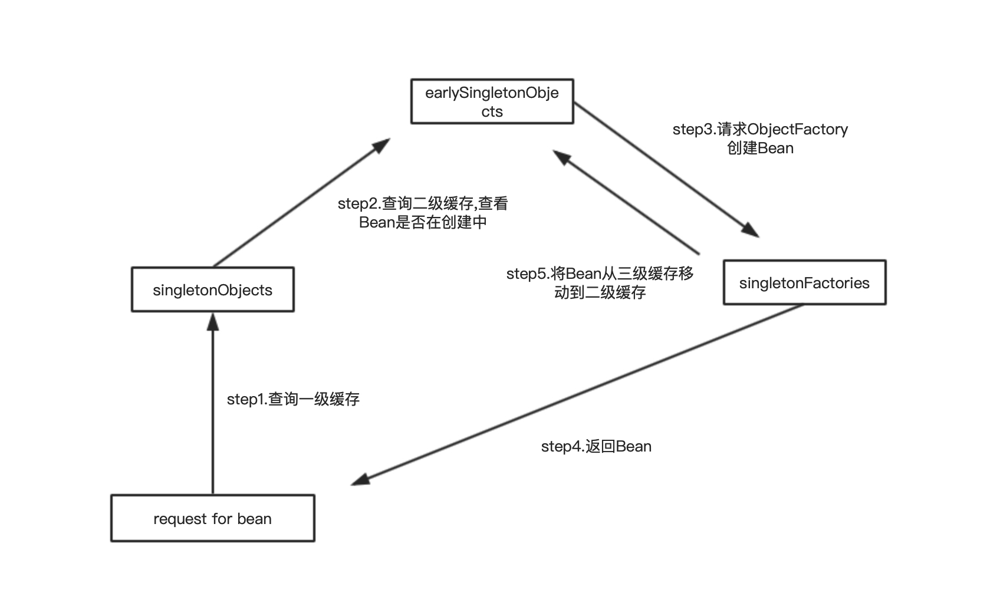

# Spring循环依赖问题

目录:

1. [简介][1]
2. [Spring循环依赖产生场景][2]
3. [解决方法][3]
4. [总结][4]
5. [参考资料][5]


### 1.简介

循环依赖(cycle-dependency)是指对象间的依赖形成了一个环(loop),如下

```
A---->B----->C
^           |
|           v    
------------D
```
其中A依赖B,B依赖C,C依赖D,D依赖A,这种依赖关系形成了一个环。**当Spring容器中Bean之间的产生循环依赖时，如果不加以解决,会出现异常.**

### 2.Spring循环依赖产生场景

如图所示,A、B、C之间形成了循环依赖.当Spring容器想要创建A对象时,发现A依赖了B,这是Spring就不会实例化(Instantiate)对象A,而是回去实例化对象B;当Spring容器想要实例化B的时候,发现B依赖了C,同理Spring容器就去实例化C；当Spring容器实例化C时,发现C依赖了A,Spring就去实例化A;这样Spring容器就会陷入一个环中.


<center>图1 循环依赖</center>


### 3.解决方法

Spring采用三级缓存的方法来解决循环依赖.Spring解决循环依赖的依据是基于JAVA的引用传递,当获取到对象的引用时,对象field是可以延后设置,**但是使用有参数的构造器实例化对象时,需要首先获取到构造器参数的引用.**

```
createBeanInstance实例化--->populateBean填充Bean属性--->initializeBean初始化Bean
```
1. createBeanInstance：实例化Bean，即创建Bean对象，调用类默认的构造方法或者带参数的构造器
2. populateBean：填充Bean属性，对Bean依赖的属性进行填充
3. initalizeBean：初始化Bean

从上面讲述的单例bean初始化步骤我们可以知道，循环依赖主要发生在第一、第二步。也就是构造器循环依赖和field循环依赖。

那么我们要解决循环引用也应该从初始化过程着手，对于单例来说，在Spring容器整个生命周期内，有且只有一个对象，所以很容易想到这个对象应该存在Cache中，Spring为了解决单例的循环依赖问题，使用了三级缓存。


如下是Spring三级缓存用来解决循环依赖：

```java
    /** Cache of singleton objects: bean name --> bean instance */
    private final Map<String, Object> singletonObjects = new ConcurrentHashMap<String, Object>(256);
     
    /** Cache of singleton factories: bean name --> ObjectFactory */
    private final Map<String, ObjectFactory<?>> singletonFactories = new HashMap<String, ObjectFactory<?>>(16);
     
    /** Cache of early singleton objects: bean name --> bean instance */
    private final Map<String, Object> earlySingletonObjects = new HashMap<String, Object>(16);
```

* singletonObjects ：用来存放单例Bean(已经创建完成的，依赖关系已经满足) -- 一级缓存
* earlySingletonObjects: 存放提前曝光的单例对象(实例化完成，但是依赖关系没有满足,即创建中的Bean;**与singletonFactoies互斥，即Bean不会同时存在earlySingletonObjects和singetonFactories中**) -- 二级缓存
* singletonFactoris: 单例对象工厂cache -- 三级缓存

当创建Bean的时候，调用`getSingleton`接口，首先是从`singletonObjects`中获取；如果没有再去earlySingletonObjects中获取；如果还是没有则从singletonFactories中获取单例对象，然后将其放到earlySingletonObjects中。下面是Spring容器中具体代码实现

```java
    protected Object getSingleton(String beanName, boolean allowEarlyReference) {
        Object singletonObject = this.singletonObjects.get(beanName);
        if (singletonObject == null && isSingletonCurrentlyInCreation(beanName)) {
            synchronized (this.singletonObjects) {
                singletonObject = this.earlySingletonObjects.get(beanName);
                if (singletonObject == null && allowEarlyReference) {
                    ObjectFactory<?> singletonFactory = this.singletonFactories.get(beanName);
                    if (singletonFactory != null) {
                        singletonObject = singletonFactory.getObject();
                        this.earlySingletonObjects.put(beanName, singletonObject);
                        this.singletonFactories.remove(beanName);
                    }
                }
            }
        }
        return (singletonObject != NULL_OBJECT ? singletonObject : null);
    }
```

从上面分析可知，解决问题的关键在于singletonFactories。这个接口在下面被引用
```java
    protected void addSingletonFactory(String beanName, ObjectFactory<?> singletonFactory) {
        Assert.notNull(singletonFactory, "Singleton factory must not be null");
        synchronized (this.singletonObjects) {
            if (!this.singletonObjects.containsKey(beanName)) {
                this.singletonFactories.put(beanName, singletonFactory);
                this.earlySingletonObjects.remove(beanName);
                this.registeredSingletons.add(beanName);
            }
        }
    }
```

如下图,是Spring容器解决循环依赖的逻辑图。我们用A<--->B循环依赖配上下面的图来说明

<center>图2 三级缓存结构</center>

当Spring容器实例化A的时候发现需要B，首先将A放到三级缓存里面去实例B。B实例化的时候需要A，首先B查询一级缓存，发现没有；然后查询二级缓存，知道从三级缓存找到需要的A，然后把A从三级缓存删除并放到二级缓存。此时，B初始化完毕，然后将B放到一级缓存中(此时B中的A依然是创建状态)。此时回来创建A，然后查找B，直接从一级缓存找到B，然后完成A的创建，并将A放到一级缓存中。

单例bean的依赖注入分为构造器注入和setter方法注入。

1，Spring只会解决setter方法注入的循环依赖，构造器注入的循环依赖会抛BeanCurrentlyInCreationException异常。
2，Spring不会解决prototype作用域的bean，因为Spring容器不进行缓存"prototype"作用域的bean，因此无法提前暴露一个创建中的bean。如果有循环依赖会抛BeanCurrentlyInCreationException异常。

Spring依赖注入方式

1. 接口注入
2. Setter方法注入
3. 构造方法注入

Spring容器无法解决构造器循环依赖(构造器循环依赖：即各个依赖Bean之间是使用有参数的构造器实例化)的原因：依然使用A<-->B举例，Spring容器想要实例化A，但是发现A的构造器依赖B，这是就不实例化A(注意和setter方法注入的区别)，进而去实例化B；Spring容器实例化B的时候，发现B的构造器依赖A，这时就去实例化A，到此就发生了循环依赖的问题。由于构造器依赖无法先生成实例，所以Spring容器无法解决此类的循环依赖。
### 4.总结

了解什么是循环依赖，循环依赖产生的原因和场景。Spring容器通过三级缓存的方式解决循环依赖，但是只能够解决**单例setter注入**的循环依赖，而不能解决原型Bean，构造器注入的循环依赖。

### 5.参考资料

1. https://blog.csdn.net/lovewebeye/article/details/105508729
2. https://blog.csdn.net/chen2526264/article/details/80673598
3. https://blog.csdn.net/qq_36381855/article/details/79752689(推荐)
4. https://blog.csdn.net/itmrchen/article/details/90201279


[1]: #1简介
[2]: #2spring循环依赖产生场景
[3]: #3解决方法
[4]: #4总结
[5]: #5参考资料