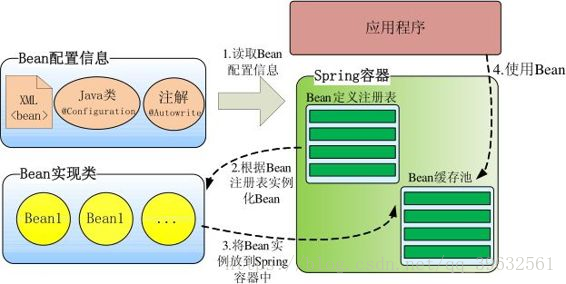
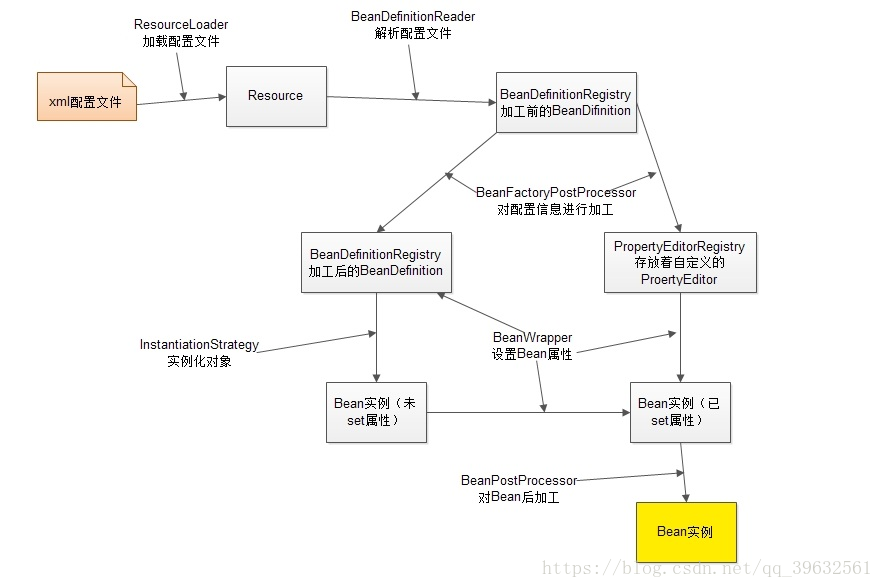
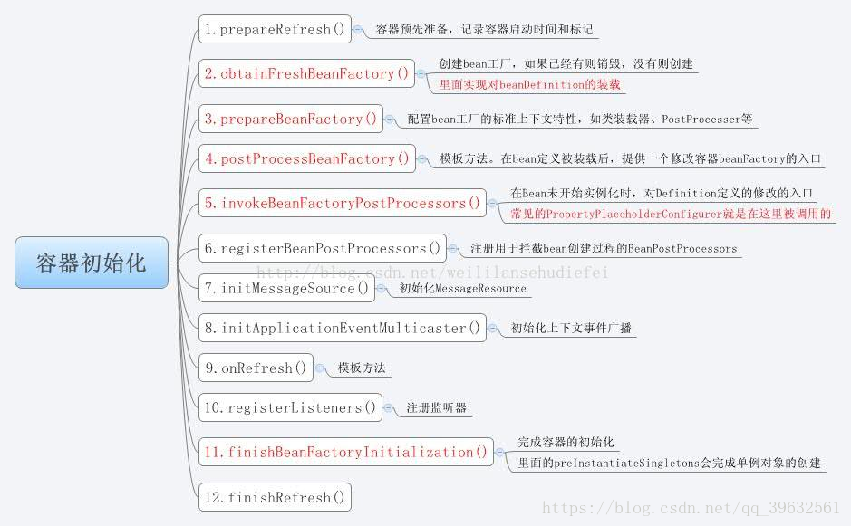

# Spring DefaultListableBeanFactory

目录:

1. [简介][1]
2. [通过DefaultListableBeanFactory向容器中注册Bean][2]
3. [了解Spring启动过程][3] 
4. [参考资料][4]

### 1.简介

Spring's default implementation of the ConfigurableListableBeanFactory and BeanDefinitionRegistry interfaces: a full-fledged bean factory based on bean definition metadata, extensible through post-processors.
Typical usage is registering all bean definitions first (possibly read from a bean definition file), before accessing beans. Bean lookup by name is therefore an inexpensive operation in a local bean definition table, operating on pre-resolved bean definition metadata objects.

Spring对`ConfigurableListableBeanFactory`和`BeanDefinitionRegistry`接口的默认实现。

### 2.通过DefaultListableBeanfactory向容器中注册Bean

在实际开发中,通常要调用Spring容器的接口向容器中注册其它组件(Component/Bean).下面的代码展示了如何通过`DefaulltListableBeanFactory`接口向Spring容器中注册Bean.

```java
    // acquire ApplicationContext reference
    ConfigurableApplicationContext context = (ConfigurableApplicationContext) applicationContext;
    DefaultListableBeanFactory beanFactory = (DefaultListableBeanFactory)context.getBeanFactory();

    // registry signleton bean
    beanFactory.registerBeanDefinition(beanName,beanDefinition);
```

### 3.Spring启动过程

#### 容器整体概览

Spring启动时读取应用程序提供的Bean配置信息(XML文件,JAVA配置,Bean隐式发现和自动装配),并在Spring容器中生成一份相应的Bean配置注册表,然后根据注册表实例化Bean,
装配Bean之间的依赖关系.然后为上层应用提供准备就绪的运行环境.

<center>图1 Spring装配Bean</center>


#### 内部工作机制


<center>图2 Spring容器内部工作机制</center>

１、ResourceLoader从存储介质中加载Spring配置信息，并使用Resource表示这个配置文件的资源；

２、BeanDefinitionReader读取Resource所指向的配置文件资源，然后解析配置文件。配置文件中每一个解析成一个BeanDefinition对象，并保存到BeanDefinitionRegistry中；

３、容器扫描BeanDefinitionRegistry中的BeanDefinition，使用Java的反射机制自动识别出Bean工厂后处理后器（实现BeanFactoryPostProcessor接口）的Bean，然后调用这些Bean工厂后处理器对BeanDefinitionRegistry中的BeanDefinition进行加工处理。主要完成以下两项工作：

1）对使用到占位符的元素标签进行解析，得到最终的配置值，这意味对一些半成品式的BeanDefinition对象进行加工处理并得到成品的BeanDefinition对象；

2）对BeanDefinitionRegistry中的BeanDefinition进行扫描，通过Java反射机制找出所有属性编辑器的Bean（实现java.beans.PropertyEditor接口的Bean），并自动将它们注册到Spring容器的属性编辑器注册表中（PropertyEditorRegistry）；

4．Spring容器从BeanDefinitionRegistry中取出加工后的BeanDefinition，并调用InstantiationStrategy着手进行Bean实例化的工作；

5．在实例化Bean时，Spring容器使用BeanWrapper对Bean进行封装，BeanWrapper提供了很多以Java反射机制操作Bean的方法，它将结合该Bean的BeanDefinition以及容器中属性编辑器，完成Bean属性的设置工作；

6．利用容器中注册的Bean后处理器（实现BeanPostProcessor接口的Bean）对已经完成属性设置工作的Bean进行后续加工，直接装配出一个准备就绪的Bean。

Spring容器确实堪称一部设计精密的机器，其内部拥有众多的组件和装置。Spring的高明之处在于，它使用众多接口描绘出了所有装置的蓝图，构建好Spring的骨架，继而通过继承体系层层推演，不断丰富，最终让Spring成为有血有肉的完整的框架。所以查看Spring框架的源码时，有两条清晰可见的脉络：

1）接口层描述了容器的重要组件及组件间的协作关系；

2）继承体系逐步实现组件的各项功能。

接口层清晰地勾勒出Spring框架的高层功能，框架脉络呼之欲出。有了接口层抽象的描述后，不但Spring自己可以提供具体的实现，任何第三方组织也可以提供不同实现， 可以说Spring完善的接口层使框架的扩展性得到了很好的保证。纵向继承体系的逐步扩展，分步骤地实现框架的功能，这种实现方案保证了框架功能不会堆积在某些类的身上，造成过重的代码逻辑负载，框架的复杂度被完美地分解开了。

Spring组件按其所承担的角色可以划分为两类：

1）物料组件：Resource、BeanDefinition、PropertyEditor以及最终的Bean等，它们是加工流程中被加工、被消费的组件，就像流水线上被加工的物料；

2）加工设备组件：ResourceLoader、BeanDefinitionReader、BeanFactoryPostProcessor、InstantiationStrategy以及BeanWrapper等组件像是流水线上不同环节的加工设备，对物料组件进行加工处理。
Spring什么时候实例化bean，首先要分2种情况

第一：如果你使用BeanFactory作为Spring Bean的工厂类，则所有的bean都是在第一次使用该Bean的时候实例化
第二：如果你使用ApplicationContext作为Spring Bean的工厂类，则又分为以下几种情况：
（1）：如果bean的scope是singleton的，并且lazy-init为false（默认是false，所以可以不用设置），则ApplicationContext启动的时候就实例化该Bean，并且将实例化的Bean放在一个map结构的缓存中，下次再使用该Bean的时候，直接从这个缓存中取
（2）：如果bean的scope是singleton的，并且lazy-init为true，则该Bean的实例化是在第一次使用该Bean的时候进行实例化
（3）：如果bean的scope是prototype的，则该Bean的实例化是在第一次使用该Bean的时候进行实例化

#### Spring容器初始化过程

<center>图3 Spring容器初始化过程</center>

#### PropertyEditor

在Spring配置文件里，我们往往通过字面值为Bean各种类型的属性提供设置值：不管是double类型还是int类型，在配置文件中都对应字符串类型的字面值。BeanWrapper填充Bean属性时如何将这个字面值转换为对应的double或int等内部类型呢？我们可以隐约地感觉到一定有一个转换器在其中起作用，这个转换器就是属性编辑器。

PropertyEditor
　　PropertyEditor是属性编辑器的接口，**它规定了将外部设置值转换为内部JavaBean属性值的转换接口方法**。PropertyEditor主要的接口方法说明如下：

```java
    Object getValue()：返回属性的当前值。基本类型被封装成对应的包装类实例；
    void setValue(Object newValue)：设置属性的值，基本类型以包装类传入（自动装箱）；
    String getAsText()：将属性对象用一个字符串表示，以便外部的属性编辑器能以可视化的方式显示。缺省返回null，表示该属性不能以字符串表示；
    void setAsText(String text)：用一个字符串去更新属性的内部值，这个字符串一般从外部属性编辑器传入；
    String[] getTags()：返回表示有效属性值的字符串数组（如boolean属性对应的有效Tag为true和false），以便属性编辑器能以下拉框的方式显示出来。缺省返回null，表示属性没有匹配的字符值有限集合；
    String getJavaInitializationString()：为属性提供一个表示初始值的字符串，属性编辑器以此值作为属性的默认值。
```

Spring使用PropertyEditor例子：

CustomEditorConfigurer实现BeanFactoryPostProcessor接口，因此是一个Bean工厂后处理器。我们知道Bean工厂后处理器在Spring容器加载配置文件并生成BeanDefinition半成品后就会被自动执行。因此CustomEditorConfigurer有容器启动时有机会注入自定义的属性编辑器

```xml
    <!--①配置自动注册属性编辑器的CustomEditorConfigurer -->    
    <bean class="org.springframework.beans.factory.config.CustomEditorConfigurer">    
            <property name="customEditors">    
                <map>    
                       <!--②-1属性编辑器对应的属性类型-->    
                       <entry key="com.baobaotao.editor.Car">     
        
                             <!--②-2对应的属性编辑器Bean -->    
                        <bean class="com.baobaotao.editor.CustomCarEditor" />    
                    </entry>    
                </map>    
            </property>    
        </bean>    
     <bean id="boss" class="com.baobaotao.editor.Boss">    
           <property name="name" value="John"/>     
           <!--③该属性将使用②处的属性编辑器完成属性填充操作-->    
           <property name="car" value="红旗CA72,200,20000.00"/>     
    </bean> 
```
上述XML片段的作用就是，通过字面值"红旗CA72,200,20000.00",来创建一个Car对象,通过
CustomCarEditor来完成转换.

　在①处，我们定义了用于注册自定义属性编辑器的CustomEditorConfigurer，Spring容器将通过反射机制自动调用这个Bean。CustomEditorConfigurer通过一个Map属性定义需要自动注册的自定义属性编辑器。在②处，我们为Car类型指定了对应属性编辑器CustomCarEditor，注意键是属性类型，而值是对应的属性编辑器Bean，而不是属性编辑器的类名。
　　最精彩的部分当然是③处的配置，我们原来通过一个<bean>元素标签配置好car Bean，然后在boss的<bean>中通过ref引用car Bean，但是现在我们直接通过value为car属性提供配置。BeanWrapper在设置boss的car属性时，它将检索自定义属性编辑器的注册表，当发现Car属性类型拥有对应的属性编辑器CustomCarEditor时，它就会利用CustomCarEditor将“红旗CA72,200,20000.00”转换为Car对象 -- [^引用自此篇文章]

```java

    package com.baobaotao.editor;    
    import java.beans.PropertyEditorSupport;    
        
    public class CustomCarEditor extends PropertyEditorSupport {    
        
        //1. 将字面值转换为属性类型对象    
        public void setAsText(String text){     
            if(text == null || text.indexOf(",") == -1){    
                throw new IllegalArgumentException("设置的字符串格式不正确");    
            }    
            String[] infos = text.split(",");    
            Car car = new Car();    
            car.setBrand(infos[0]);    
            car.setMaxSpeed(Integer.parseInt(infos[1]));    
            car.setPrice(Double.parseDouble(infos[2]));    
        
             //2. 调用父类的setValue()方法设置转换后的属性对象    
            setValue(car);     
        }    
    } 
```
这是CustomCarEditor的具体实现.


### 4.参考资料

1. https://blog.csdn.net/qq_39632561/article/details/83070140(推荐)
2. https://blog.csdn.net/shenchaohao12321/article/details/80295371


[1]: #1简介
[2]: #2通过defaultlistablebeanfactory向容器中注册bean
[3]: #3了解spring启动过程
[4]: #4参考资料


[^引用自此篇文章]: https://blog.csdn.net/shenchaohao12321/article/details/80295371