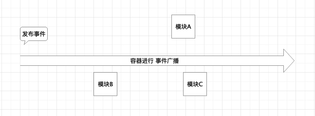
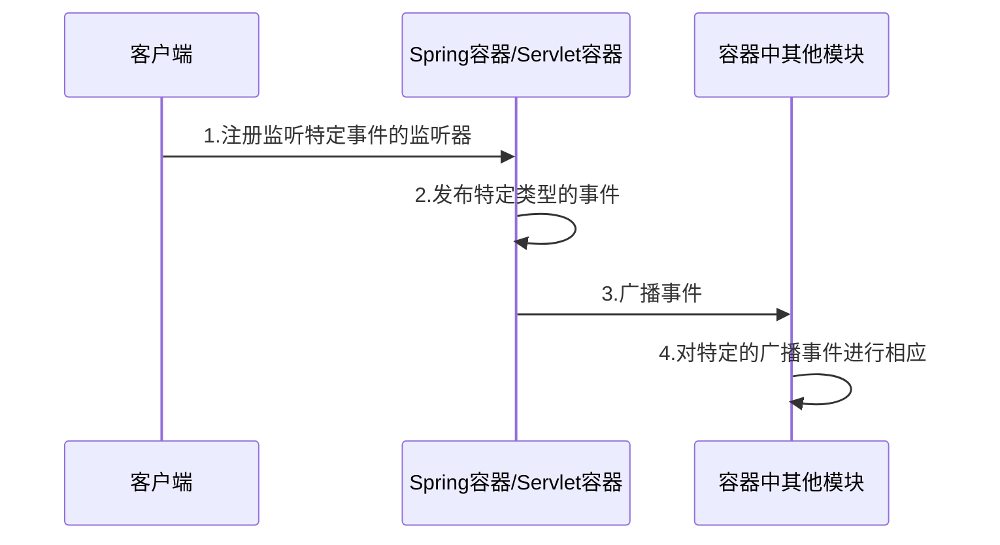
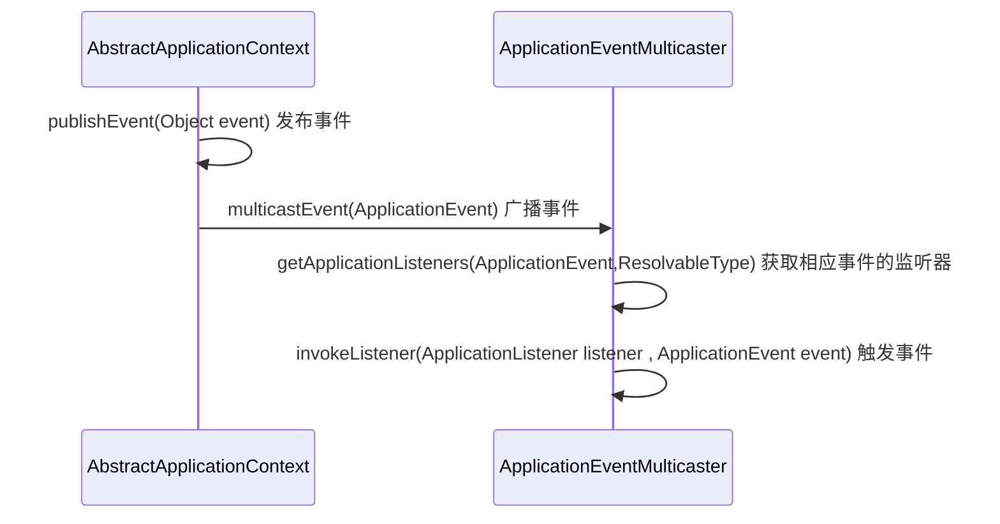

# Spring事件发布

目录：

1. [简介][1]
2. [源码分析][2]
3. [总结][3]
4. [参考资料][4]

### 1.简介

Spring中的事件通知机制是观察者模式的一种实现。观察者是ApplicaitonListener，观察者感兴趣的是某种状态的变化，这种变化使用ApplicaitonEvent来传达，也就是事件对象。Spring中的事件包括 : ContextStartedEvent(容器启动事件)，ContextStopEvent（容器停止事件），ContextRefreshEvent(容器重启事件)，ContextClosedEvent（容器关闭事件)。

图1 事件发布和通知

如图所示，是事件发布的一个大体流程。首先容器（Spring容器，Servlet容器/即tomcat服务器）注册监听器用来监听特定的事件；然后容器发布特定类型的事件，然后进行事件通知/事件广播通知已经注册的监听器用来处理

图2 事件发布和通知时序图

### 2.源码分析

图3 Spring事件发布代码时序图

### 3.总结

事件发布适用于某些容器/系统中 产生各种事件的情况。要考虑到事件所在的上下文（容器/系统）

### 4.参考资料

1. https://www.toutiao.com/a6602764338715427336/
2. https://www.toutiao.com/a6602764338715427336/
3. https://www.toutiao.com/a6770321822299718151/
4. https://www.toutiao.com/a6758771082041246222/
5. https://www.cnblogs.com/vettel0329/p/11269733.html
6. https://www.cnblogs.com/xinde123/p/8918714.html (推荐)

[1]: #1简介
[2]: #2源码分析
[3]: #3总结
[4]: #4参考资料

