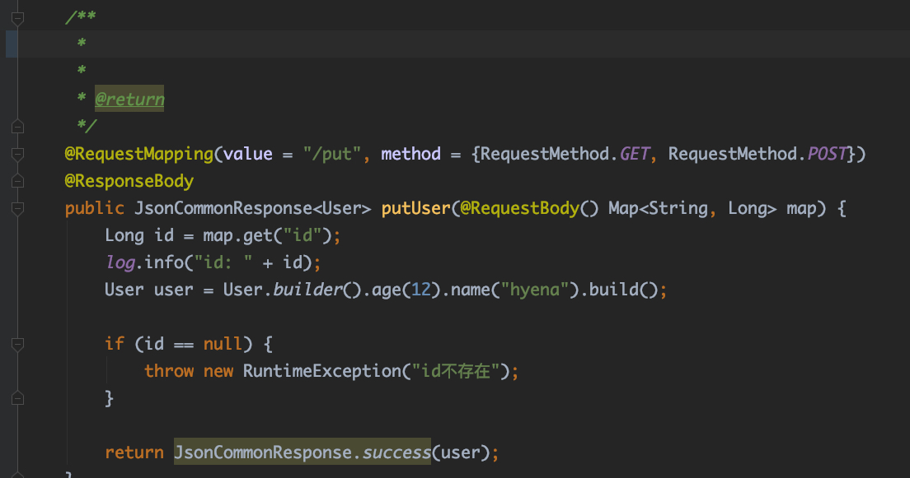
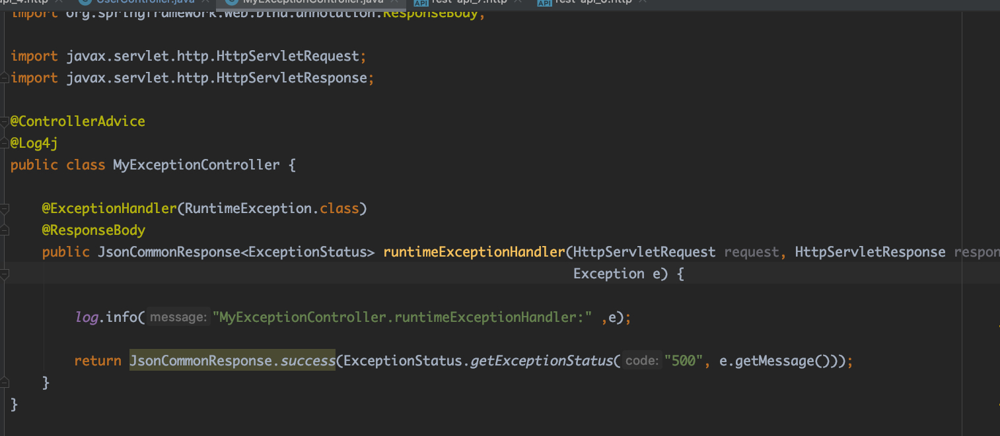

# Spring全局统一异常处理

目录：

1. [简介][1]
2. [注册异常处理器][2]
3. [参考资料][3]

### 1.简介

在实际的web工程开发中，会出现各种类型的异常，通常的做法是使用`try-catch`将可能出现异常的代码进行处理。然而这样的缺点是，**会出现大量的样版式代码**，**异常处理逻辑和正常业务逻辑相耦合**，开发人员不仅要写业务代码，还要考虑业务中可能出现的异常。Spring统一异常处理能解决上面的问题，将正常业务逻辑和异常业务逻辑解耦。其处理方式如下：

图1 Spring异常处理

如图所示，异常类型#1/#2/#3都是业务层可能产生的异常，这些异常经过Spring统一异常处理返回给前端相应的状态码或者`Model`对象。**具体的异常处理逻辑**在Spring统一异常处理层做，而不是耦合在业务层。

### 2.注册异常处理器

2.1 Controller

图2 controller层

2.2 ExceptionHandler

图2 ExceptionHandler

ExceptionHandler处理`NullPointerException`，并且向前端返回状态码

**注意：@ControllerAdvice , @ExceptionHandler**

### 3.参考资料

1. https://www.toutiao.com/a6471246543285387790/
2. https://www.toutiao.com/a6597726289598087688/
3. https://www.toutiao.com/a6568045618189566467/

[1]: #1简介
[2]: #2注册异常处理器
[3]: #3参考资料