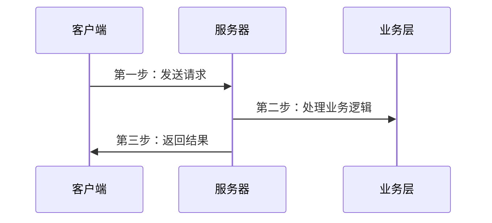
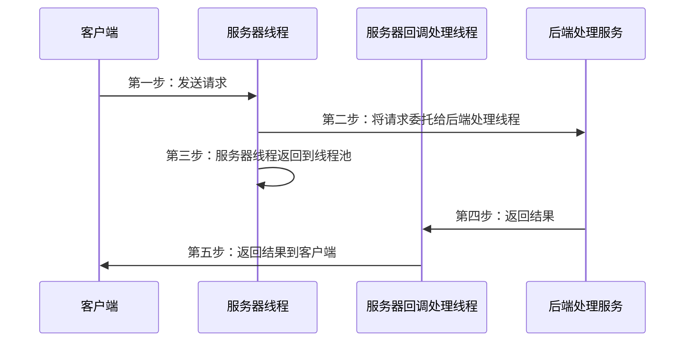
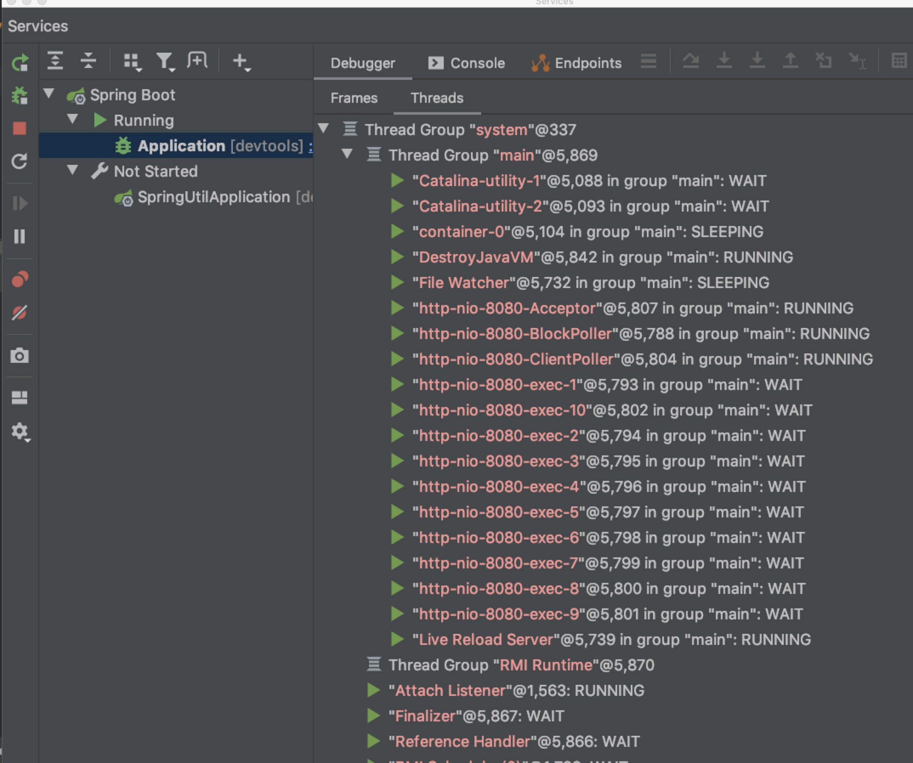
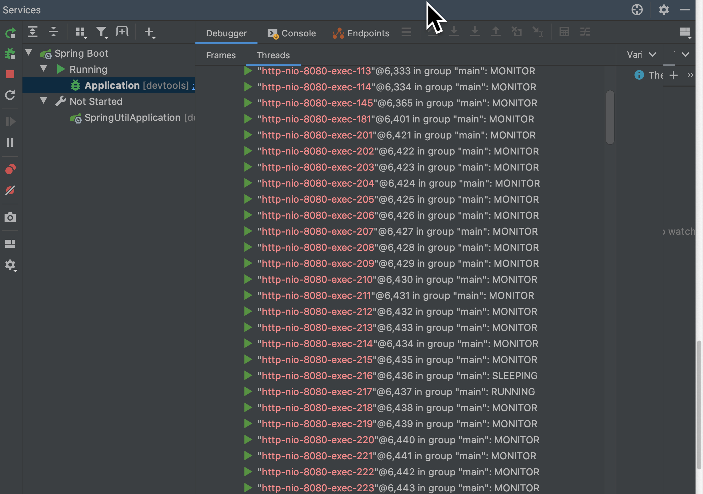
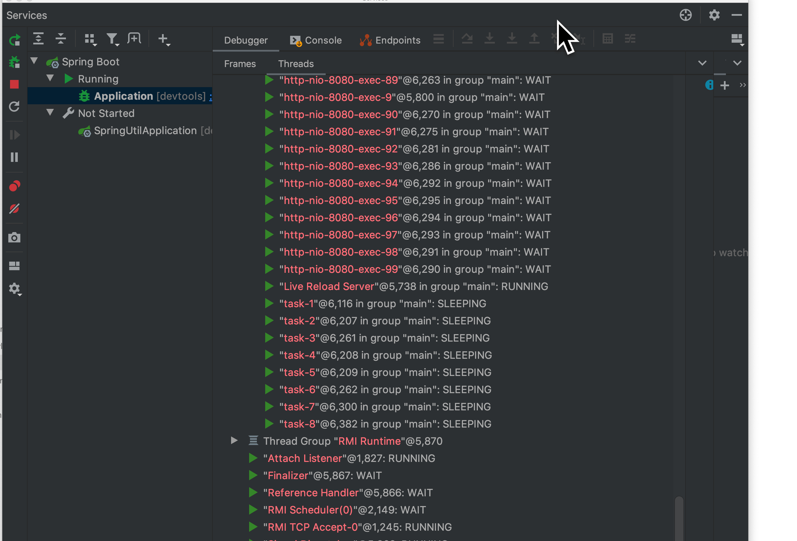
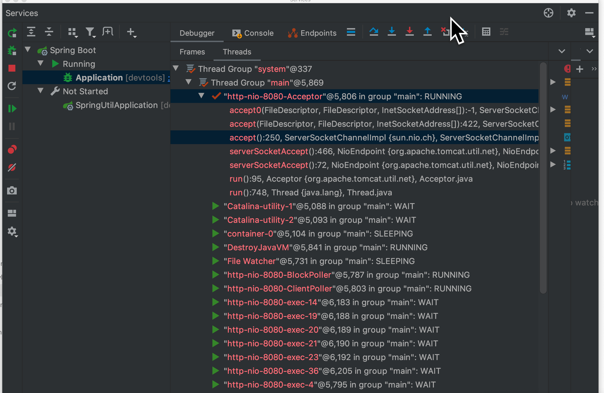
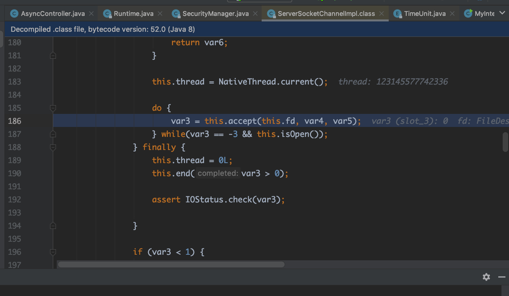

# Spring异步处理Servlet

目录:

1. [简介][1]
2. [原理][2]
3. [例子][3]
4. [参考资料][4]

### 1.简介

通常`Servlet`的主要工作流程为，客户端发起请求，`Servlet`接收到请求后进行业务处理，最后将处理结果返回。



<center>图1 典型Servlet请求 </center>

其中，第二步处理业务逻辑通常是最耗时的，主要体现在**数据库操作**，**跨网络调用**等。<font color='brown'>在此过程中，Servlet线程一直处于阻塞状态，直到方法执行完毕</font>。在业务处理过程中，服务器的工作线程数是有限的，Servlet资源(Servlet线程)一直被占用得不到释放，对于并发请求比较大的情况下，其他的请求由于获取不到连接而处于等待状态。这样就影响了服务器的吞吐能力。

### 2.原理

异步请求的请求类型keep-alive，这样客户端请求后不关闭连接，这样服务器就可以把返回结果推送到客户端。异步请求的过程如下，客户端发起请求，`Servlet`线程将请求转交给一个异步线程来执行业务处理，线程本身返回到容器(这样这个线程就可以继续处理接下来的请求)，，异步线程处理完业务以后，可以直接生成响应数据（异步线程拥有 ServletRequest 和 ServletResponse 对象的引用），或者将请求继续转发给其它 Servlet。如此一来， Servlet 线程不再是一直处于阻塞状态以等待业务逻辑的处理，而是启动异步线程之后可以立即返回， Servlet request请求线程可以被快速释放回Web容器，从而提高并发性。



<center>图2 Servelt异步请求</center>

#### 2.1 Spring异步请求配置

SpringMVC中Controller中的方法返回值为`java.util.concurrent.Callable`的时候Spring就会自动启动异步执行。Spring返回的`Callable`对象会被`RequestMappingHadnlerAdapter`拦截，然后将任务提交到线程池，默认使用`SimpleAsyncTaskExecutor`去处理，线程池会产生一个新的线程取执行`Callable`中的代码。`SimpleAsyncTaskExecutor`每次会产生一个新的线程去处理。


1.设置`ThreadPoolTaskExecutor`属性

```xml
<bean id="asyncSupportThreadPoolTaskExecutor" class="org.springframework.scheduling.concurrent.ThreadPoolTaskExecutor">
	<property name="corePoolSize" value="5"/>  // 核心线程，即使空闲也不会被销毁
  <property name="maxPoolSize" value="10"/> // 线程池最大线程数
  <property name="queueCapacity" value="50"/> //缓冲队列大小
  <property name="thradNamePrefix" value="async-"/> //线程池中产生线程名字前缀
  <property name="keepAliveSeconds" value="30"/> //线程池中空闲线程的存活时间，单位秒
</bean>
```


2.设置线程池

```xml
<mvc:annotaion-driven>
	<mvc:async-supoort task-executor="asyncSupportThreadPoolTaskExecutor"
                     default-timeout="600">
  	<mvc:callable-interceptors>
    	<bean class="com...foo.MyCallableInteceptor"/> // 设置超级处理的bean
    </mvc:callable-interceptors>
  </mvc:async-supoort>
</mvc:annotaion-driven>
```


### 3.例子

使用linux ab命令进行测试。

1.同步请求 

服务器启动 （idea debug模式）



<center>图3 服务器debug模式 </center>

如图，可以看到tomcat服务器使用了NIO方式，用**http-nio-8080-Acceptor**来接收客户端的请求，默认线程池数量为10。可以看到线程目前都是wait状态


ab -n100000 -c20000 http://localhost:8080/async/sync  模拟20000个客户端同时请求，请求总数100000



<center>图2 使用ab命令发送请求</center>

可以看到服务器线程增多，并且线程都处于SLEEPING，MONITOR状态（具体业务代码是线程sleep 1秒）。


2.异步请求

ab -n100000 -c20000 http://localhost:8080/async/async  模拟20000个客户端同时请求，请求总数100000



<center>图3 使用ab命令发送异步请求url</center>

可以看到生成了"task-1...task-8"这些线程，而tomcat服务器线程处于wait状态




<center>图5 tomcat NIO Acceptor</center>



<center>图6 接收客户端连接</center>

如图5，6是tomcat服务器等待客户端连接的代码，其实就是使用了典型的NIO编程模型


### 4.参考资料

1. https://www.oschina.net/question/1414315_2286431?sort=time
2. https://www.jianshu.com/p/f9e2255ffec2
3. https://blog.csdn.net/he90227/article/details/52262163 （推荐）
4. https://www.iteye.com/blog/elim-2426566  （推荐）
6. https://www.cnblogs.com/zemliu/p/3556615.html
6. https://blog.csdn.net/it_freshman/article/details/84330461
7. https://blog.csdn.net/JinXYan/article/details/89340711


[1]: #1简介
[2]: #2原理
[3]: #3例子
[4]: #4参考资料

