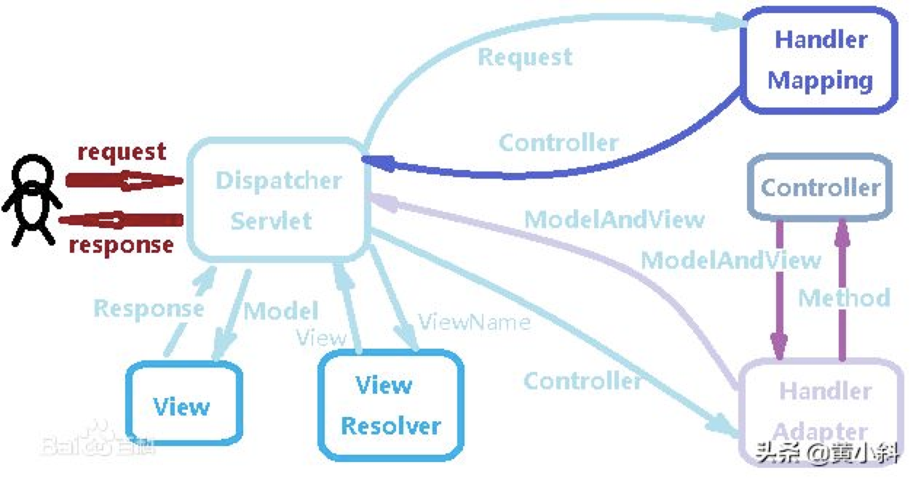
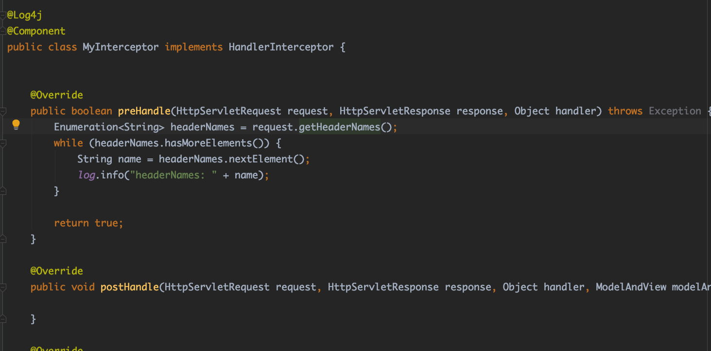
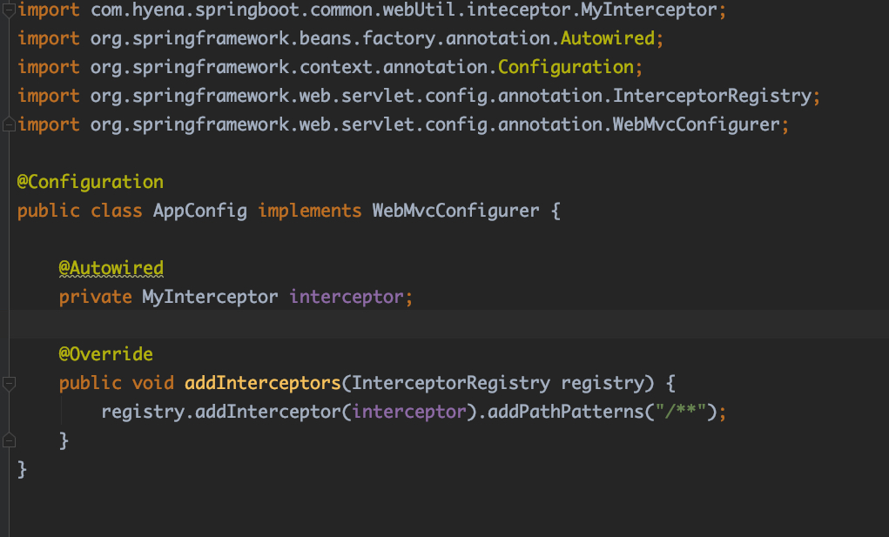

# SpringMVC拦截器

目录：

1. [简介][1]
2. [HandlerInterceptor和WebRequestHandler接口][2]
3. [拦截器处理逻辑][3]
4. [多个拦截器处理流程][4]
5. [Spring和SpringBoot配置拦截器方式][5]
6. [参考资料][6]


### 1.简介

SpringMVC拦截器(Interceptor)用于实现对每一个请求前后进行相关的业务处理。SpringMVC中的拦截器是通过`HandlerInterceptor`来实现的。在Spring中定义拦截器方式。

1. 实现Spring的`HandlerInterceptor`接口
2. 继承实现`HandlerInteceptor`接口的类，比如Spring已经提供了实现了`HandlerInterceptor`接口的抽象类`HandlerInterceptorAdapter`
3. 实现Spring的`WebRequestInterceptor`接口
4. 继承实现了`WebRequestInterceptor`接口的类

实现了拦截器后，可以通过重写`WebMvcConfigure`的`addInterceptors`方法注册拦截器


### 2.HandlerInterceptor和WebRequestInteceptor接口

HandlerInteceptor

```java
/*
 * Copyright 2002-2019 the original author or authors.
 *
 * Licensed under the Apache License, Version 2.0 (the "License");
 * you may not use this file except in compliance with the License.
 * You may obtain a copy of the License at
 *
 *      https://www.apache.org/licenses/LICENSE-2.0
 *
 * Unless required by applicable law or agreed to in writing, software
 * distributed under the License is distributed on an "AS IS" BASIS,
 * WITHOUT WARRANTIES OR CONDITIONS OF ANY KIND, either express or implied.
 * See the License for the specific language governing permissions and
 * limitations under the License.
 */

package org.springframework.web.servlet;

import javax.servlet.http.HttpServletRequest;
import javax.servlet.http.HttpServletResponse;

import org.springframework.lang.Nullable;
import org.springframework.web.method.HandlerMethod;

/**
 * Workflow interface that allows for customized handler execution chains.
 * Applications can register any number of existing or custom interceptors
 * for certain groups of handlers, to add common preprocessing behavior
 * without needing to modify each handler implementation.
 *
 * <p>A HandlerInterceptor gets called before the appropriate HandlerAdapter
 * triggers the execution of the handler itself. This mechanism can be used
 * for a large field of preprocessing aspects, e.g. for authorization checks,
 * or common handler behavior like locale or theme changes. Its main purpose
 * is to allow for factoring out repetitive handler code.
 *
 * <p>In an asynchronous processing scenario, the handler may be executed in a
 * separate thread while the main thread exits without rendering or invoking the
 * {@code postHandle} and {@code afterCompletion} callbacks. When concurrent
 * handler execution completes, the request is dispatched back in order to
 * proceed with rendering the model and all methods of this contract are invoked
 * again. For further options and details see
 * {@code org.springframework.web.servlet.AsyncHandlerInterceptor}
 *
 * <p>Typically an interceptor chain is defined per HandlerMapping bean,
 * sharing its granularity. To be able to apply a certain interceptor chain
 * to a group of handlers, one needs to map the desired handlers via one
 * HandlerMapping bean. The interceptors themselves are defined as beans
 * in the application context, referenced by the mapping bean definition
 * via its "interceptors" property (in XML: a &lt;list&gt; of &lt;ref&gt;).
 *
 * <p>HandlerInterceptor is basically similar to a Servlet Filter, but in
 * contrast to the latter it just allows custom pre-processing with the option
 * of prohibiting the execution of the handler itself, and custom post-processing.
 * Filters are more powerful, for example they allow for exchanging the request
 * and response objects that are handed down the chain. Note that a filter
 * gets configured in web.xml, a HandlerInterceptor in the application context.
 *
 * <p>As a basic guideline, fine-grained handler-related preprocessing tasks are
 * candidates for HandlerInterceptor implementations, especially factored-out
 * common handler code and authorization checks. On the other hand, a Filter
 * is well-suited for request content and view content handling, like multipart
 * forms and GZIP compression. This typically shows when one needs to map the
 * filter to certain content types (e.g. images), or to all requests.
 *
 * @author Juergen Hoeller
 * @since 20.06.2003
 * @see HandlerExecutionChain#getInterceptors
 * @see org.springframework.web.servlet.handler.HandlerInterceptorAdapter
 * @see org.springframework.web.servlet.handler.AbstractHandlerMapping#setInterceptors
 * @see org.springframework.web.servlet.handler.UserRoleAuthorizationInterceptor
 * @see org.springframework.web.servlet.i18n.LocaleChangeInterceptor
 * @see org.springframework.web.servlet.theme.ThemeChangeInterceptor
 * @see javax.servlet.Filter
 */
public interface HandlerInterceptor {

	/**
	 * Intercept the execution of a handler. Called after HandlerMapping determined
	 * an appropriate handler object, but before HandlerAdapter invokes the handler.
	 * <p>DispatcherServlet processes a handler in an execution chain, consisting
	 * of any number of interceptors, with the handler itself at the end.
	 * With this method, each interceptor can decide to abort the execution chain,
	 * typically sending an HTTP error or writing a custom response.
	 * <p><strong>Note:</strong> special considerations apply for asynchronous
	 * request processing. For more details see
	 * {@link org.springframework.web.servlet.AsyncHandlerInterceptor}.
	 * <p>The default implementation returns {@code true}.
	 * @param request current HTTP request
	 * @param response current HTTP response
	 * @param handler chosen handler to execute, for type and/or instance evaluation
	 * @return {@code true} if the execution chain should proceed with the
	 * next interceptor or the handler itself. Else, DispatcherServlet assumes
	 * that this interceptor has already dealt with the response itself.
	 * @throws Exception in case of errors
	 */
	default boolean preHandle(HttpServletRequest request, HttpServletResponse response, Object handler)
			throws Exception {

		return true;
	}

	/**
	 * Intercept the execution of a handler. Called after HandlerAdapter actually
	 * invoked the handler, but before the DispatcherServlet renders the view.
	 * Can expose additional model objects to the view via the given ModelAndView.
	 * <p>DispatcherServlet processes a handler in an execution chain, consisting
	 * of any number of interceptors, with the handler itself at the end.
	 * With this method, each interceptor can post-process an execution,
	 * getting applied in inverse order of the execution chain.
	 * <p><strong>Note:</strong> special considerations apply for asynchronous
	 * request processing. For more details see
	 * {@link org.springframework.web.servlet.AsyncHandlerInterceptor}.
	 * <p>The default implementation is empty.
	 * @param request current HTTP request
	 * @param response current HTTP response
	 * @param handler handler (or {@link HandlerMethod}) that started asynchronous
	 * execution, for type and/or instance examination
	 * @param modelAndView the {@code ModelAndView} that the handler returned
	 * (can also be {@code null})
	 * @throws Exception in case of errors
	 */
	default void postHandle(HttpServletRequest request, HttpServletResponse response, Object handler,
			@Nullable ModelAndView modelAndView) throws Exception {
	}

	/**
	 * Callback after completion of request processing, that is, after rendering
	 * the view. Will be called on any outcome of handler execution, thus allows
	 * for proper resource cleanup.
	 * <p>Note: Will only be called if this interceptor's {@code preHandle}
	 * method has successfully completed and returned {@code true}!
	 * <p>As with the {@code postHandle} method, the method will be invoked on each
	 * interceptor in the chain in reverse order, so the first interceptor will be
	 * the last to be invoked.
	 * <p><strong>Note:</strong> special considerations apply for asynchronous
	 * request processing. For more details see
	 * {@link org.springframework.web.servlet.AsyncHandlerInterceptor}.
	 * <p>The default implementation is empty.
	 * @param request current HTTP request
	 * @param response current HTTP response
	 * @param handler handler (or {@link HandlerMethod}) that started asynchronous
	 * execution, for type and/or instance examination
	 * @param ex any exception thrown on handler execution, if any; this does not
	 * include exceptions that have been handled through an exception resolver
	 * @throws Exception in case of errors
	 */
	default void afterCompletion(HttpServletRequest request, HttpServletResponse response, Object handler,
			@Nullable Exception ex) throws Exception {
	}

}


```

WebRequestInterceptor

```java
/*
 * Copyright 2002-2016 the original author or authors.
 *
 * Licensed under the Apache License, Version 2.0 (the "License");
 * you may not use this file except in compliance with the License.
 * You may obtain a copy of the License at
 *
 *      https://www.apache.org/licenses/LICENSE-2.0
 *
 * Unless required by applicable law or agreed to in writing, software
 * distributed under the License is distributed on an "AS IS" BASIS,
 * WITHOUT WARRANTIES OR CONDITIONS OF ANY KIND, either express or implied.
 * See the License for the specific language governing permissions and
 * limitations under the License.
 */

package org.springframework.web.context.request;

import org.springframework.lang.Nullable;
import org.springframework.ui.ModelMap;

/**
 * Interface for general web request interception. Allows for being applied
 * to Servlet request by building on the {@link WebRequest} abstraction.
 *
 * <p>This interface assumes MVC-style request processing: A handler gets executed,
 * exposes a set of model objects, then a view gets rendered based on that model.
 * Alternatively, a handler may also process the request completely, with no
 * view to be rendered.
 *
 * <p>In an async processing scenario, the handler may be executed in a separate
 * thread while the main thread exits without rendering or invoking the
 * {@code postHandle} and {@code afterCompletion} callbacks. When concurrent
 * handler execution completes, the request is dispatched back in order to
 * proceed with rendering the model and all methods of this contract are invoked
 * again. For further options and comments see
 * {@code org.springframework.web.context.request.async.AsyncWebRequestInterceptor}
 *
 * <p>This interface is deliberately minimalistic to keep the dependencies of
 * generic request interceptors as minimal as feasible.
 *
 * @author Juergen Hoeller
 * @since 2.0
 * @see ServletWebRequest
 * @see org.springframework.web.servlet.DispatcherServlet
 * @see org.springframework.web.servlet.handler.AbstractHandlerMapping#setInterceptors
 * @see org.springframework.web.servlet.HandlerInterceptor
 */
public interface WebRequestInterceptor {

	/**
	 * Intercept the execution of a request handler <i>before</i> its invocation.
	 * <p>Allows for preparing context resources (such as a Hibernate Session)
	 * and expose them as request attributes or as thread-local objects.
	 * @param request the current web request
	 * @throws Exception in case of errors
	 */
	void preHandle(WebRequest request) throws Exception;

	/**
	 * Intercept the execution of a request handler <i>after</i> its successful
	 * invocation, right before view rendering (if any).
	 * <p>Allows for modifying context resources after successful handler
	 * execution (for example, flushing a Hibernate Session).
	 * @param request the current web request
	 * @param model the map of model objects that will be exposed to the view
	 * (may be {@code null}). Can be used to analyze the exposed model
	 * and/or to add further model attributes, if desired.
	 * @throws Exception in case of errors
	 */
	void postHandle(WebRequest request, @Nullable ModelMap model) throws Exception;

	/**
	 * Callback after completion of request processing, that is, after rendering
	 * the view. Will be called on any outcome of handler execution, thus allows
	 * for proper resource cleanup.
	 * <p>Note: Will only be called if this interceptor's {@code preHandle}
	 * method has successfully completed!
	 * @param request the current web request
	 * @param ex exception thrown on handler execution, if any
	 * @throws Exception in case of errors
	 */
	void afterCompletion(WebRequest request, @Nullable Exception ex) throws Exception;

}

```

方法区别：

| HandlerInterceptor                                           | WebRequestInterceptor                                        |
| ------------------------------------------------------------ | ------------------------------------------------------------ |
| boolean preHandle(HttpServletRequest request, HttpServletResponse response, Object handler) | void preHandle(WebRequest request)                           |
| void postHandle(HttpServletRequest request, HttpServletResponse response, Object handler,<br/>			@Nullable ModelAndView modelAndView) | void postHandle(WebRequest request, @Nullable ModelMap model) |
| void afterCompletion(HttpServletRequest request, HttpServletResponse response, Object handler,<br/>			@Nullable Exception ex) | void afterCompletion(WebRequest request, @Nullable Exception ex) |

可以看到`preHandler`方法的区别。`HandlerInterceptor`返回`boolean`，用来判断请求是否可以向下执行。通过注释可以发现`HandlerInteceptor`和`WebRequestInterceptor`的`preHandler`的区别。前者重在执行`handler`之间的逻辑判断；后者重在对资源的初始化上面。


### 3.拦截器处理逻辑

首先我们看一下SpringMVC的处理流程。



<center>图1 SpringMVC处理流程</center>

​																																						图片来自头条@黄小斜


SpringMVC具体的执行过程如下：

1.请求通过`DispatcherServlet`进行路由

2.这个类使用`HandlerMapping`找到对应的`Controller/或者叫Handler`

<font color=red>preHandle</font>

3.然后再通过`HandlerAdapter`确定由`Controller`里面哪个具体的方法执行

4.由上面`Controller`里面具体方法返回`ModelAndView`。

<font color=red>postHandle</font>

5.然后由`ViewResolver`决定选择哪个`View/视图`

6.然后使用`Model`渲染这个上面返回的视图

<font color=red>afterCompletion</font>

7.最后返回`Response`对象


`boolean preHandle(HttpServletRequest request, HttpServletResponse response, Object handler)`

Intercept the execution of a handler. **Called after HandlerMapping determined an appropriate handler object, but before HandlerAdapter invokes the handler.**
DispatcherServlet processes a handler in an execution chain, consisting of any number of interceptors, with the handler itself at the end. With this method, each interceptor can decide to abort the execution chain, typically sending an HTTP error or writing a custom response.
Note: special considerations apply for asynchronous request processing. For more details see AsyncHandlerInterceptor.

可以看出`preHandler`是在HandlerMapping确定了Handler对象之后，调用Handler对象之前，**所以在`preHandle`中可以访问到Handler对象**


`void postHandle(HttpServletRequest request, HttpServletResponse response, Object handler,@Nullable ModelAndView modelAndView)`

Intercept the execution of a handler. **Called after HandlerAdapter actually invoked the handler, but before the DispatcherServlet renders the view. Can expose additional model objects to the view via the given ModelAndView**

`postHandle`在调用了Handler之后，渲染视图之前，所以能够访问到ModelAndView对象。


`void afterCompletion(HttpServletRequest request, HttpServletResponse response, Object handler,@Nullable Exception ex)`

**Callback after completion of request processing, that is, after rendering the view.** Will be called on any outcome of handler execution, thus allows for proper resource cleanup.
Note: **Will only be called if this interceptor's preHandle method has successfully completed and returned true!**
As with the postHandle method, the method will be invoked on each interceptor in the chain in reverse order, so the first interceptor will be the last to be invoked.

渲染视图之后，并且只有preHandler返回true才会调用。


上面的结合springMVC处理流程看。


### 4.多个拦截器处理流程

当存在多个拦截器时，拦截器的处理流程如下：

preHandle #1 -> preHandle #2 -> preHandle -> #3  -> Handler

postHandle #3 <- postHandle #2 <- postHandle  #1 <-Handler

afterCompletion #3 <- afterCompletion #2 <- afterCompletion #1 <-Handler


当存在多个拦截器时，preHandle方法按照**拦截器的注册顺序** 顺序执行，postHandle方法则按照**拦截器的注册顺序** 逆序执行，afterCompletion方法则按照**拦截器的注册顺序** 逆序执行。

### 5.Spring和SpringBoot配置拦截器方式

SpringBoot配置拦截器

1.定义拦截器



<center>图2 定义拦截器</center>

2.注册拦截器



<center>图3 注册拦截器</center>


Spring拦截器注册方式

```xml
<bean id="myInterceptor" class="com.hyena.springboot.common.webUtil.inteceptor.MyInterceptor"/>

<mvc:interceptors>
	<mvc:interceptor>
  		<mvc:mapping path="/**"/>
			<mvc:exclude-mapping path="/user/put" />
			<mvc:exclude-mapping path="/shopping/**" />
			<mvc:exclude-mapping path="/file/upload"/>
  </mvc:interceptor>
</mvc:interceptors>
```


### 6.参考资料

1. https://www.jianshu.com/p/25ea148edbc1
2. https://www.toutiao.com/a6808139254972023300/
3. https://www.cnblogs.com/juanzila/p/11276067.html
4. https://www.cnblogs.com/jing99/p/11147152.html
5. https://blog.csdn.net/qq924862077/article/details/53524507
6. https://www.jianshu.com/p/1e8d088c2be9
7. https://blog.csdn.net/qq_36918149/article/details/93405589


[1]: #1简介
[2]: #2handlerinterceptor和webrequestinteceptor接口
[3]: #3拦截器处理逻辑
[4]: #4多个拦截器处理流程
[5]: #5spring和springboot配置拦截器方式
[6]: #6参考资料

