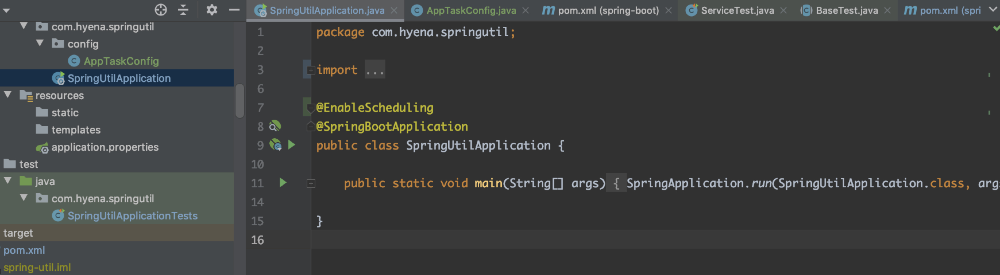

# Spring定时任务和Cron表达式

目录：

1. [简介][1]
2. [Cron表达式][2]
3. [Spring定时任务配置][3]
4. [QA][4]
5. [参考资料][5]


### 1.简介

Spring定时任务框架根据cron表达式对任务进行定时调度。本节主要内容是Cron表达式和Spring定时任务的配置

### 2.Cron表达式

Cron表达式是用来配置Spring定时任务执行时间的时间串，由5个空格分隔成的6个域构成，格式如下

`{秒/seconde} {分/minutes} {时/hour} {日/dayofmonth} {月/month} {周/dayofweek}`

每一个域含义解释：

1)秒：表示在指定的秒数触发定时任务，范围0-59。例如，**"*"表示任何秒都触发，"0,3"表示0秒和3秒触发。**
2)分：表示在指定的分钟触发定时任务，范围0-59。例如，**"0-3"表示0分钟到3分钟每分钟都触发，"0/2"表示只有偶数分钟触发。**
3)时：表示在指定的小时触发定时任务，范围0-23。例如，**"3-15/2"表示上午3点到下午3点每隔2个小时触发。**
4)日：表示在指定的日期触发定时任务，范围1-31(可以写0，但不会生效)。例如，**"1"表示1号触发，"5,15"表示5号和15号触发。需要注意的是，日期可以写0，不会报错但也不会生效。**
5)月：表示在指定的月份触发定时任务，范围1-12。例如，**"1-4,12"表示1月到4月以及12月触发。**
6)周：表示在指定的星期触发定时任务，范围0-7(0和7都表示周日)。例如，**"?"表示一周都触发，"6,7"表示周六日触发。**
注意，1月到12月可以用对应的英文缩写JAN-DEC代替，周日到周六可以用对应的英文缩写SUN-SAT代替。但是，周日的缩写SUN只会被替换为0，因此在cron表达式的周域，我们可以写6-7，却不能写SAT-SUN。


特殊符号：

（1) * ：表示匹配该域的任意值。假如在Minutes域使用*, 即表示每分钟都会触发事件。

（2）**?：只能用在DayofMonth和DayofWeek两个域。它也匹配域的任意值，但实际不会。因为DayofMonth和DayofWeek会相互影响。例如想在每月的20日触发调度，不管20日到底是星期几，则只能使用如下写法： 13 13 15 20 * ?, 其中最后一位只能用？，而不能使用\*，如果使用*表示不管星期几都会触发，实际上并不是这样。**

（3）- ：表示**范围**。例如在Minutes域使用5-20，表示从5分到20分钟每分钟触发一次 

（4）/ ：表示起始时间开始触发，然后**每隔固定时间**触发一次。例如在Minutes域使用5/20,则意味着5分钟触发一次，而25，45等分别触发一次. 

（5）, ：表示列出**枚举值**。例如：在Minutes域使用5,20，则意味着在5和20分每分钟触发一次。 


例子：

（1）**0 0 2 1 \* ? \***  表示在每月的1日的凌晨2点调整任务

（2）**0 15 10 ? \* MON-FRI**  表示周一到周五每天上午10:15执行作业

（3）**0 15 10 ? 6L 2002-2006**  表示2002-2006年的每个月的最后一个星期五上午10:15执行作

（4）**0 0 10,14,16 \* \* ?**  每天上午10点，下午2点，4点 

（5）**0 0/30 9-17 \* \* ?**  朝九晚五工作时间内每半小时 

（6）**0 0 12 ? \* WED**   表示每个星期三中午12点 

（7）**0 0 12 \* \* ?**  每天中午12点触发 

（8）**0 15 10 ? \* \***   每天上午10:15触发 

（9）**0 15 10 \* \* ?**   每天上午10:15触发 

（10）**0 15 10 \* \* ? **   每天上午10:15触发 

（11）**0 15 10 \* \* ? 2005**   2005年的每天上午10:15触发 

（12）**0 \* 14 \* \* ?**   在每天下午2点到下午2:59期间的每1分钟触发 

（13）**0 0/5 14 \* \* ?**   在每天下午2点到下午2:55期间的每5分钟触发 

（14）**0 0/5 14,18 \* \* ?**   在每天下午2点到2:55期间和下午6点到6:55期间的每5分钟触发 

（15）**0 0-5 14 \* \* ?**   在每天下午2点到下午2:05期间的每1分钟触发 

（16）**0 10,44 14 ? 3 WED**   每年三月的星期三的下午2:10和2:44触发 

（17）**0 15 10 ? \* MON-FRI**   周一至周五的上午10:15触发 


总结：

​    **1.注意cron特殊符号的用法**

​	**2.注意cron表达式“每天”的写法，0 15 10 * * ? 或 0 15 0 ? * ***

   **3.如果指定日期，dayofweek要用? ，例如： 0 15 10 10 * ?  ，即每月10号上午10点15分执行**


### 3.Spring定时任务配置

3.1 Springboot配置

1.启用@EnableScheduling注解


<center>图1 启用@EnableScheduling</center>

其中`@EnableScheduling`可以在配置类`@Compnent`也可以在Springboot启动类`SpringApplicaitonUtil`

`@EnableScheduling` **This enables detection of @Scheduled annotations on any Spring-managed bean in the container.**

2.创建任务类，执行任务使用 `@Scheduled`注解 


例子：

```java

method #1:
package com.myco.tasks;

public class MyTask{
   @Scheduled(fixedRate=1000)
   public void work(){
      // task execution logic
   }
}

the following configuration would ensure that MyTask.work() is called once every 1000 ms:


   @Configuration
   @EnableScheduling
   public class AppConfig {
  
       @Bean
       public MyTask task() {
           return new MyTask();
       }
   }

method #2: 
use ComponentScan:

   @Configuration
   @EnableScheduling
   @ComponentScan(basePackages="com.myco.tasks")
   public class AppConfig {
   }

method #3:

Methods annotated with @Scheduled may even be declared directly within @Configuration classes:

   @Configuration
   @EnableScheduling
   public class AppConfig {
  
       @Scheduled(fixedRate=1000)
       public void work() {
           // task execution logic
       }
   }

```

3.配置执行器(TaskScheduler)

By default, will be searching for an associated scheduler definition: either a unique **org.springframework.scheduling.TaskScheduler bean in the context, or a TaskScheduler bean named "taskScheduler" otherwise**; the same lookup will also be performed for a **java.util.concurrent.ScheduledExecutorService** bean. If neither of the two is resolvable, a local single-threaded default scheduler will be created and used within the registrar.

默认情况下Spring会搜索`org.springframework.scheduling.TaskScheduler`类型的bean或者名称为`taskScheduler`的bean，同样也会搜索`java.util.concurrent.ScheduledExecutorService`类型的bean；如果都没有搜索到，spring会创建一个`single-thread scheduler`

-------------
通过实现`SchedulerConfigurer`配置执行器

```java
 @Configuration
   @EnableScheduling
   public class AppConfig implements SchedulingConfigurer {
  
       @Override
       public void configureTasks(ScheduledTaskRegistrar taskRegistrar) {
           taskRegistrar.setScheduler(taskExecutor());
       }
  
       @Bean(destroyMethod="shutdown")
       public Executor taskExecutor() {
           return Executors.newScheduledThreadPool(100);
       }
   }
```
3.2 Spring xml配置
```xml

<!--创建执行器，并设置线程池大小-->
<task:annotation-driver scheduler="taskScheduler"/>
<task:scheduled id="taskScheduler" pool-size="42/>

<task:scheduled-tasks scheduler="taskScheduler">
   <task:scheduled ref="myTask" method="work" fixed-rate="1000"/>
</task:scheduled-tasks>

<bean id="myTask" class="com.foo.MyTask"/>

```


### 4.QA

### 5.参考资料

1. https://www.cnblogs.com/javahr/p/8318728.html
2. https://www.cnblogs.com/summary-2017/p/8974139.html


[1]: #1简介
[2]: #2Cron表达式
[3]: #3spring定时任务配置
[4]: #4qa
[5]: #5参考资料